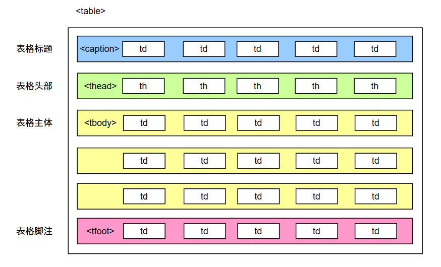
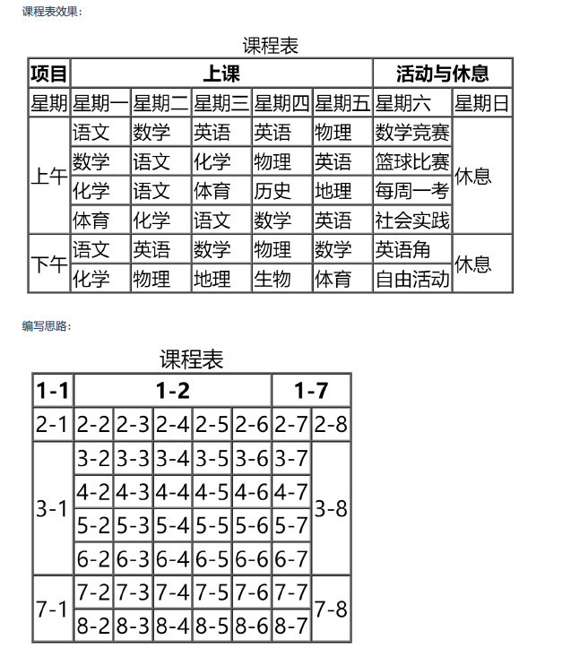

# HTML 表格标签

表格是以结构化方式展示行列数据，使信息清晰、易读且便于对比。主要用于数据展示或者后台管理系统的信息展示。

:::danger

美化表格是CSS的工作，所以这里千万不要花时间去美化表格，无意义。

:::

## 基本使用

一个完整的表格由：表格标题、表格头部、表格主体、表格脚注，四部分组成。

表格基本组成：

- `<table>`：表格容器标签。
- `<tr>`：行标签。
- `<td>`：单元格标签。
- `<th>`：表头单元格。

表格结构标签：增强表格语义，让表格结构更加清晰。

- `<caption>`：定义表格的标题区域。
- `<thead>`：定义表格的头部区域。
- `<tbody>`：定义表格的主体内容。



```html
<table border="1">
  <!-- 表格标题 -->
  <caption>
    学生信息
  </caption>
  <!-- 表格头部 -->
  <thead>
    <tr>
      <th>姓名</th>
      <th>性别</th>
      <th>年龄</th>
      <th>民族</th>
      <th>政治面貌</th>
    </tr>
  </thead>
  <!-- 表格主体 -->
  <tbody>
    <tr>
      <td>张三</td>
      <td>男</td>
      <td>18</td>
      <td>汉族</td>
      <td>团员</td>
    </tr>
    <tr>
      <td>李四</td>
      <td>女</td>
      <td>20</td>
      <td>满族</td>
      <td>群众</td>
    </tr>
    <tr>
      <td>王五</td>
      <td>男</td>
      <td>20</td>
      <td>回族</td>
      <td>党员</td>
    </tr>
    <tr>
      <td>赵六</td>
      <td>女</td>
      <td>21</td>
      <td>壮族</td>
      <td>团员</td>
    </tr>
  </tbody>
  <!-- 表格脚注 -->
  <tfoot>
    <tr>
      <td></td>
      <td></td>
      <td></td>
      <td></td>
      <td>共计：4人</td>
    </tr>
  </tfoot>
</table>
```

## 常用属性

| 标签名            | 标签语义   | 常用属性                                                                                                                                                                                                                                                                              |
| ----------------- | ---------- | ------------------------------------------------------------------------------------------------------------------------------------------------------------------------------------------------------------------------------------------------------------------------------------- |
| `<table></table>` | 表格       | width ：设置表格宽度。<br/>height ：设置表格最小高度，表格最终高度可能比设置<br/>的值大。<br/>border ：设置表格边框宽度。<br/>cellspacing ： 设置单元格之间的间距。                                                                                                                   |
| `<thead></thead>` | 表格头部   | height ：设置表格头部高度。<br/>align ： 设置单元格的水平对齐方式，可选值如下：<br/> 1. left ：左对齐<br/> 2. center ：中间对齐<br/> 3. right ：右对齐<br/>valign ：设置单元格的垂直对齐方式，可选值如下：<br/> 1. top ：顶部对齐<br/> 2. middle ：中间对齐<br/> 3. bottom ：底部对齐 |
| `<tbody></tbody>` | 表格主体   | 常用属性与thead 相同                                                                                                                                                                                                                                                                  |
| `<tr></tr>`       | 行         | 常用属性与thead 相同                                                                                                                                                                                                                                                                  |
| `<tfoot></tfoot>` | 表格脚注   | 常用属性与thead 相同                                                                                                                                                                                                                                                                  |
| `<td></td>`       | 普通单元格 | width ：设置单元格的宽度，同列所有单元格全都受影<br/>响。<br/>heigth ：设置单元格的高度，同行所有单元格全都受影<br/>响。<br/>align ：设置单元格的水平对齐方式。<br/>valign ：设置单元格的垂直对齐方式。<br/>rowspan ：指定要跨的行数。<br/>colspan ：指定要跨的列数。                 |
| `<th></th>`       | 表头单元格 | 常用属性与td 相同                                                                                                                                                                                                                                                                     |

:::danger

1. `<table>` 元素的border 属性可以控制表格边框，但border 值的大小，并不控制单元格边框的宽度，只能控制表格最外侧边框的宽度，后期靠CSS 控制。
2. 默认情况下，每列的宽度，得看这一列单元格最长的那个文字。
3. 给某个th 或td 设置了宽度之后，他们所在的那一列的宽度就确定了。
4. 给某个th 或td 设置了高度之后，他们所在的那一行的高度就确定了。

:::

## 合并单元格

表格开发中很少使用合并，因为会导致表格难以维护，且可能影响响应式适配 (尤其在移动端)。如果特殊情况，可以借助于AI。

原理：

1. 确定是跨行(rowspan)还是跨列合并(colspan)。
2. 找到目标单元格（左上原则），写合并数量。
3. 删除多余单元格。


