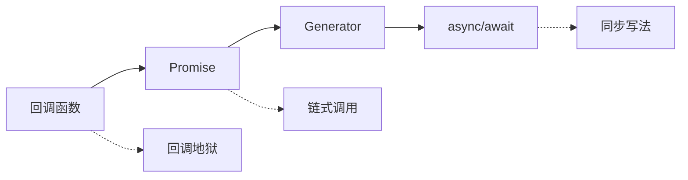

# JavaScript Promise 与异步

## 异步编程演进



## Promise 基础

### 创建 Promise

```javascript [promise-create.js]
// 基础 Promise
const promise = new Promise((resolve, reject) => {
  setTimeout(() => {
    const success = true
    if (success) {
      resolve('操作成功')
    } else {
      reject(new Error('操作失败'))
    }
  }, 1000)
})

// 使用 Promise
promise
  .then(result => console.log(result))
  .catch(error => console.error(error))
  .finally(() => console.log('完成'))

// Promise.resolve / Promise.reject
const resolved = Promise.resolve('成功')
const rejected = Promise.reject(new Error('失败'))
```

### Promise 状态

```javascript [promise-states.js]
// pending - 进行中
// fulfilled - 已成功
// rejected - 已失败

const promise = new Promise((resolve, reject) => {
  console.log('Promise 执行')  // 同步执行
  resolve('成功')
})

console.log(promise)  // Promise { '成功' }

// 状态一旦改变就不能再改变
const p = new Promise((resolve, reject) => {
  resolve('成功')
  reject('失败')  // 无效
})

p.then(console.log)  // 成功
```

## Promise 链式调用

```javascript [promise-chain.js]
// 链式调用
fetch('/api/user')
  .then(response => response.json())
  .then(user => fetch(`/api/posts/${user.id}`))
  .then(response => response.json())
  .then(posts => console.log(posts))
  .catch(error => console.error(error))

// 返回值传递
Promise.resolve(1)
  .then(x => x + 1)      // 2
  .then(x => x * 2)      // 4
  .then(x => x - 1)      // 3
  .then(console.log)     // 3

// 返回 Promise
Promise.resolve(1)
  .then(x => Promise.resolve(x + 1))
  .then(x => console.log(x))  // 2

// 错误传播
Promise.resolve(1)
  .then(x => { throw new Error('错误') })
  .catch(err => console.error(err.message))
  .then(() => console.log('继续执行'))
```

## Promise 组合

### Promise.all

```javascript [promise-all.js]
// 全部成功才返回
const p1 = Promise.resolve(1)
const p2 = Promise.resolve(2)
const p3 = Promise.resolve(3)

Promise.all([p1, p2, p3])
  .then(results => console.log(results))  // [1, 2, 3]
  .catch(error => console.error(error))

// 一个失败就失败
const p4 = Promise.reject(new Error('失败'))

Promise.all([p1, p4])
  .catch(error => console.error(error.message))  // 失败

// 实际应用
async function fetchDashboard() {
  const [users, posts, comments] = await Promise.all([
    fetch('/api/users').then(r => r.json()),
    fetch('/api/posts').then(r => r.json()),
    fetch('/api/comments').then(r => r.json())
  ])
  return { users, posts, comments }
}
```

### Promise.allSettled

```javascript [promise-all-settled.js]
// 等待所有 Promise 完成
const p1 = Promise.resolve(1)
const p2 = Promise.reject(new Error('失败'))
const p3 = Promise.resolve(3)

Promise.allSettled([p1, p2, p3])
  .then(results => {
    results.forEach((result, index) => {
      if (result.status === 'fulfilled') {
        console.log(`Promise ${index} 成功:`, result.value)
      } else {
        console.error(`Promise ${index} 失败:`, result.reason)
      }
    })
  })
```

### Promise.race

```javascript [promise-race.js]
// 返回第一个完成的 Promise
const p1 = new Promise(resolve => setTimeout(() => resolve('p1'), 100))
const p2 = new Promise(resolve => setTimeout(() => resolve('p2'), 50))

Promise.race([p1, p2])
  .then(result => console.log(result))  // p2

// 超时控制
function fetchWithTimeout(url, timeout = 5000) {
  const timeoutPromise = new Promise((_, reject) => {
    setTimeout(() => reject(new Error('请求超时')), timeout)
  })

  return Promise.race([
    fetch(url),
    timeoutPromise
  ])
}
```

### Promise.any

```javascript [promise-any.js]
// 返回第一个成功的 Promise
const p1 = Promise.reject(new Error('失败'))
const p2 = Promise.resolve('成功')
const p3 = Promise.resolve('也成功')

Promise.any([p1, p2, p3])
  .then(result => console.log(result))  // 成功
  .catch(error => console.error(error))

// 全部失败
Promise.any([
  Promise.reject(new Error('失败 1')),
  Promise.reject(new Error('失败 2'))
]).catch(error => console.error(error))  // AggregateError
```

## async/await

### 基础用法

```javascript [async-await.js]
// async 函数
async function fetchData() {
  const response = await fetch('/api/data')
  const data = await response.json()
  return data
}

// 错误处理
async function safeFetch(url) {
  try {
    const response = await fetch(url)
    if (!response.ok) {
      throw new Error(`HTTP ${response.status}`)
    }
    return await response.json()
  } catch (error) {
    console.error('请求失败:', error.message)
    return null
  }
}

// 并行请求
async function fetchParallel() {
  const [users, posts] = await Promise.all([
    fetch('/api/users').then(r => r.json()),
    fetch('/api/posts').then(r => r.json())
  ])
  return { users, posts }
}
```

### 循环中的 async/await

```javascript [async-loop.js]
// 顺序执行
async function processSequentially(items) {
  for (const item of items) {
    await processItem(item)
  }
}

// 并行执行
async function processParallel(items) {
  await Promise.all(items.map(item => processItem(item)))
}

// 限制并发数
async function processWithLimit(items, limit = 5) {
  const results = []
  for (let i = 0; i < items.length; i += limit) {
    const batch = items.slice(i, i + limit)
    const batchResults = await Promise.all(batch.map(processItem))
    results.push(...batchResults)
  }
  return results
}
```

## Promise 封装

### 回调转 Promise

```javascript [callback-to-promise.js]
// fs.readFile 回调转 Promise
function readFile(path) {
  return new Promise((resolve, reject) => {
    fs.readFile(path, 'utf8', (err, data) => {
      if (err) reject(err)
      else resolve(data)
    })
  })
}

// 使用 util.promisify
const { promisify } = require('util')
const readFileAsync = promisify(fs.readFile)

// setTimeout Promise
function delay(ms) {
  return new Promise(resolve => setTimeout(resolve, ms))
}

// 使用
async function example() {
  await delay(1000)
  console.log('1 秒后执行')
}
```

### Promise 工具函数

```javascript [promise-utils.js]
// 重试
async function retry(fn, retries = 3, delay = 1000) {
  for (let i = 0; i < retries; i++) {
    try {
      return await fn()
    } catch (error) {
      if (i === retries - 1) throw error
      await delay(delay)
    }
  }
}

// 超时
function withTimeout(promise, ms) {
  const timeout = new Promise((_, reject) => {
    setTimeout(() => reject(new Error('超时')), ms)
  })
  return Promise.race([promise, timeout])
}

// 缓存
function memoizePromise(fn) {
  const cache = new Map()
  return async (...args) => {
    const key = JSON.stringify(args)
    if (!cache.has(key)) {
      cache.set(key, fn(...args))
    }
    return cache.get(key)
  }
}

// 队列
class PromiseQueue {
  constructor(concurrency = 1) {
    this.concurrency = concurrency
    this.queue = []
    this.running = 0
  }

  async add(fn) {
    return new Promise((resolve, reject) => {
      this.queue.push({ fn, resolve, reject })
      this.run()
    })
  }

  async run() {
    while (this.running < this.concurrency && this.queue.length) {
      const { fn, resolve, reject } = this.queue.shift()
      this.running++
      try {
        resolve(await fn())
      } catch (error) {
        reject(error)
      }
      this.running--
      this.run()
    }
  }
}
```

## 异步迭代器

```javascript [async-iterator.js]
// 异步生成器
async function* fetchData(urls) {
  for (const url of urls) {
    const response = await fetch(url)
    yield await response.json()
  }
}

// 使用
async function example() {
  const urls = ['/api/1', '/api/2', '/api/3']
  for await (const data of fetchData(urls)) {
    console.log(data)
  }
}

// 异步迭代器
const asyncIterable = {
  [Symbol.asyncIterator]() {
    return {
      i: 0,
      async next() {
        if (this.i < 3) {
          await delay(1000)
          return { value: this.i++, done: false }
        }
        return { done: true }
      }
    }
  }
}

async function consume() {
  for await (const value of asyncIterable) {
    console.log(value)
  }
}
```

::: tip 提示
- 优先使用 async/await 替代 Promise 链
- 使用 Promise.all 并行请求提高性能
- 使用 Promise.allSettled 处理部分失败场景
- 异步循环注意并发控制
:::
