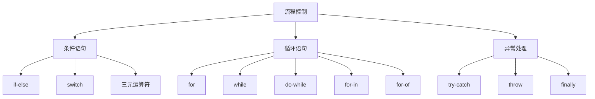

# JavaScript 流程控制

## 条件语句

### if 语句

```javascript [if.js]
let age = 20

// 基础 if
if (age >= 18) {
  console.log('成年人')
}

// if-else
if (age >= 18) {
  console.log('成年人')
} else {
  console.log('未成年人')
}

// if-else if-else
let score = 85

if (score >= 90) {
  console.log('优秀')
} else if (score >= 80) {
  console.log('良好')
} else if (score >= 60) {
  console.log('及格')
} else {
  console.log('不及格')
}
```

### switch 语句

```javascript [switch.js]
let day = 3

switch (day) {
  case 1:
    console.log('星期一')
    break
  case 2:
    console.log('星期二')
    break
  case 3:
    console.log('星期三')
    break
  case 4:
    console.log('星期四')
    break
  case 5:
    console.log('星期五')
    break
  case 6:
    console.log('星期六')
    break
  case 7:
    console.log('星期日')
    break
  default:
    console.log('无效的日期')
}

// 穿透用法
let month = 2
let days

switch (month) {
  case 1: case 3: case 5: case 7: case 8: case 10: case 12:
    days = 31
    break
  case 4: case 6: case 9: case 11:
    days = 30
    break
  case 2:
    days = 28
    break
  default:
    days = 0
}
console.log(days)  // 28
```

## 循环语句

### for 循环

```javascript [for.js]
// 基础 for 循环
for (let i = 0; i < 5; i++) {
  console.log(i)  // 0, 1, 2, 3, 4
}

// 遍历数组
const fruits = ['苹果', '香蕉', '橙子']
for (let i = 0; i < fruits.length; i++) {
  console.log(fruits[i])
}

// 倒序循环
for (let i = 5; i > 0; i--) {
  console.log(i)  // 5, 4, 3, 2, 1
}

// 多变量循环
for (let i = 0, j = 10; i < j; i++, j--) {
  console.log(i, j)
}
```

### for...in 循环

```javascript [for-in.js]
// 遍历对象属性
const person = {
  name: '张三',
  age: 25,
  city: '北京'
}

for (let key in person) {
  console.log(`${key}: ${person[key]}`)
}

// 遍历数组索引
const arr = ['a', 'b', 'c']
for (let index in arr) {
  console.log(index, arr[index])
}
```

### for...of 循环

```javascript [for-of.js]
// 遍历数组值
const arr = ['a', 'b', 'c']
for (let value of arr) {
  console.log(value)
}

// 遍历字符串
const str = 'Hello'
for (let char of str) {
  console.log(char)
}

// 遍历 Map
const map = new Map([['a', 1], ['b', 2]])
for (let [key, value] of map) {
  console.log(key, value)
}

// 遍历 Set
const set = new Set([1, 2, 3])
for (let value of set) {
  console.log(value)
}
```

### while 循环

```javascript [while.js]
// while 循环
let i = 0
while (i < 5) {
  console.log(i)
  i++
}

// do-while 循环
let j = 0
do {
  console.log(j)
  j++
} while (j < 5)

// 实际应用：用户输入
let input
do {
  input = prompt('请输入密码（至少 6 位）：')
} while (!input || input.length < 6)
console.log('密码设置成功')
```

## 循环控制

### break 语句

```javascript [break.js]
// 跳出循环
for (let i = 0; i < 10; i++) {
  if (i === 5) {
    break
  }
  console.log(i)  // 0, 1, 2, 3, 4
}

// 跳出 switch
let fruit = '苹果'
switch (fruit) {
  case '苹果':
    console.log('选择苹果')
    break
  case '香蕉':
    console.log('选择香蕉')
    break
  default:
    console.log('未知水果')
}

// 标签 break
outer: for (let i = 0; i < 3; i++) {
  for (let j = 0; j < 3; j++) {
    if (i === 1 && j === 1) {
      break outer
    }
    console.log(i, j)
  }
}
```

### continue 语句

```javascript [continue.js]
// 跳过当前迭代
for (let i = 0; i < 10; i++) {
  if (i % 2 === 0) {
    continue
  }
  console.log(i)  // 1, 3, 5, 7, 9
}

// 标签 continue
outer: for (let i = 0; i < 3; i++) {
  for (let j = 0; j < 3; j++) {
    if (i === 1 && j === 1) {
      continue outer
    }
    console.log(i, j)
  }
}
```

## 异常处理

### try...catch

```javascript [try-catch.js]
// 基础用法
try {
  let result = JSON.parse('invalid json')
} catch (error) {
  console.error('解析失败:', error.message)
}

// finally 块
try {
  console.log('尝试执行')
  throw new Error('出错了')
} catch (error) {
  console.error('捕获错误:', error.message)
} finally {
  console.log('总是执行')
}

// 实际应用场景
async function fetchData() {
  let connection
  try {
    connection = await connectToDatabase()
    const data = await connection.query('SELECT * FROM users')
    return data
  } catch (error) {
    console.error('查询失败:', error)
    throw error
  } finally {
    if (connection) {
      await connection.close()
    }
  }
}
```

### 自定义错误

```javascript [custom-error.js]
// 抛出错误
function divide(a, b) {
  if (b === 0) {
    throw new Error('除数不能为 0')
  }
  return a / b
}

try {
  console.log(divide(10, 0))
} catch (error) {
  console.error(error.message)  // 除数不能为 0
}

// 自定义错误类
class ValidationError extends Error {
  constructor(message, field) {
    super(message)
    this.name = 'ValidationError'
    this.field = field
  }
}

function validateUser(user) {
  if (!user.name) {
    throw new ValidationError('姓名不能为空', 'name')
  }
  if (!user.email) {
    throw new ValidationError('邮箱不能为空', 'email')
  }
  return true
}

try {
  validateUser({ email: 'test@example.com' })
} catch (error) {
  if (error instanceof ValidationError) {
    console.error(`字段 ${error.field} 验证失败: ${error.message}`)
  }
}
```

## 流程控制对比



## 循环性能对比

| 循环类型 | 适用场景 | 性能 | 说明 |
|----------|----------|------|------|
| for | 数组遍历 | 快 | 最常用，可控制索引 |
| for...in | 对象属性 | 慢 | 遍历原型链属性 |
| for...of | 可迭代对象 | 快 | 推荐用于数组 |
| while | 条件循环 | 快 | 不确定循环次数 |
| do-while | 至少执行一次 | 快 | 先执行后判断 |
| forEach | 数组遍历 | 中 | 不能 break/continue |

::: tip 提示
- 优先使用 `for...of` 遍历数组
- 使用 `for...in` 遍历对象属性时注意原型链
- 循环中避免不必要的 DOM 操作
- 大数据量考虑使用 Web Worker
:::

::: danger 注意
- `for...in` 会遍历原型链上的可枚举属性
- `throw` 只能抛出 Error 对象或继承自 Error 的对象
- `finally` 块中的代码总是会执行，即使有 return 语句
:::
