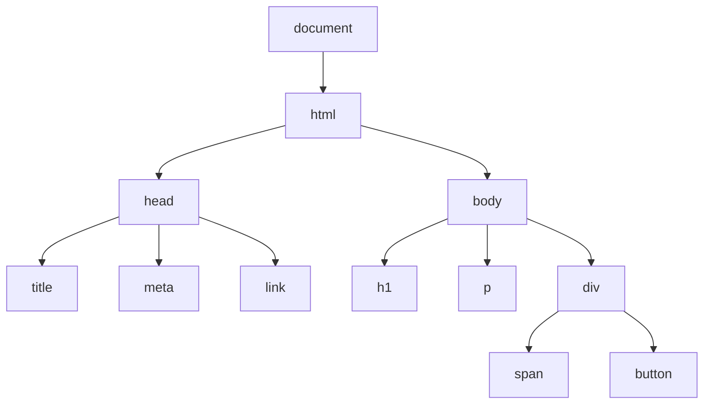

# JavaScript DOM 操作

## DOM 树结构



## 获取元素

```javascript [dom-select.js]
// 通过 ID
const element = document.getElementById('myId')

// 通过类名
const elements = document.getElementsByClassName('myClass')

// 通过标签名
const divs = document.getElementsByTagName('div')

// CSS 选择器（返回第一个）
const element = document.querySelector('.myClass')
const element2 = document.querySelector('#myId')
const element3 = document.querySelector('div > p:first-child')

// CSS 选择器（返回所有）
const elements = document.querySelectorAll('.myClass')
elements.forEach(el => console.log(el))

// 特殊元素
console.log(document.documentElement)  // <html>
console.log(document.head)             // <head>
console.log(document.body)             // <body>
```

## 创建元素

```javascript [dom-create.js]
// 创建元素
const div = document.createElement('div')
div.className = 'container'
div.id = 'main'

// 创建文本节点
const text = document.createTextNode('Hello, World!')
div.appendChild(text)

// 创建文档片段
const fragment = document.createDocumentFragment()
for (let i = 0; i < 10; i++) {
  const li = document.createElement('li')
  li.textContent = `项目 ${i + 1}`
  fragment.appendChild(li)
}
document.querySelector('ul').appendChild(fragment)

// innerHTML
div.innerHTML = '<p>Hello</p><span>World</span>'

// insertAdjacentHTML
div.insertAdjacentHTML('beforebegin', '<p>之前</p>')
div.insertAdjacentHTML('afterbegin', '<p>内部开头</p>')
div.insertAdjacentHTML('beforeend', '<p>内部结尾</p>')
div.insertAdjacentHTML('afterend', '<p>之后</p>')
```

## 修改元素

```javascript [dom-modify.js]
const element = document.querySelector('#myElement')

// 修改内容
element.textContent = '新文本'
element.innerHTML = '<strong>HTML 内容</strong>'

// 修改属性
element.setAttribute('data-id', '123')
element.getAttribute('data-id')
element.removeAttribute('data-id')

// 修改样式
element.style.color = 'red'
element.style.fontSize = '16px'
element.style.backgroundColor = '#f0f0f0'

// 修改类名
element.className = 'new-class another-class'
element.classList.add('active')
element.classList.remove('hidden')
element.classList.toggle('visible')
element.classList.contains('active')

// 修改属性（布尔值）
element.disabled = true
element.checked = false
```

## 遍历 DOM

```javascript [dom-traverse.js]
const element = document.querySelector('#myElement')

// 父节点
console.log(element.parentNode)
console.log(element.parentElement)
console.log(element.closest('.container'))

// 子节点
console.log(element.childNodes)      // 包含文本节点
console.log(element.children)        // 仅元素节点
console.log(element.firstChild)
console.log(element.firstElementChild)
console.log(element.lastChild)
console.log(element.lastElementChild)

// 兄弟节点
console.log(element.previousSibling)
console.log(element.previousElementSibling)
console.log(element.nextSibling)
console.log(element.nextElementSibling)

// 遍历子元素
element.children.forEach(child => {
  console.log(child)
})

// 递归遍历
function traverseDOM(node, callback) {
  callback(node)
  for (const child of node.children) {
    traverseDOM(child, callback)
  }
}
```

## 添加/删除元素

```javascript [dom-insert-remove.js]
const parent = document.querySelector('#parent')
const child = document.querySelector('#child')

// 添加元素
parent.appendChild(child)
parent.insertBefore(newChild, referenceChild)

// 替换元素
parent.replaceChild(newChild, oldChild)

// 删除元素
parent.removeChild(child)
child.remove()

// 克隆元素
const clone = child.cloneNode(false)  // 浅克隆
const deepClone = child.cloneNode(true)  // 深克隆

// 插入位置
element.insertAdjacentElement('beforebegin', newElement)
element.insertAdjacentElement('afterbegin', newElement)
element.insertAdjacentElement('beforeend', newElement)
element.insertAdjacentElement('afterend', newElement)
```

## 元素属性

```javascript [dom-attributes.js]
const element = document.querySelector('#myElement')

// 标准属性
console.log(element.id)
console.log(element.className)
console.log(element.title)
console.log(element.src)
console.log(element.href)

// data 属性
console.log(element.dataset.id)
console.log(element.dataset.userId)
element.dataset.newAttr = 'value'

// 属性操作
console.log(element.hasAttribute('disabled'))
element.setAttribute('disabled', '')
element.removeAttribute('disabled')

// 属性列表
for (const attr of element.attributes) {
  console.log(attr.name, attr.value)
}
```

## 元素尺寸和位置

```javascript [dom-size-position.js]
const element = document.querySelector('#myElement')

// 内容尺寸
console.log(element.clientWidth)   // 内容宽度 + padding
console.log(element.clientHeight)  // 内容高度 + padding

// 完整尺寸（含边框）
console.log(element.offsetWidth)   // 内容 + padding + border
console.log(element.offsetHeight)  // 内容 + padding + border

// 位置（相对于视口）
const rect = element.getBoundingClientRect()
console.log(rect.top)
console.log(rect.left)
console.log(rect.width)
console.log(rect.height)

// 滚动尺寸
console.log(element.scrollWidth)
console.log(element.scrollHeight)
console.log(element.scrollTop)
console.log(element.scrollLeft)

// 滚动到
element.scrollTop = 100
element.scrollTo({ top: 100, behavior: 'smooth' })
element.scrollIntoView({ behavior: 'smooth' })
```

## 样式操作

```javascript [dom-style.js]
const element = document.querySelector('#myElement')

// 内联样式
element.style.color = 'red'
element.style.setProperty('--main-color', 'blue')
element.style.getPropertyValue('--main-color')

// 计算样式
const computedStyle = window.getComputedStyle(element)
console.log(computedStyle.color)
console.log(computedStyle.fontSize)

// 样式表
const styleSheets = document.styleSheets
for (const sheet of styleSheets) {
  for (const rule of sheet.cssRules) {
    console.log(rule.cssText)
  }
}

// 动态添加样式
const style = document.createElement('style')
style.textContent = `
  .dynamic-class {
    color: red;
    font-size: 16px;
  }
`
document.head.appendChild(style)
```

## DOM 性能优化

```javascript [dom-performance.js]
// 使用文档片段
const fragment = document.createDocumentFragment()
for (let i = 0; i < 100; i++) {
  const li = document.createElement('li')
  li.textContent = `项目 ${i + 1}`
  fragment.appendChild(li)
}
document.querySelector('ul').appendChild(fragment)

// 批量操作
const element = document.querySelector('#myElement')
element.style.cssText = `
  color: red;
  font-size: 16px;
  padding: 10px;
  margin: 5px;
`

// 使用 requestAnimationFrame
function animate() {
  element.style.transform = `translateX(${position}px)`
  requestAnimationFrame(animate)
}
requestAnimationFrame(animate)

// 虚拟 DOM 思想
function createVirtualDOM(tag, props, ...children) {
  return { tag, props, children }
}

function render(virtualNode, container) {
  const element = document.createElement(virtualNode.tag)
  for (const [key, value] of Object.entries(virtualNode.props || {})) {
    element.setAttribute(key, value)
  }
  for (const child of virtualNode.children) {
    if (typeof child === 'string') {
      element.appendChild(document.createTextNode(child))
    } else {
      render(child, element)
    }
  }
  container.appendChild(element)
}
```

## MutationObserver

```javascript [mutation-observer.js]
// 监听 DOM 变化
const observer = new MutationObserver((mutations) => {
  mutations.forEach(mutation => {
    console.log(mutation.type)
    console.log(mutation.target)
  })
})

observer.observe(document.body, {
  childList: true,        // 子节点变化
  attributes: true,       // 属性变化
  subtree: true,          // 后代节点变化
  characterData: true     // 文本内容变化
})

// 停止监听
observer.disconnect()

// 实际应用：监听元素尺寸变化
const resizeObserver = new ResizeObserver(entries => {
  for (const entry of entries) {
    console.log('元素尺寸变化:', entry.contentRect)
  }
})

resizeObserver.observe(document.querySelector('#myElement'))
```

::: tip 提示
- 优先使用 querySelector/querySelectorAll
- 批量 DOM 操作使用文档片段
- 使用 classList 替代 className
- 使用 requestAnimationFrame 进行动画
- 避免频繁读写样式属性
:::
