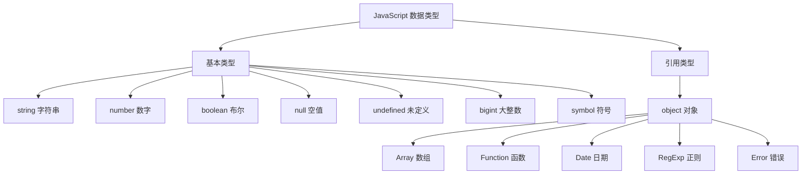
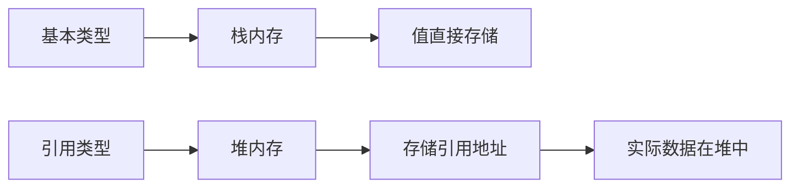

# JavaScript 数据类型

## 数据类型分类

JavaScript 有 8 种数据类型，分为两大类：



## 基本类型

### string 字符串

字符串用于存储文本数据：

```javascript [string.js]
// 字符串声明
const name = 'JavaScript'
const greeting = "Hello, World!"
const message = `欢迎学习 ${name}`

// 字符串属性
console.log(name.length)           // 10
console.log(name.toUpperCase())    // JAVASCRIPT
console.log(name.toLowerCase())    // javascript

// 字符串方法
const text = 'Hello, JavaScript!'
console.log(text.charAt(0))        // H
console.log(text.indexOf('Java'))  // 7
console.log(text.slice(0, 5))      // Hello
console.log(text.split(', '))      // ['Hello', 'JavaScript!']
console.log(text.replace('JavaScript', 'World'))  // Hello, World!
```

### number 数字

JavaScript 只有一种数字类型，可以表示整数和浮点数：

```javascript [number.js]
// 整数
const age = 25
const year = 2024

// 浮点数
const price = 9.99
const pi = 3.14159

// 特殊值
const max = Infinity       // 无穷大
const min = -Infinity      // 负无穷
const notNum = NaN         // 非数字

// 数字方法
console.log(Number.isInteger(25))      // true
console.log(Number.isInteger(3.14))    // false
console.log(Number.isNaN(NaN))         // true
console.log(Number.parseInt('123'))    // 123
console.log(Number.parseFloat('3.14')) // 3.14
console.log(Math.round(3.6))           // 4
console.log(Math.floor(3.9))           // 3
console.log(Math.ceil(3.1))            // 4
console.log(Math.random())             // 0-1 之间的随机数
```

### boolean 布尔

布尔值只有两个：true 和 false：

```javascript [boolean.js]
// 布尔值
const isTrue = true
const isFalse = false

// 布尔转换
console.log(Boolean(1))        // true
console.log(Boolean(0))        // false
console.log(Boolean(''))       // false
console.log(Boolean('hello'))  // true
console.log(Boolean(null))     // false
console.log(Boolean(undefined))// false
console.log(Boolean([]))       // true
console.log(Boolean({}))       // true

// 逻辑运算
console.log(true && false)     // false
console.log(true || false)     // true
console.log(!true)             // false
```

### null 和 undefined

```javascript [null-undefined.js]
// null：表示"空值"，有意设置为空
const emptyValue = null

// undefined：表示"未定义"，变量声明但未赋值
let unassigned
console.log(unassigned)  // undefined

// 区别
console.log(typeof null)         // object（历史遗留 bug）
console.log(typeof undefined)    // undefined

console.log(null == undefined)   // true
console.log(null === undefined)  // false
```

### bigint 大整数

用于表示超过安全整数范围的整数：

```javascript [bigint.js]
// 大整数声明
const bigInt = 9007199254740991n
const bigInt2 = BigInt('9007199254740992')

// 运算
console.log(bigInt + 1n)         // 9007199254740992n
console.log(bigInt * 2n)         // 18014398509481982n

// 注意：bigint 和 number 不能混用
// console.log(bigInt + 1)       // TypeError
```

### symbol 符号

用于创建唯一的标识符：

```javascript [symbol.js]
// 创建 symbol
const sym1 = Symbol('description')
const sym2 = Symbol('description')

console.log(sym1 === sym2)       // false（每个 symbol 都是唯一的）

// 使用场景：对象属性
const user = {
  [Symbol('id')]: 1,
  name: '张三'
}

// 全局 symbol
const globalSym1 = Symbol.for('global')
const globalSym2 = Symbol.for('global')
console.log(globalSym1 === globalSym2)  // true
```

## 引用类型

### object 对象

对象是键值对的集合：

```javascript [object.js]
// 对象字面量
const person = {
  name: '张三',
  age: 25,
  greet() {
    console.log(`你好，我是${this.name}`)
  }
}

// 访问属性
console.log(person.name)         // 张三
console.log(person['age'])       // 25

// 修改属性
person.age = 26
person.email = 'zhangsan@example.com'

// 删除属性
delete person.email

// 对象方法
console.log(Object.keys(person))     // ['name', 'age', 'greet']
console.log(Object.values(person))   // ['张三', 26, ƒ]
console.log(Object.entries(person))  // [['name', '张三'], ['age', 26], ...]
```

### Array 数组

```javascript [array.js]
// 数组声明
const numbers = [1, 2, 3, 4, 5]
const mixed = [1, 'hello', true, null]

// 数组方法
const arr = [1, 2, 3, 4, 5]

// 添加/删除
arr.push(6)              // 末尾添加
arr.pop()                // 末尾删除
arr.unshift(0)           // 开头添加
arr.shift()              // 开头删除

// 查找
console.log(arr.indexOf(3))        // 2
console.log(arr.includes(3))       // true
console.log(arr.find(x => x > 3))  // 4

// 转换
console.log(arr.slice(1, 3))       // [2, 3]
console.log(arr.splice(1, 2))      // [2, 3]

// 遍历
arr.forEach(x => console.log(x))
const doubled = arr.map(x => x * 2)
const filtered = arr.filter(x => x > 2)
const sum = arr.reduce((a, b) => a + b, 0)
```

### Function 函数

```javascript [function.js]
// 函数声明
function add(a, b) {
  return a + b
}

// 函数表达式
const subtract = function(a, b) {
  return a - b
}

// 箭头函数
const multiply = (a, b) => a * b

// 调用
console.log(add(2, 3))         // 5
console.log(subtract(5, 2))    // 3
console.log(multiply(3, 4))    // 12
```

### Date 日期

```javascript [date.js]
const now = new Date()
console.log(now.getFullYear())     // 2024
console.log(now.getMonth())        // 0-11
console.log(now.getDate())         // 1-31
console.log(now.getDay())          // 0-6
console.log(now.getHours())        // 0-23
console.log(now.getMinutes())      // 0-59
console.log(now.getSeconds())      // 0-59

// 格式化
console.log(now.toDateString())    // "Mon Jan 01 2024"
console.log(now.toTimeString())    // "12:00:00 GMT+0800"
console.log(now.toISOString())     // "2024-01-01T04:00:00.000Z"
```

## 类型检测

```javascript [type-check.js]
// typeof
console.log(typeof 'hello')        // string
console.log(typeof 123)            // number
console.log(typeof true)           // boolean
console.log(typeof undefined)      // undefined
console.log(typeof Symbol())       // symbol
console.log(typeof 123n)           // bigint
console.log(typeof {})             // object
console.log(typeof [])             // object
console.log(typeof null)           // object（历史遗留 bug）

// instanceof
console.log([] instanceof Array)   // true
console.log({} instanceof Object)  // true

// Object.prototype.toString
console.log(Object.prototype.toString.call([]))     // [object Array]
console.log(Object.prototype.toString.call({}))     // [object Object]
console.log(Object.prototype.toString.call(null))   // [object Null]

// Array.isArray
console.log(Array.isArray([]))     // true
console.log(Array.isArray({}))     // false
```

## 类型转换

```javascript [type-conversion.js]
// 转字符串
console.log(String(123))           // '123'
console.log(String(true))          // 'true'
console.log(String(null))          // 'null'
console.log((123).toString())      // '123'

// 转数字
console.log(Number('123'))         // 123
console.log(Number('123.45'))      // 123.45
console.log(Number('abc'))         // NaN
console.log(Number(true))          // 1
console.log(Number(null))          // 0
console.log(Number(undefined))     // NaN

// 转布尔
console.log(Boolean(1))            // true
console.log(Boolean(0))            // false
console.log(Boolean(''))           // false
console.log(Boolean('hello'))      // true
console.log(Boolean(null))         // false
console.log(Boolean(undefined))    // false
```

## 数据类型存储



| 类型 | 存储位置 | 复制方式 | 比较方式 |
|------|----------|----------|----------|
| 基本类型 | 栈内存 | 值复制 | 值比较 |
| 引用类型 | 堆内存 | 引用复制 | 引用比较 |

::: tip 提示
- 基本类型的值是不可变的
- 引用类型的值是可变的
- 使用 `Object.freeze()` 可以冻结对象，使其不可变
:::
