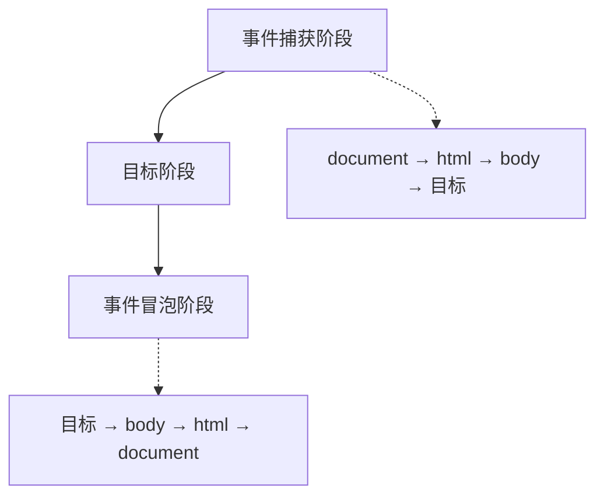

# JavaScript 事件处理

## 事件流



## 事件绑定

```javascript [event-bind.js]
const button = document.querySelector('#myButton')

// HTML 内联（不推荐）
// <button onclick="handleClick()">点击</button>

// DOM 属性
button.onclick = function() {
  console.log('点击了')
}

// addEventListener（推荐）
button.addEventListener('click', function(event) {
  console.log('点击了', event)
})

// 多个监听器
button.addEventListener('click', () => console.log('监听器 1'))
button.addEventListener('click', () => console.log('监听器 2'))

// 移除监听器
function handler() {
  console.log('点击')
}
button.addEventListener('click', handler)
button.removeEventListener('click', handler)
```

## 事件对象

```javascript [event-object.js]
element.addEventListener('click', (event) => {
  // 事件类型
  console.log(event.type)  // click

  // 目标元素
  console.log(event.target)        // 实际触发元素
  console.log(event.currentTarget) // 绑定监听器元素

  // 鼠标事件
  console.log(event.clientX)  // 相对于视口 X
  console.log(event.clientY)  // 相对于视口 Y
  console.log(event.pageX)    // 相对于页面 X
  console.log(event.pageY)    // 相对于页面 Y
  console.log(event.screenX)  // 相对于屏幕 X
  console.log(event.screenY)  // 相对于屏幕 Y

  // 键盘事件
  console.log(event.key)      // 按键名称
  console.log(event.code)     // 物理按键
  console.log(event.keyCode)  // 按键代码（已废弃）

  // 修饰键
  console.log(event.shiftKey)
  console.log(event.ctrlKey)
  console.log(event.altKey)
  console.log(event.metaKey)

  // 阻止默认行为
  event.preventDefault()

  // 阻止冒泡
  event.stopPropagation()
})
```

## 鼠标事件

```javascript [mouse-events.js]
const element = document.querySelector('#myElement')

// 点击事件
element.addEventListener('click', (e) => console.log('点击'))
element.addEventListener('dblclick', (e) => console.log('双击'))

// 按下/释放
element.addEventListener('mousedown', (e) => console.log('按下'))
element.addEventListener('mouseup', (e) => console.log('释放'))

// 移动
element.addEventListener('mousemove', (e) => console.log('移动'))
element.addEventListener('mouseover', (e) => console.log('进入'))
element.addEventListener('mouseout', (e) => console.log('离开'))

// 拖拽
element.addEventListener('dragstart', (e) => console.log('开始拖拽'))
element.addEventListener('drag', (e) => console.log('拖拽中'))
element.addEventListener('dragend', (e) => console.log('结束拖拽'))

// 滚轮
element.addEventListener('wheel', (e) => {
  console.log(e.deltaY)
})

// 拖放
element.addEventListener('drop', (e) => {
  e.preventDefault()
  console.log(e.dataTransfer.files)
})
```

## 键盘事件

```javascript [keyboard-events.js]
document.addEventListener('keydown', (e) => {
  console.log('按下:', e.key)
  console.log('代码:', e.code)

  // 快捷键
  if (e.ctrlKey && e.key === 'c') {
    console.log('Ctrl+C')
  }

  if (e.key === 'Escape') {
    console.log('ESC')
  }
})

document.addEventListener('keyup', (e) => {
  console.log('释放:', e.key)
})

document.addEventListener('keypress', (e) => {
  console.log('按键:', e.key)
})

// 输入事件
const input = document.querySelector('input')
input.addEventListener('input', (e) => {
  console.log('输入值:', e.target.value)
})
```

## 表单事件

```javascript [form-events.js]
const form = document.querySelector('#myForm')

// 提交
form.addEventListener('submit', (e) => {
  e.preventDefault()
  const formData = new FormData(form)
  console.log(formData.get('username'))
})

// 重置
form.addEventListener('reset', (e) => {
  console.log('表单重置')
})

// 焦点
const input = document.querySelector('input')
input.addEventListener('focus', (e) => {
  console.log('获得焦点')
})

input.addEventListener('blur', (e) => {
  console.log('失去焦点')
})

// 变化
input.addEventListener('change', (e) => {
  console.log('值变化:', e.target.value)
})

// 输入
input.addEventListener('input', (e) => {
  console.log('实时输入:', e.target.value)
})

// 选择
input.addEventListener('select', (e) => {
  console.log('文本被选择')
})
```

## 事件委托

```javascript [event-delegation.js]
// 不推荐：为每个子元素绑定事件
document.querySelectorAll('.item').forEach(item => {
  item.addEventListener('click', handleClick)
})

// 推荐：事件委托
document.querySelector('#list').addEventListener('click', (e) => {
  const item = e.target.closest('.item')
  if (item) {
    console.log('点击了:', item.dataset.id)
  }
})

// 动态内容
const list = document.querySelector('#list')
list.addEventListener('click', (e) => {
  if (e.target.matches('.delete-btn')) {
    e.target.closest('.item').remove()
  }
  if (e.target.matches('.edit-btn')) {
    console.log('编辑:', e.target.closest('.item').dataset.id)
  }
})
```

## 自定义事件

```javascript [custom-events.js]
// 创建自定义事件
const event = new CustomEvent('myEvent', {
  detail: { message: '自定义数据' },
  bubbles: true,
  cancelable: true
})

// 监听
element.addEventListener('myEvent', (e) => {
  console.log(e.detail.message)
})

// 触发
element.dispatchEvent(event)

// 事件总线
class EventBus {
  constructor() {
    this.events = {}
  }

  on(event, callback) {
    if (!this.events[event]) {
      this.events[event] = []
    }
    this.events[event].push(callback)
  }

  emit(event, data) {
    if (this.events[event]) {
      this.events[event].forEach(callback => callback(data))
    }
  }

  off(event, callback) {
    if (this.events[event]) {
      this.events[event] = this.events[event].filter(cb => cb !== callback)
    }
  }
}

const bus = new EventBus()
bus.on('user:login', (user) => console.log('用户登录:', user))
bus.emit('user:login', { name: '张三' })
```

## 常见事件类型

| 事件类型 | 事件名称 | 说明 |
|----------|----------|------|
| 鼠标 | click, dblclick, mousedown, mouseup, mousemove | 鼠标操作 |
| 键盘 | keydown, keyup, keypress | 键盘操作 |
| 表单 | submit, reset, change, input, focus, blur | 表单交互 |
| 窗口 | load, unload, resize, scroll | 窗口操作 |
| 触摸 | touchstart, touchmove, touchend | 移动端触摸 |
| 拖拽 | dragstart, drag, dragend, drop | 拖放操作 |
| 剪贴板 | copy, cut, paste | 剪贴板操作 |
| 媒体 | play, pause, ended, volumechange | 音视频控制 |

::: tip 提示
- 优先使用 addEventListener 绑定事件
- 使用事件委托减少监听器数量
- 及时移除不需要的事件监听器
- 使用 passive: true 优化滚动性能
:::
