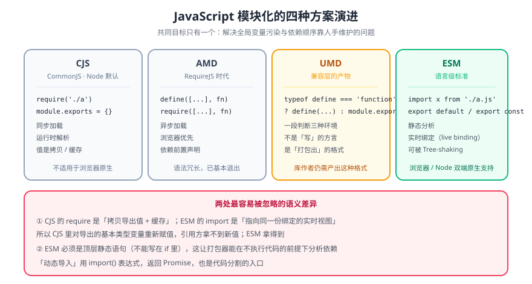

# JavaScript 模块化

> 模块化解决的是三个具体问题：**变量不污染全局**、**依赖关系显式声明**、**代码可被打包器做静态分析**。JS 没有内建模块系统的那十几年里，社区先后造了四种方案，最后 ESM 被写进语言标准——本页把这四种讲清，并说明它们之间怎么互操作。



## 一句话定位

看懂模块化的关键是把「**规范**」和「**运行时/打包器**」分开：CommonJS 是 Node 的规范，AMD 是浏览器的（RequireJS 时代），UMD 是「两种都能跑」的兼容写法，ESM 是**语言标准**。语法很像，加载时机与语义差别很大。

## 一、四种方案对照

| 方案 | 代表 | 加载时机 | 依赖解析 | 现在还用吗 |
| --- | --- | --- | --- | --- |
| **CommonJS（CJS）** | Node.js | **同步**、运行时 | 运行时 `require` | 用，Node 侧主力；ESM 已是首选 |
| **AMD** | RequireJS | **异步**、运行时 | 运行时数组声明 | 基本退场，老项目可见 |
| **UMD** | 各库的 dist 产物 | 两者兼容 | 运行时判断 | 库的兼容产物仍常见 |
| **ESM** | 语言标准 | **静态**、编译期 | 编译期 `import` | 用，**新代码首选** |

::: tip 一句话判断
看到 `require()` 是 CJS；看到 `define([...], fn)` 是 AMD；看到一大段 `typeof define === 'function' && define.amd` 的判断是 UMD；看到 `import` / `export` 是 ESM。
:::

## 二、CommonJS

```javascript
// utils/format.js —— 导出
function formatDate(d) { return d.toISOString().slice(0, 10); }
module.exports = { formatDate };

// index.js —— 导入（可以解构，也可以整个拿）
const { formatDate } = require('./utils/format');
console.log(formatDate(new Date()));
```

三个必须记住的性质：

1. **同步加载**：`require` 返回时模块已执行完——所以 CJS 不能在浏览器里直接用于网络模块；
2. **值拷贝**：`require` 拿到的是导出对象的**快照引用**。基本类型导出后再改，外部看不到；
3. **运行时解析**：路径可以是变量（`require('./' + name)`），代价是打包器无法做静态裁剪（tree-shaking）。

## 三、ESM

```javascript
// utils/format.mjs —— 具名导出
export function formatDate(d) { return d.toISOString().slice(0, 10); }
export const PAGE_SIZE = 10;

// 默认导出（一个模块只能有一个）
export default function log(msg) { console.log('[log]', msg); }

// index.mjs —— 导入
import log, { formatDate, PAGE_SIZE } from './utils/format.mjs';
import * as fmt from './utils/format.mjs';   // 命名空间对象
```

| 特性 | 说明 |
| --- | --- |
| 静态解析 | `import` 必须在顶层、路径必须是字面量 → 打包器能做 tree-shaking |
| **实时绑定** | 导入的是**绑定**不是值拷贝：导出的变量在模块内被重新赋值，导入侧能看到新值 |
| 提升 | `import` 声明会被提升到模块顶部，先于其他语句执行 |
| 严格模式 | ESM 默认严格模式，不需要 `'use strict'` |
| 顶层 await | 支持（`await` 直接写在模块顶层） |
| 浏览器 | `<script type="module" src="./main.mjs"></script>` |

::: danger CJS 与 ESM 互操作的两个坑
1. **`require()` 一个 ESM 模块**：Node 22+ 已支持 `require(esm)`（仅限没有顶层 await 的模块），但老版本会抛 `ERR_REQUIRE_ESM`。跨版本兼容的做法是统一到 ESM，或用动态 `import()`。
2. **默认导出不对称**：CJS 的 `module.exports = fn` 在 ESM 里要用 `import fn from` 拿；而 ESM 的 `export default` 在 CJS 侧拿到的是 `{ default: fn }`。**打包器（Vite/webpack）会自动加一层兼容**，源码直跑 Node 时不会——这解释了「构建后能跑、直接 node 跑报 undefined」。
:::

## 四、循环依赖

```javascript
// a.mjs
import { b } from './b.mjs';
export const a = 'A';
console.log(b);          // 视执行顺序，可能是 undefined

// b.mjs
import { a } from './a.mjs';
export const b = 'B';
```

ESM 用**实时绑定**处理循环：绑定存在但可能尚未初始化，于是读到 `undefined`（甚至抛 `ReferenceError` 而不是 `undefined`）。判据很简单——**出现「构建通过、运行时某个值为 undefined」时，先查有没有循环依赖**。处理方式是把共享部分抽到第三个模块，或用函数延迟取值。

## 五、打包器的角色

| 能力 | 说明 |
| --- | --- |
| 模块解析 | 把 `import './x'` 解析到具体文件，处理扩展名省略与别名（`@/`） |
| 依赖图 + tree-shaking | 基于 ESM 的静态结构删掉未使用导出（CJS 基本做不到） |
| 代码分割 | `import()` 动态导入 → 自动产出独立 chunk（路由懒加载的基础） |
| 格式产出 | 按 `build.target` 产出目标环境可用的格式与语法降级 |

```javascript
// 动态导入：只有真正执行到这行才去加载该 chunk
button.addEventListener('click', async () => {
  const { mountEditor } = await import('./editor/index.mjs');
  mountEditor(document.getElementById('app'));
});
```

::: warning `sideEffects` 不配，tree-shaking 会打折
打包器默认假设「模块可能有副作用」，不敢删。在 `package.json` 里声明 `"sideEffects": false`（或列出确实有副作用的文件，如 `*.css`）才能让未使用模块被真正删掉。**但配错会删掉必要的样式导入**——配之前先确认 CSS/全局注册那几处都列进了白名单。
:::

## 六、验证方式

```shell
# ① Node 下确认模块格式：.mjs 走 ESM，.cjs 走 CJS，.js 看 package.json 的 type
node -e "console.log(require('./package.json').type ?? 'commonjs')"

# ② ESM 实时绑定是否符合预期
node --input-type=module -e "
import { readFileSync } from 'node:fs';
console.log(typeof readFileSync);"      # 期望：function

# ③ 循环依赖排查：能让打包器输出依赖图
npx vite build --debug 2>&1 | grep -i "circular" | head
# 期望：无输出（有循环依赖时这里会列出环）

# ④ tree-shaking 是否生效：对比产物体积
ls -l dist/assets/*.js
# 期望：未使用的导出不会出现在产物里（对照移除前后的大小）
```

## 七、深入阅读

- [ES6 模块化开发](../../ECMAScript/ES6/Module/index.md)（语言侧的 `import` / `export` 语法与语义）
- [前端工程化](../../../Others/FrontendEngineering/index.md)（打包、分包、产物优化整体流程）
- [Node.js 模块系统](../../NodeJs/Modules/index.md)（CJS 解析规则、`exports` 与 `module.exports` 的区别）
- MDN · JavaScript modules：[developer.mozilla.org/zh-CN/docs/Web/JavaScript/Guide/Modules](https://developer.mozilla.org/zh-CN/docs/Web/JavaScript/Guide/Modules)
