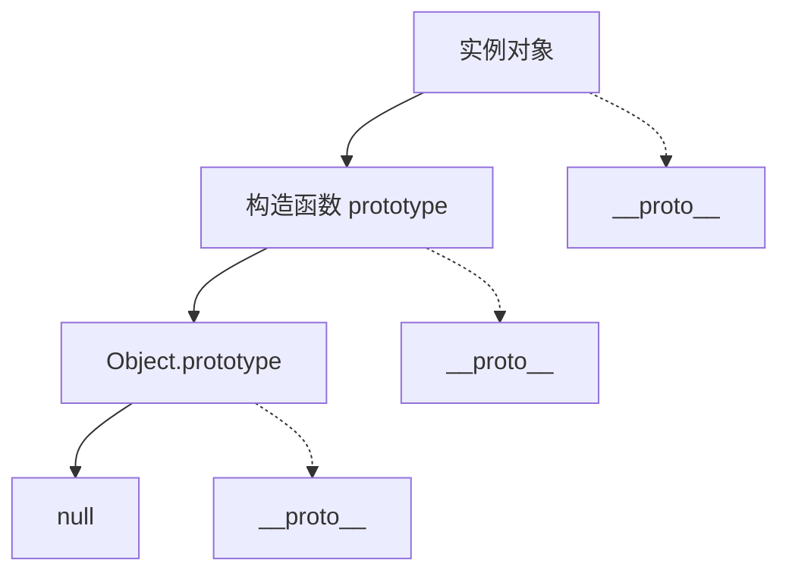

# JavaScript 对象与原型

## 对象创建

### 对象字面量

```javascript [object-literal.js]
const person = {
  name: '张三',
  age: 25,
  city: '北京',
  greet() {
    console.log(`你好，我是${this.name}`)
  }
}

// 动态属性名
const key = 'email'
const user = {
  name: '李四',
  [key]: 'lisi@example.com'
}

// 简写
const name = '王五'
const age = 30
const shortHand = { name, age }
```

### Object.create

```javascript [object-create.js]
const proto = {
  greet() {
    console.log(`你好，我是${this.name}`)
  }
}

const person = Object.create(proto)
person.name = '张三'
person.greet()  // 你好，我是张三

// 带属性描述符
const person2 = Object.create(proto, {
  name: {
    value: '李四',
    writable: true,
    enumerable: true,
    configurable: true
  }
})
```

### 构造函数

```javascript [constructor.js]
function Person(name, age) {
  this.name = name
  this.age = age
}

Person.prototype.greet = function() {
  console.log(`你好，我是${this.name}`)
}

const p1 = new Person('张三', 25)
const p2 = new Person('李四', 30)

p1.greet()  // 你好，我是张三
p2.greet()  // 你好，我是李四
```

### class 类

```javascript [class.js]
class Person {
  constructor(name, age) {
    this.name = name
    this.age = age
  }

  greet() {
    console.log(`你好，我是${this.name}`)
  }

  static create(name, age) {
    return new Person(name, age)
  }
}

const p = new Person('张三', 25)
p.greet()

const p2 = Person.create('李四', 30)
```

## 属性操作

### 属性描述符

```javascript [property-descriptor.js]
const obj = {}

Object.defineProperty(obj, 'name', {
  value: '张三',
  writable: false,      // 不可写
  enumerable: true,     // 可枚举
  configurable: false   // 不可配置
})

console.log(obj.name)   // 张三
// obj.name = '李四'    // 严格模式下报错

// 获取属性描述符
console.log(Object.getOwnPropertyDescriptor(obj, 'name'))

// 定义多个属性
Object.defineProperties(obj, {
  age: { value: 25, writable: true },
  city: { value: '北京' }
})
```

### 属性遍历

```javascript [property-iteration.js]
const obj = {
  name: '张三',
  age: 25,
  [Symbol('id')]: 1
}

// Object.keys - 可枚举属性名
console.log(Object.keys(obj))  // ['name', 'age']

// Object.values - 可枚举属性值
console.log(Object.values(obj))  // ['张三', 25]

// Object.entries - 键值对
console.log(Object.entries(obj))  // [['name', '张三'], ['age', 25]]

// for...in - 包括原型链
for (let key in obj) {
  console.log(key, obj[key])
}

// Object.getOwnPropertyNames - 所有属性名
console.log(Object.getOwnPropertyNames(obj))

// Object.getOwnPropertySymbols - 符号属性
console.log(Object.getOwnPropertySymbols(obj))
```

## 原型链



```javascript [prototype.js]
function Person(name) {
  this.name = name
}

Person.prototype.greet = function() {
  console.log(`你好，我是${this.name}`)
}

const p = new Person('张三')

// 原型链查找
console.log(p.name)        // 自身属性
console.log(p.greet())     // 原型属性
console.log(p.toString())  // Object.prototype

// 原型关系
console.log(p.__proto__ === Person.prototype)        // true
console.log(Person.prototype.__proto__ === Object.prototype)  // true
console.log(Object.prototype.__proto__ === null)     // true
```

## 继承

### 原型链继承

```javascript [prototype-inheritance.js]
function Animal(name) {
  this.name = name
}

Animal.prototype.speak = function() {
  console.log(`${this.name} 发出声音`)
}

function Dog(name, breed) {
  Animal.call(this, name)
  this.breed = breed
}

Dog.prototype = Object.create(Animal.prototype)
Dog.prototype.constructor = Dog

Dog.prototype.bark = function() {
  console.log(`${this.name} 汪汪叫`)
}

const dog = new Dog('旺财', '金毛')
dog.speak()  // 旺财 发出声音
dog.bark()   // 旺财 汪汪叫
```

### class 继承

```javascript [class-inheritance.js]
class Animal {
  constructor(name) {
    this.name = name
  }

  speak() {
    console.log(`${this.name} 发出声音`)
  }
}

class Dog extends Animal {
  constructor(name, breed) {
    super(name)
    this.breed = breed
  }

  bark() {
    console.log(`${this.name} 汪汪叫`)
  }

  // 重写方法
  speak() {
    console.log(`${this.name} 汪汪叫`)
  }
}

const dog = new Dog('旺财', '金毛')
dog.speak()  // 旺财 汪汪叫
dog.bark()   // 旺财 汪汪叫

// instanceof
console.log(dog instanceof Dog)     // true
console.log(dog instanceof Animal)  // true
console.log(dog instanceof Object)  // true
```

## 对象方法

### 对象合并

```javascript [object-merge.js]
const defaults = { theme: 'light', lang: 'zh' }
const options = { theme: 'dark' }

// Object.assign
const config1 = Object.assign({}, defaults, options)
console.log(config1)  // { theme: 'dark', lang: 'zh' }

// 展开运算符
const config2 = { ...defaults, ...options }
console.log(config2)  // { theme: 'dark', lang: 'zh' }

// 深度合并
function deepMerge(target, source) {
  const result = { ...target }
  for (const key in source) {
    if (source[key] && typeof source[key] === 'object') {
      result[key] = deepMerge(result[key] || {}, source[key])
    } else {
      result[key] = source[key]
    }
  }
  return result
}
```

### 对象拷贝

```javascript [object-copy.js]
const obj = {
  name: '张三',
  address: {
    city: '北京',
    district: '朝阳'
  }
}

// 浅拷贝
const shallow1 = { ...obj }
const shallow2 = Object.assign({}, obj)

shallow1.address.city = '上海'
console.log(obj.address.city)  // 上海（影响原对象）

// 深拷贝
const deep1 = JSON.parse(JSON.stringify(obj))
deep1.address.city = '广州'
console.log(obj.address.city)  // 上海（不影响原对象）

// 结构化克隆
const deep2 = structuredClone(obj)

// 自定义深拷贝
function deepClone(obj, map = new WeakMap()) {
  if (obj === null || typeof obj !== 'object') return obj
  if (map.has(obj)) return map.get(obj)
  
  const clone = Array.isArray(obj) ? [] : {}
  map.set(obj, clone)
  
  for (let key in obj) {
    if (obj.hasOwnProperty(key)) {
      clone[key] = deepClone(obj[key], map)
    }
  }
  
  return clone
}
```

### 对象冻结

```javascript [object-freeze.js]
const obj = {
  name: '张三',
  age: 25
}

// 防止扩展
Object.preventExtensions(obj)
// obj.email = 'test@example.com'  // 失败

// 密封（不可扩展 + 不可删除）
Object.seal(obj)
// delete obj.name  // 失败

// 冻结（不可扩展 + 不可删除 + 不可修改）
Object.freeze(obj)
// obj.name = '李四'  // 失败
// delete obj.age     // 失败

// 检查状态
console.log(Object.isExtensible(obj))  // false
console.log(Object.isSealed(obj))      // true
console.log(Object.isFrozen(obj))      // true
```

## 对象模式

### 单例模式

```javascript [singleton.js]
const Singleton = (function() {
  let instance
  
  function createInstance() {
    return { name: '单例对象' }
  }
  
  return {
    getInstance() {
      if (!instance) {
        instance = createInstance()
      }
      return instance
    }
  }
})()

const s1 = Singleton.getInstance()
const s2 = Singleton.getInstance()
console.log(s1 === s2)  // true
```

### 工厂模式

```javascript [factory.js]
class User {
  constructor(name) {
    this.name = name
  }
}

class Admin {
  constructor(name) {
    this.name = name
    this.role = 'admin'
  }
}

function UserFactory(name, type) {
  switch (type) {
    case 'user':
      return new User(name)
    case 'admin':
      return new Admin(name)
    default:
      throw new Error('未知类型')
  }
}

const user = UserFactory('张三', 'user')
const admin = UserFactory('李四', 'admin')
```

::: tip 提示
- 优先使用 class 语法创建对象
- 使用 Object.freeze() 保护常量对象
- 深拷贝注意循环引用问题
- 使用 WeakMap 存储私有数据
:::
