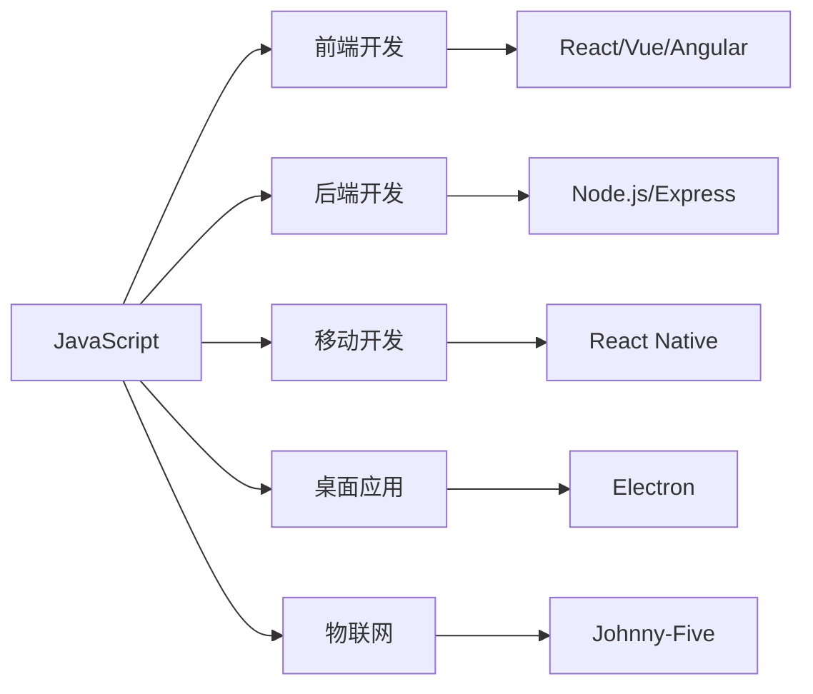
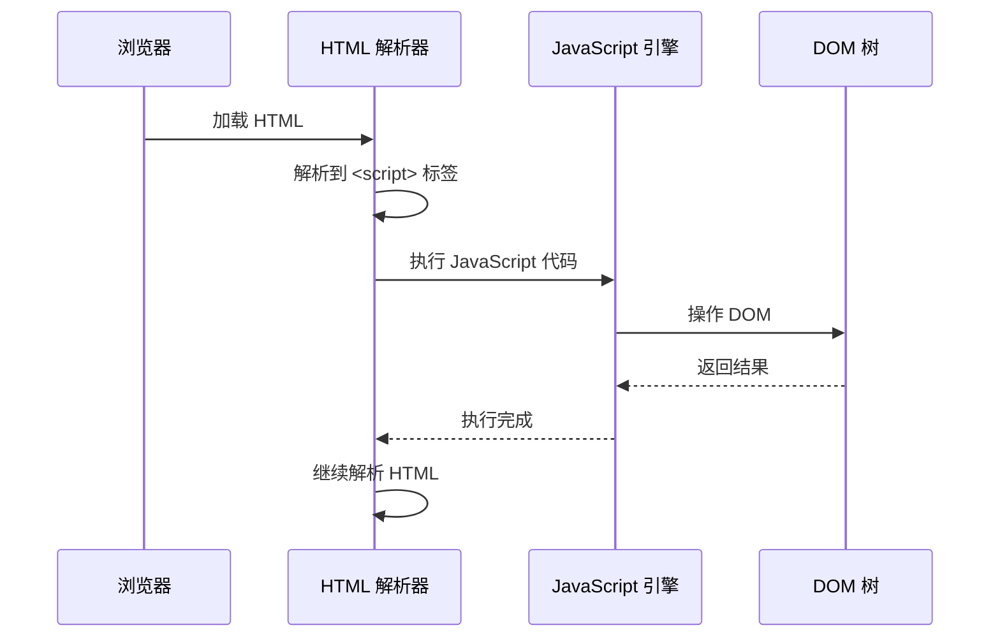

# JavaScript 概述与环境搭建

## JavaScript 简介

JavaScript 是一种轻量级、解释型或即时编译型的编程语言，具有函数优先的特性。它作为 HTML 和 CSS 之外的第三大 Web 核心技术，被广泛应用于网页开发、服务器端开发、移动应用开发等领域。

### JavaScript 历史

| 年份 | 事件 |
|------|------|
| 1995 | Brendan Eich 在 Netscape 公司用 10 天时间设计了 JavaScript |
| 1997 | ECMAScript 标准第一版发布 |
| 2009 | ECMAScript 5 发布，引入严格模式、JSON 支持等 |
| 2015 | ECMAScript 2015（ES6）发布，引入类、模块、箭头函数等重大特性 |
| 2016-至今 | 每年发布一个新版本，持续迭代 |

### JavaScript 特性

- **解释型语言**：代码在运行时被解释执行
- **弱类型**：变量类型可以动态改变
- **基于原型**：使用原型链实现继承
- **事件驱动**：支持异步编程模型
- **跨平台**：可在浏览器、服务器、移动端等运行

### JavaScript 应用场景



## 环境搭建

### 浏览器环境

任何现代浏览器都内置了 JavaScript 引擎：

- **Chrome**：V8 引擎
- **Firefox**：SpiderMonkey 引擎
- **Safari**：JavaScriptCore 引擎
- **Edge**：V8 引擎

打开浏览器开发者工具（F12），在 Console 面板中即可运行 JavaScript 代码：

```javascript [Console]
console.log('Hello, World!')
// 输出: Hello, World!
```

### Node.js 环境

Node.js 是基于 Chrome V8 引擎的 JavaScript 运行时：

```bash [终端]
# 下载并安装 Node.js
# https://nodejs.org/

# 验证安装
node --version
# 输出: v20.x.x

npm --version
# 输出: 10.x.x
```

创建第一个 Node.js 程序：

```javascript [hello.js]
console.log('Hello, Node.js!')

const os = require('os')
console.log('操作系统:', os.platform())
console.log('Node 版本:', process.version)
```

运行程序：

```bash [终端]
node hello.js
```

### VS Code 配置

1. 安装 [VS Code](https://code.visualstudio.com/)
2. 安装推荐扩展：
   - ESLint：代码检查
   - Prettier：代码格式化
   - JavaScript (ES6) code snippets：代码片段

### 在线运行环境

- [CodePen](https://codepen.io/)：前端代码在线编辑器
- [JSFiddle](https://jsfiddle.net/)：在线 JavaScript 编辑器
- [RunJS](https://runjs.cn/)：中文在线编辑器
- [Node.js Repl](https://replit.com/languages/nodejs)：在线 Node.js 环境

## 第一个 JavaScript 程序

### 在 HTML 中嵌入 JavaScript

```html [index.html]
<!DOCTYPE html>
<html lang="zh-CN">
<head>
  <meta charset="UTF-8">
  <title>第一个 JavaScript 程序</title>
</head>
<body>
  <h1 id="title">Hello</h1>
  
  <!-- 内联脚本 -->
  <script>
    document.getElementById('title').textContent = 'Hello, JavaScript!'
    alert('页面加载完成！')
  </script>
  
  <!-- 外部脚本 -->
  <script src="main.js"></script>
</body>
</html>
```

```javascript [main.js]
console.log('外部脚本加载成功！')

// 获取页面元素
const title = document.getElementById('title')

// 修改元素内容
title.textContent = 'Hello, JavaScript!'

// 添加点击事件
title.addEventListener('click', () => {
  alert('你点击了标题！')
})
```

### 在 Node.js 中运行

```javascript [server.js]
const http = require('http')

const server = http.createServer((req, res) => {
  res.writeHead(200, { 'Content-Type': 'text/html; charset=utf-8' })
  res.end('<h1>Hello, Node.js!</h1>')
})

server.listen(3000, () => {
  console.log('服务器运行在 http://localhost:3000')
})
```

## JavaScript 执行流程



## JavaScript 版本对比

| 特性 | ES5 | ES6+ |
|------|-----|------|
| 变量声明 | var | let, const |
| 函数 | function | 箭头函数 |
| 类 | 构造函数 | class |
| 模块 | CommonJS/AMD | import/export |
| 异步 | 回调函数 | Promise, async/await |
| 字符串 | 拼接 | 模板字符串 |
| 解构 | 手动赋值 | 解构赋值 |
| 默认参数 | 手动判断 | 默认参数 |

::: tip 提示
现代 JavaScript 开发推荐使用 ES6+ 语法，配合 Babel 等工具进行兼容性转换。
:::
