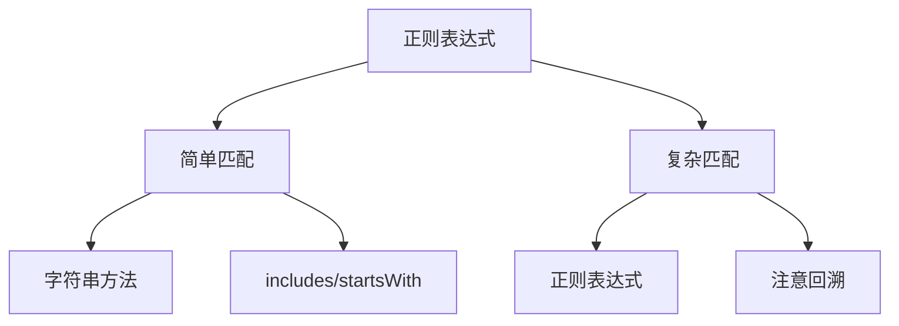

# JavaScript 正则表达式

## 正则表达式创建

```javascript [regex-create.js]
// 字面量
const re1 = /hello/
const re2 = /hello/gi

// 构造函数
const re3 = new RegExp('hello')
const re4 = new RegExp('hello', 'gi')

// 动态正则
const pattern = 'world'
const re5 = new RegExp(pattern, 'i')
```

## 修饰符

```javascript [regex-flags.js]
const str = 'Hello World hello world'

// g - 全局匹配
console.log(str.match(/hello/g))  // ['hello', 'hello']

// i - 忽略大小写
console.log(str.match(/hello/gi))  // ['Hello', 'hello']

// m - 多行模式
const multiline = 'first line\nsecond line\nthird line'
console.log(multiline.match(/^second/gm))  // ['second']

// s - dotAll 模式
const withNewline = 'hello\nworld'
console.log(withNewline.match(/hello.world/s))  // ['hello\nworld']

// u - Unicode 模式
const emoji = '😀'
console.log(/^.$/u.test(emoji))  // true

// y - sticky 模式
const stickyStr = 'hello world'
const re = /hello/y
console.log(re.test(stickyStr))  // true
re.lastIndex = 6
console.log(re.test(stickyStr))  // false
```

## 字符类

```javascript [regex-classes.js]
// 基础字符类
console.log(/\d/.test('123'))    // true（数字）
console.log(/\w/.test('abc'))    // true（单词字符）
console.log(/\s/.test(' '))      // true（空白）
console.log(/\D/.test('abc'))    // true（非数字）
console.log(/\W/.test('!'))      // true（非单词字符）
console.log(/\S/.test('a'))      // true（非空白）

// 自定义字符类
console.log(/[aeiou]/.test('hello'))   // true
console.log(/[0-9]/.test('123'))       // true
console.log(/[a-z]/.test('abc'))       // true
console.log(/[A-Z]/.test('ABC'))       // true

// 否定字符类
console.log(/[^0-9]/.test('abc'))      // true
console.log(/[^a-z]/.test('123'))      // true

// 点号
console.log(/./.test('a'))       // true（除换行外任意字符）
console.log(/./s.test('\n'))     // true（dotAll 模式）
```

## 量词

```javascript [regex-quantifiers.js]
// * - 0 次或多次
console.log(/ab*c/.test('ac'))       // true
console.log(/ab*c/.test('abc'))      // true
console.log(/ab*c/.test('abbbc'))    // true

// + - 1 次或多次
console.log(/ab+c/.test('ac'))       // false
console.log(/ab+c/.test('abc'))      // true
console.log(/ab+c/.test('abbbc'))    // true

// ? - 0 次或 1 次
console.log(/ab?c/.test('ac'))       // true
console.log(/ab?c/.test('abc'))      // true
console.log(/ab?c/.test('abbc'))     // false

// {n} - 恰好 n 次
console.log(/a{3}/.test('aa'))       // false
console.log(/a{3}/.test('aaa'))      // true

// {n,} - 至少 n 次
console.log(/a{2,}/.test('a'))       // false
console.log(/a{2,}/.test('aa'))      // true
console.log(/a{2,}/.test('aaaa'))    // true

// {n,m} - n 到 m 次
console.log(/a{2,4}/.test('a'))      // false
console.log(/a{2,4}/.test('aa'))     // true
console.log(/a{2,4}/.test('aaaaa'))  // true（匹配前 4 个）
```

## 边界

```javascript [regex-boundaries.js]
// ^ - 开头
console.log(/^Hello/.test('Hello World'))   // true
console.log(/^Hello/.test('World Hello'))   // false

// $ - 结尾
console.log(/World$/.test('Hello World'))   // true
console.log(/World$/.test('World Hello'))   // false

// \b - 单词边界
console.log(/\bcat\b/.test('the cat'))      // true
console.log(/\bcat\b/.test('category'))     // false

// \B - 非单词边界
console.log(/\Bcat\B/.test('category'))     // true
console.log(/\Bcat\B/.test('the cat'))      // false
```

## 分组与引用

```javascript [regex-groups.js]
const str = '2024-01-15'

// 捕获分组
const re1 = /(\d{4})-(\d{2})-(\d{2})/
const match1 = str.match(re1)
console.log(match1[1])  // 2024
console.log(match1[2])  // 01
console.log(match1[3])  // 15

// 命名分组
const re2 = /(?<year>\d{4})-(?<month>\d{2})-(?<day>\d{2})/
const match2 = str.match(re2)
console.log(match2.groups.year)   // 2024
console.log(match2.groups.month)  // 01
console.log(match2.groups.day)    // 15

// 非捕获分组
const re3 = /(?:https?:\/\/)?(\w+\.\w+)/
console.log(re3.exec('https://example.com')[1])  // example.com

// 反向引用
const re4 = /(\w+)\s+\1/
console.log(re4.test('hello hello'))   // true
console.log(re4.test('hello world'))   // false

// 替换中使用分组
const date = '2024-01-15'
console.log(date.replace(/(\d{4})-(\d{2})-(\d{2})/, '$2/$3/$1'))
// 01/15/2024
```

## 断言

```javascript [regex-assertions.js]
// 正向前瞻
const re1 = /\d+(?=元)/
console.log(re1.exec('价格是100元'))  // ['100']

// 负向前瞻
const re2 = /\d+(?!元)/
console.log(re2.exec('价格是100美元'))  // ['100']

// 正向后瞻
const re3 = /(?<=￥)\d+/
console.log(re3.exec('￥100'))  // ['100']

// 负向后瞻
const re4 = /(?<!￥)\d+/
console.log(re4.exec('$100'))  // ['100']
```

## 常用正则

```javascript [regex-common.js]
// 邮箱
const email = /^[a-zA-Z0-9._%+-]+@[a-zA-Z0-9.-]+\.[a-zA-Z]{2,}$/
console.log(email.test('test@example.com'))  // true

// 手机号
const phone = /^1[3-9]\d{9}$/
console.log(phone.test('13800138000'))  // true

// 身份证号
const idCard = /^\d{17}[\dXx]$/
console.log(idCard.test('110101199001011234'))  // true

// URL
const url = /^(https?:\/\/)?([\da-z.-]+)\.([a-z.]{2,6})([/\w.-]*)*\/?$/
console.log(url.test('https://example.com'))  // true

// IP 地址
const ip = /^(\d{1,3}\.){3}\d{1,3}$/
console.log(ip.test('192.168.1.1'))  // true

// 密码强度（至少 8 位，包含大小写字母和数字）
const password = /^(?=.*[a-z])(?=.*[A-Z])(?=.*\d)[a-zA-Z\d]{8,}$/
console.log(password.test('Password123'))  // true

// HTML 标签
const htmlTag = /<([a-z]+)([^<]+)*(?:>(.*)<\/\1>|\s+\/>)/gi
console.log(htmlTag.test('<div class="test">content</div>'))  // true
```

## 正则方法

```javascript [regex-methods.js]
const str = 'Hello, World! Hello, JavaScript!'
const re = /Hello/g

// test
console.log(/Hello/.test(str))  // true

// exec
console.log(re.exec(str))  // ['Hello', index: 0, ...]
console.log(re.exec(str))  // ['Hello', index: 14, ...]

// match
console.log(str.match(/Hello/g))  // ['Hello', 'Hello']

// matchAll
const matches = [...str.matchAll(/Hello/g)]
console.log(matches.length)  // 2

// search
console.log(str.search(/World/))  // 7

// replace
console.log(str.replace(/Hello/g, 'Hi'))
// Hi, World! Hi, JavaScript!

// replaceAll
console.log(str.replaceAll('Hello', 'Hi'))
// Hi, World! Hi, JavaScript!

// split
console.log(str.split(/[,!]\s*/))
// ['Hello', 'World', 'Hello', 'JavaScript', '']
```

## 正则性能



| 场景 | 推荐方法 | 说明 |
|------|----------|------|
| 简单查找 | includes | 性能最好 |
| 开头/结尾 | startsWith/endsWith | 语义清晰 |
| 复杂模式 | 正则 | 功能强大 |
| 替换 | replace | 支持正则 |

::: danger 注意
- 避免使用可能导致灾难性回溯的正则
- 量词嵌套可能导致性能问题
- 使用非捕获分组 `(?:...)` 提高性能
- 大量匹配时使用 `exec` 循环替代 `match`
:::
