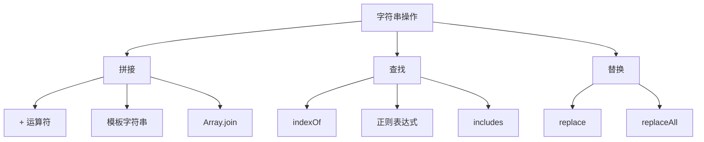

# JavaScript 字符串处理

## 字符串创建

```javascript [string-create.js]
// 字面量
const str1 = 'Hello'
const str2 = "World"
const str3 = `Hello World`

// String 构造函数
const str4 = new String('Hello')
const str5 = String(123)  // '123'

// 模板字符串
const name = '张三'
const age = 25
const greeting = `你好，我是${name}，今年${age}岁`

// 多行字符串
const multiline = `
  第一行
  第二行
  第三行
`
```

## 字符串属性

```javascript [string-props.js]
const str = 'Hello, JavaScript!'

// length
console.log(str.length)  // 19

// 访问字符
console.log(str[0])      // H
console.log(str.charAt(0))  // H
console.log(str.at(0))      // H
console.log(str.at(-1))     // !
```

## 字符串方法

### 查找方法

```javascript [string-find.js]
const str = 'Hello, JavaScript!'

// indexOf / lastIndexOf
console.log(str.indexOf('Java'))      // 7
console.log(str.indexOf('java'))      // -1
console.log(str.lastIndexOf('a'))     // 15

// includes
console.log(str.includes('Java'))     // true
console.log(str.includes('java'))     // false

// startsWith / endsWith
console.log(str.startsWith('Hello'))  // true
console.log(str.endsWith('!'))        // true
console.log(str.startsWith('Java', 7))// true

// search（支持正则）
console.log(str.search(/Java/))       // 7
console.log(str.search(/java/))       // -1

// match
console.log(str.match(/Java/))        // ['Java', index: 7, ...]
console.log(str.match(/[A-Z]/g))      // ['H', 'J', 'S']
```

### 截取方法

```javascript [string-slice.js]
const str = 'Hello, JavaScript!'

// slice
console.log(str.slice(0, 5))     // Hello
console.log(str.slice(7))        // JavaScript!
console.log(str.slice(-5))       // ript!

// substring（不支持负数）
console.log(str.substring(0, 5)) // Hello
console.log(str.substring(7))    // JavaScript!

// substr（已废弃）
console.log(str.substr(7, 10))   // JavaScript
```

### 转换方法

```javascript [string-transform.js]
const str = 'Hello, JavaScript!'

// 大小写转换
console.log(str.toUpperCase())   // HELLO, JAVASCRIPT!
console.log(str.toLowerCase())   // hello, javascript!

// 替换
console.log(str.replace('Java', 'Type'))  // Hello, TypeScript!
console.log(str.replace(/[aeiou]/g, '*')) // H*ll*, J*v*scr*pt!

// 分割
console.log(str.split(', '))     // ['Hello', 'JavaScript!']
console.log(str.split(''))       // ['H', 'e', 'l', 'l', 'o', ...]

// 去除空白
const padded = '  Hello  '
console.log(padded.trim())       // 'Hello'
console.log(padded.trimStart())  // 'Hello  '
console.log(padded.trimEnd())    // '  Hello'

// 填充
console.log('5'.padStart(3, '0'))   // '005'
console.log('5'.padEnd(3, '0'))     // '500'
console.log('hello'.padStart(10))   // '     hello'
```

### 拼接方法

```javascript [string-concat.js]
const str1 = 'Hello'
const str2 = 'World'

// concat
console.log(str1.concat(', ', str2, '!'))  // Hello, World!

// + 运算符
console.log(str1 + ', ' + str2 + '!')      // Hello, World!

// 模板字符串
console.log(`${str1}, ${str2}!`)           // Hello, World!

// join
const arr = ['Hello', 'World']
console.log(arr.join(', '))                // Hello, World!
```

## 模板字符串高级

```javascript [template-literal.js]
// 表达式
const x = 10, y = 20
console.log(`${x} + ${y} = ${x + y}`)  // 10 + 20 = 30

// 函数调用
const format = (n) => n.toFixed(2)
console.log(`价格：${format(9.9)}`)  // 价格：9.90

// 嵌套
const user = { name: '张三', items: ['苹果', '香蕉'] }
console.log(`
  用户：${user.name}
  购物车：
  ${user.items.map(item => `  - ${item}`).join('\n')}
`)

// 标签模板
function highlight(strings, ...values) {
  return strings.reduce((result, str, i) => {
    const value = values[i] || ''
    return result + str + `<mark>${value}</mark>`
  }, '')
}

const name = '张三'
const action = '登录'
console.log(highlight`用户${name}执行了${action}操作`)
// 用户<mark>张三</mark>执行了<mark>登录</mark>操作
```

## 字符串编码

```javascript [string-encoding.js]
const str = 'Hello'

// charCodeAt
console.log(str.charCodeAt(0))  // 72 (H 的 Unicode)

// fromCharCode
console.log(String.fromCharCode(72, 101, 108, 108, 111))  // Hello

// codePointAt（支持 emoji）
const emoji = '😀'
console.log(emoji.codePointAt(0))  // 128512

// fromCodePoint
console.log(String.fromCodePoint(128512))  // 😀

// normalize（Unicode 规范化）
const str1 = 'é'
const str2 = 'e\u0301'
console.log(str1 === str2)  // false
console.log(str1.normalize() === str2.normalize())  // true
```

## 字符串遍历

```javascript [string-iterate.js]
const str = 'Hello'

// for...of
for (const char of str) {
  console.log(char)
}

// 展开运算符
const chars = [...str]
console.log(chars)  // ['H', 'e', 'l', 'l', 'o']

// Array.from
const chars2 = Array.from(str)

// 处理 emoji
const emojiStr = 'Hello😀World'
console.log([...emojiStr])  // ['H', 'e', 'l', 'l', 'o', '😀', 'W', 'o', 'r', 'l', 'd']
```

## 字符串比较

```javascript [string-compare.js]
// 字典序比较
console.log('apple' < 'banana')   // true
console.log('apple' > 'Apple')    // true（小写字母编码更大）

// localeCompare（本地化比较）
console.log('apple'.localeCompare('banana'))   // -1
console.log('banana'.localeCompare('apple'))   // 1
console.log('apple'.localeCompare('apple'))    // 0

// 中文比较
console.log('张三'.localeCompare('李四', 'zh'))  // 按拼音排序

// 忽略大小写比较
console.log('Hello'.localeCompare('hello', undefined, { sensitivity: 'base' }))  // 0
```

## 字符串常用算法

```javascript [string-algorithms.js]
// 反转字符串
const reverse = (str) => [...str].reverse().join('')
console.log(reverse('hello'))  // 'olleh'

// 回文判断
const isPalindrome = (str) => {
  const clean = str.toLowerCase().replace(/[^a-z0-9]/g, '')
  return clean === [...clean].reverse().join('')
}
console.log(isPalindrome('A man, a plan, a canal: Panama'))  // true

// 统计字符频率
const charCount = (str) => {
  return [...str].reduce((acc, char) => {
    acc[char] = (acc[char] || 0) + 1
    return acc
  }, {})
}
console.log(charCount('hello'))  // { h: 1, e: 1, l: 2, o: 1 }

// 驼峰转换
const toCamelCase = (str) => {
  return str.toLowerCase().replace(/[-_\s]+(.)?/g, (_, char) => char ? char.toUpperCase() : '')
}
console.log(toCamelCase('hello-world'))      // helloWorld
console.log(toCamelCase('hello_world'))      // helloWorld
console.log(toCamelCase('hello world'))      // helloWorld

// 首字母大写
const capitalize = (str) => str.charAt(0).toUpperCase() + str.slice(1)
console.log(capitalize('hello'))  // Hello

// 截断字符串
const truncate = (str, maxLen) => {
  return str.length > maxLen ? str.slice(0, maxLen) + '...' : str
}
console.log(truncate('Hello, World!', 8))  // Hello, ...
```

## 字符串性能



| 操作 | 推荐方法 | 说明 |
|------|----------|------|
| 拼接 | 模板字符串 | 可读性好 |
| 大量拼接 | Array.join | 性能更好 |
| 查找 | includes | 语义清晰 |
| 复杂查找 | 正则 | 功能强大 |
| 替换 | replace/replaceAll | 支持正则 |
| 截取 | slice | 支持负数 |

::: tip 提示
- 优先使用模板字符串进行拼接
- 大量字符串拼接使用 Array.join
- 使用 includes 替代 indexOf 进行存在性检查
- 正则表达式注意性能，避免灾难性回溯
:::
