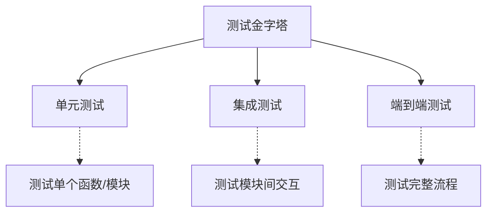

# JavaScript 测试

## 测试类型



## Jest 基础

### 安装配置

```bash [install.sh]
npm install --save-dev jest
```

```json [jest.config.js]
module.exports = {
  testEnvironment: 'jsdom',
  setupFilesAfterEnv: ['<rootDir>/setupTests.js'],
  collectCoverage: true,
  coverageDirectory: 'coverage',
  coverageReporters: ['text', 'lcov'],
  testMatch: ['**/__tests__/**/*.test.js'],
  moduleNameMapper: {
    '^@/(.*)$': '<rootDir>/src/$1'
  }
}
```

### 基础测试

```javascript [basic.test.js]
// math.js
function add(a, b) {
  return a + b
}

function subtract(a, b) {
  return a - b
}

function multiply(a, b) {
  return a * b
}

function divide(a, b) {
  if (b === 0) throw new Error('除数不能为 0')
  return a / b
}

module.exports = { add, subtract, multiply, divide }

// math.test.js
const { add, subtract, multiply, divide } = require('./math')

test('add 函数', () => {
  expect(add(1, 2)).toBe(3)
  expect(add(-1, 1)).toBe(0)
  expect(add(0, 0)).toBe(0)
})

test('subtract 函数', () => {
  expect(subtract(5, 3)).toBe(2)
  expect(subtract(0, 5)).toBe(-5)
})

test('multiply 函数', () => {
  expect(multiply(2, 3)).toBe(6)
  expect(multiply(0, 5)).toBe(0)
})

test('divide 函数', () => {
  expect(divide(6, 3)).toBe(2)
  expect(divide(5, 2)).toBe(2.5)
  expect(() => divide(1, 0)).toThrow('除数不能为 0')
})
```

### 匹配器

```javascript [matchers.test.js]
test('相等匹配', () => {
  expect(1 + 1).toBe(2)           // 严格相等
  expect({ name: '张三' }).toEqual({ name: '张三' })  // 深度相等
})

test('真假匹配', () => {
  expect(true).toBeTruthy()
  expect(false).toBeFalsy()
  expect(null).toBeNull()
  expect(undefined).toBeUndefined()
  expect('hello').toBeDefined()
})

test('数字匹配', () => {
  expect(2 + 2).toBeGreaterThan(3)
  expect(2 + 2).toBeGreaterThanOrEqual(4)
  expect(2 + 2).toBeLessThan(5)
  expect(2 + 2).toBeLessThanOrEqual(4)
  expect(0.1 + 0.2).toBeCloseTo(0.3)
})

test('字符串匹配', () => {
  expect('hello world').toMatch(/world/)
  expect('hello world').toContain('world')
  expect('hello world').toHaveLength(11)
})

test('数组匹配', () => {
  expect([1, 2, 3]).toContain(2)
  expect([1, 2, 3]).toEqual(expect.arrayContaining([2, 3]))
})

test('对象匹配', () => {
  expect({ name: '张三', age: 25 }).toHaveProperty('name')
  expect({ name: '张三', age: 25 }).toMatchObject({ name: '张三' })
})

test('异常匹配', () => {
  expect(() => { throw new Error('错误') }).toThrow()
  expect(() => { throw new Error('错误') }).toThrow('错误')
  expect(() => { throw new Error('错误') }).toThrow(Error)
})
```

### 异步测试

```javascript [async.test.js]
// 异步函数
function fetchData() {
  return new Promise(resolve => {
    setTimeout(() => resolve('数据'), 1000)
  })
}

function fetchError() {
  return new Promise((_, reject) => {
    setTimeout(() => reject(new Error('请求失败')), 1000)
  })
}

// 回调方式
test('fetchData 回调方式', (done) => {
  fetchData().then(data => {
    expect(data).toBe('数据')
    done()
  })
})

// async/await 方式
test('fetchData async/await', async () => {
  const data = await fetchData()
  expect(data).toBe('数据')
})

// 错误测试
test('fetchError 错误测试', async () => {
  await expect(fetchError()).rejects.toThrow('请求失败')
})

// Promise 方式
test('fetchData Promise', () => {
  return expect(fetchData()).resolves.toBe('数据')
})
```

### Mock 和 Spy

```javascript [mock.test.js]
// Mock 函数
test('mock 函数', () => {
  const mockFn = jest.fn()
  mockFn('hello')
  mockFn('world')

  expect(mockFn).toHaveBeenCalled()
  expect(mockFn).toHaveBeenCalledTimes(2)
  expect(mockFn).toHaveBeenCalledWith('hello')
  expect(mockFn.mock.calls).toEqual([['hello'], ['world']])
})

// Mock 返回值
test('mock 返回值', () => {
  const mockFn = jest.fn()
    .mockReturnValue('默认值')
    .mockReturnValueOnce('第一次')
    .mockReturnValueOnce('第二次')

  expect(mockFn()).toBe('第一次')
  expect(mockFn()).toBe('第二次')
  expect(mockFn()).toBe('默认值')
})

// Mock 模块
jest.mock('./api', () => ({
  fetchUsers: jest.fn(() => Promise.resolve([{ id: 1, name: '张三' }]))
}))

test('mock 模块', async () => {
  const { fetchUsers } = require('./api')
  const users = await fetchUsers()
  expect(users).toHaveLength(1)
  expect(users[0].name).toBe('张三')
})

// Spy
test('spy', () => {
  const obj = {
    method() { return '原始值' }
  }

  const spy = jest.spyOn(obj, 'method')
  obj.method()

  expect(spy).toHaveBeenCalled()
  expect(spy).toHaveReturnedWith('原始值')

  spy.mockRestore()
})
```

## 测试覆盖率

```javascript [coverage.test.js]
// user.js
class User {
  constructor(name, age) {
    this.name = name
    this.age = age
  }

  isAdult() {
    return this.age >= 18
  }

  greet() {
    if (this.isAdult()) {
      return `你好，${this.name}`
    }
    return `你好，小朋友 ${this.name}`
  }
}

module.exports = User

// user.test.js
const User = require('./user')

describe('User 类', () => {
  let user

  beforeEach(() => {
    user = new User('张三', 25)
  })

  afterEach(() => {
    user = null
  })

  test('构造函数', () => {
    expect(user.name).toBe('张三')
    expect(user.age).toBe(25)
  })

  test('isAdult 成年人', () => {
    expect(user.isAdult()).toBe(true)
  })

  test('isAdult 未成年人', () => {
    user.age = 15
    expect(user.isAdult()).toBe(false)
  })

  test('greet 成年人', () => {
    expect(user.greet()).toBe('你好，张三')
  })

  test('greet 未成年人', () => {
    user.age = 15
    expect(user.greet()).toBe('你好，小朋友 张三')
  })
})
```

## 测试钩子

```javascript [hooks.test.js]
describe('测试钩子', () => {
  beforeAll(() => {
    console.log('所有测试前执行一次')
  })

  afterAll(() => {
    console.log('所有测试后执行一次')
  })

  beforeEach(() => {
    console.log('每个测试前执行')
  })

  afterEach(() => {
    console.log('每个测试后执行')
  })

  test('测试 1', () => {
    expect(true).toBe(true)
  })

  test('测试 2', () => {
    expect(1 + 1).toBe(2)
  })
})

// 跳过测试
test.skip('跳过测试', () => {
  // 不会执行
})

// 只运行指定测试
test.only('只运行这个测试', () => {
  expect(true).toBe(true)
})
```

## DOM 测试

```javascript [dom.test.js]
// 设置 jsdom 环境
// @jest-environment jsdom

test('DOM 操作', () => {
  document.body.innerHTML = '<div id="app"><button>点击</button></div>'

  const button = document.querySelector('button')
  button.addEventListener('click', () => {
    button.textContent = '已点击'
  })

  button.click()
  expect(button.textContent).toBe('已点击')
})

test('表单测试', () => {
  document.body.innerHTML = `
    <form id="login">
      <input name="username" />
      <input name="password" type="password" />
      <button type="submit">登录</button>
    </form>
  `

  const form = document.querySelector('#login')
  form.addEventListener('submit', (e) => {
    e.preventDefault()
    const formData = new FormData(form)
    console.log(formData.get('username'))
  })

  const username = document.querySelector('[name="username"]')
  const password = document.querySelector('[name="password"]')
  const submit = document.querySelector('button[type="submit"]')

  username.value = 'admin'
  password.value = '123456'
  submit.click()
})
```

## 快照测试

```javascript [snapshot.test.js]
test('快照测试', () => {
  const user = {
    name: '张三',
    age: 25,
    email: 'zhangsan@example.com'
  }

  expect(user).toMatchSnapshot()
})

test('更新快照', () => {
  const user = {
    name: '李四',
    age: 30
  }

  expect(user).toMatchSnapshot()
})

// 内联快照
test('内联快照', () => {
  const result = { id: 1, name: '测试' }
  expect(result).toMatchInlineSnapshot(`
    {
      "id": 1,
      "name": "测试",
    }
  `)
})
```

## 测试最佳实践

```javascript [best-practices.test.js]
// 测试命名
describe('UserService', () => {
  describe('#createUser', () => {
    test('应该成功创建用户', () => {
      // 测试逻辑
    })

    test('应该拒绝重复的用户名', () => {
      // 测试逻辑
    })

    test('应该拒绝无效的邮箱', () => {
      // 测试逻辑
    })
  })
})

// 测试数据工厂
function createUser(overrides = {}) {
  return {
    name: '测试用户',
    email: 'test@example.com',
    age: 25,
    ...overrides
  }
}

test('使用工厂函数', () => {
  const user = createUser({ name: '自定义' })
  expect(user.name).toBe('自定义')
})

// 测试隔离
describe('独立测试', () => {
  let db

  beforeEach(() => {
    db = createTestDatabase()
  })

  afterEach(() => {
    db.destroy()
  })

  test('测试 1', () => {
    // 使用独立的数据库
  })

  test('测试 2', () => {
    // 使用独立的数据库
  })
})
```

## 测试运行

```bash [test-commands.sh]
# 运行所有测试
npm test

# 监听模式
npm test -- --watch

# 覆盖率报告
npm test -- --coverage

# 运行指定文件
npm test -- user.test.js

# 运行匹配名称的测试
npm test -- -t "UserService"

# 更新快照
npm test -- --updateSnapshot
```

::: tip 提示
- 测试应该独立、可重复
- 使用描述性的测试名称
- 测试边界条件和异常情况
- 保持测试简洁明了
- 定期审查测试覆盖率
:::
