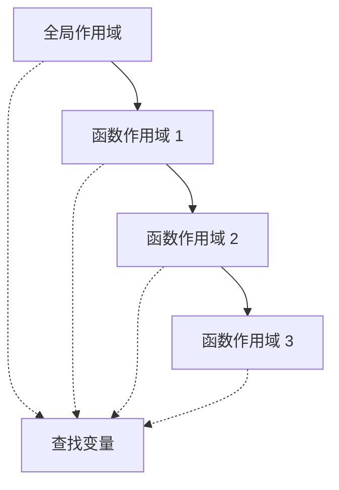

# JavaScript 变量与作用域

## 变量声明

### var 声明

```javascript [var.js]
// var 声明
var name = 'JavaScript'
var age = 25

// 变量提升
console.log(hoisted)  // undefined
var hoisted = '提升变量'

// 重复声明
var x = 1
var x = 2
console.log(x)  // 2
```

### let 声明

```javascript [let.js]
// let 声明
let name = 'JavaScript'
let age = 25

// 不存在变量提升
// console.log(notHoisted)  // ReferenceError
let notHoisted = '不提升'

// 不能重复声明
// let y = 1
// let y = 2  // SyntaxError

// 块级作用域
if (true) {
  let blockVar = '块级变量'
  console.log(blockVar)  // 块级变量
}
// console.log(blockVar)  // ReferenceError
```

### const 声明

```javascript [const.js]
// const 声明常量
const PI = 3.14159
const API_URL = 'https://api.example.com'

// 必须初始化
// const UNINITIALIZED  // SyntaxError

// 不能重新赋值
// PI = 3  // TypeError

// 对象属性可修改
const user = { name: '张三' }
user.name = '李四'  // 允许
// user = {}  // TypeError

// 数组元素可修改
const arr = [1, 2, 3]
arr.push(4)  // 允许
// arr = []  // TypeError
```

## 作用域

### 全局作用域

```javascript [global.js]
// 全局变量
let globalVar = '全局变量'

function showGlobal() {
  console.log(globalVar)  // 可以访问
}

showGlobal()
console.log(globalVar)  // 可以访问
```

### 函数作用域

```javascript [function-scope.js]
function myFunction() {
  let localVar = '局部变量'
  console.log(localVar)  // 局部变量
}

myFunction()
// console.log(localVar)  // ReferenceError
```

### 块级作用域

```javascript [block-scope.js]
if (true) {
  let blockLet = 'let 块级'
  const blockConst = 'const 块级'
  var blockVar = 'var 无块级'
}

// console.log(blockLet)   // ReferenceError
// console.log(blockConst) // ReferenceError
console.log(blockVar)     // var 无块级作用域
```

### 词法作用域

```javascript [lexical-scope.js]
let outer = '外部变量'

function outerFunc() {
  let inner = '内部变量'
  
  function innerFunc() {
    console.log(outer)  // 可以访问外部
    console.log(inner)  // 可以访问内部
  }
  
  innerFunc()
}

outerFunc()
```

## 作用域链



```javascript [scope-chain.js]
let globalVar = '全局'

function level1() {
  let var1 = 'level1'
  
  function level2() {
    let var2 = 'level2'
    
    function level3() {
      let var3 = 'level3'
      
      // 作用域链查找
      console.log(var3)    // level3（当前作用域）
      console.log(var2)    // level2（上一级）
      console.log(var1)    // level1（上两级）
      console.log(globalVar) // 全局（最外层）
    }
    
    level3()
  }
  
  level2()
}

level1()
```

## 闭包

```javascript [closure.js]
// 基础闭包
function createCounter() {
  let count = 0
  
  return {
    increment: () => ++count,
    decrement: () => --count,
    getCount: () => count
  }
}

const counter = createCounter()
console.log(counter.increment())  // 1
console.log(counter.increment())  // 2
console.log(counter.decrement())  // 1
console.log(counter.getCount())   // 1

// 闭包应用：数据私有化
function createBankAccount(initialBalance) {
  let balance = initialBalance
  
  return {
    deposit: (amount) => {
      balance += amount
      return balance
    },
    withdraw: (amount) => {
      if (amount > balance) {
        throw new Error('余额不足')
      }
      balance -= amount
      return balance
    },
    getBalance: () => balance
  }
}

const account = createBankAccount(1000)
console.log(account.deposit(500))    // 1500
console.log(account.withdraw(200))   // 1300
console.log(account.getBalance())    // 1300
// console.log(account.balance)      // undefined（私有）
```

## 暂时性死区

```javascript [tdz.js]
// 暂时性死区示例
console.log(typeof x)  // undefined（var 未声明）

// console.log(typeof y)  // ReferenceError（let 暂时性死区）
let y = 10

// 函数参数也有暂时性死区
function foo(x = x) {  // ReferenceError
  // ...
}

// 正确写法
function bar(x = 10) {
  console.log(x)
}
bar()  // 10
```

## 变量提升机制

```javascript [hoisting.js]
// 变量提升
console.log(a)  // undefined
var a = 1

// 函数提升
hello()  // Hello!
function hello() {
  console.log('Hello!')
}

// 函数表达式不提升
// greet()  // TypeError
var greet = function() {
  console.log('Hi!')
}

// let/const 不提升
// console.log(b)  // ReferenceError
let b = 2
```

## 全局对象

```javascript [global-object.js]
// 浏览器环境
console.log(window)       // 全局对象
console.log(this === window)  // true（全局作用域）

// Node.js 环境
console.log(global)       // 全局对象
console.log(globalThis)   // 通用全局对象

// 全局属性
console.log(globalThis.Infinity)
console.log(globalThis.NaN)
console.log(globalThis.undefined)
```

::: danger 注意
- 避免使用 `var`，优先使用 `let` 和 `const`
- 全局变量会污染全局命名空间，应尽量避免
- 闭包会导致内存占用，注意及时释放引用
:::
