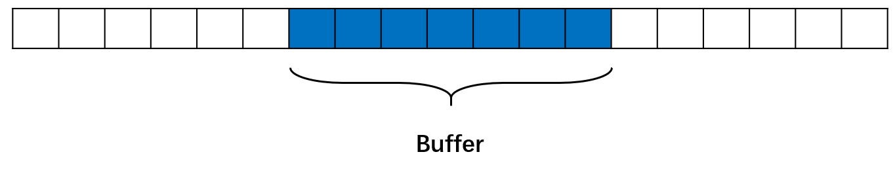
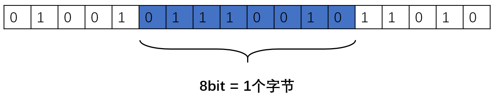
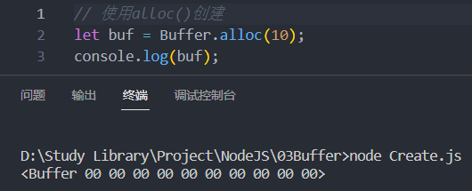
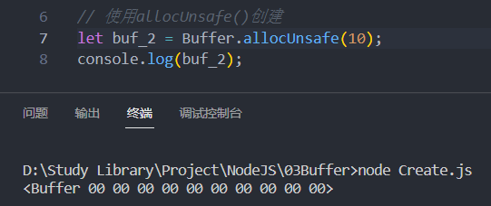
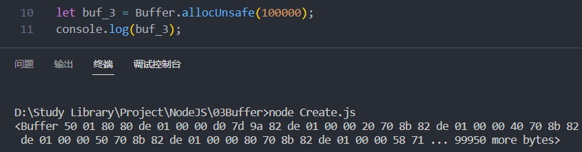
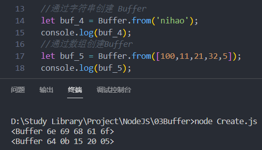
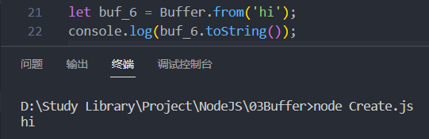
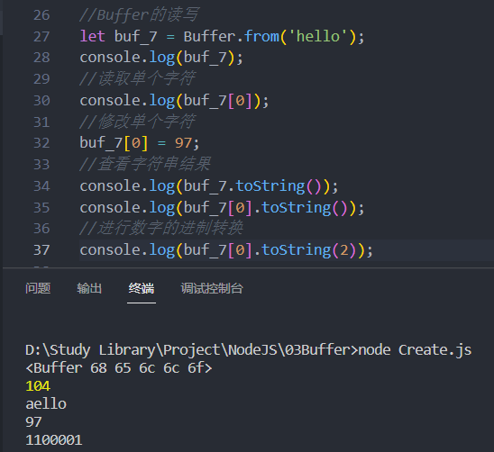
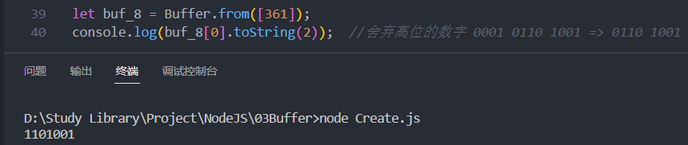
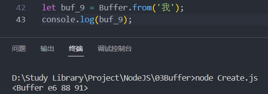

# Buffer

Buffer(缓冲区)，是一个类似于Array的**对象**，用于表示固定长度的字节序列

换句话说，Buffer就是一段固定长度的内存空间，用于处理二进制数据。



## 特点

1. Buffer 大小固定且无法调整

2. Buffer 性能较好，可以直接对计算机内存进行操作

3. 每个元素的大小为 1 字节 (byte)

   

**说明**：Buffer 是Node.js 中的内置模块。在启动时已经将此模块自动加载，不需要手动导入即可使用，直接使用Buffer模块完成操作即可。

## 创建Buffer

### 使用alloc()创建

创建了一个长度为 10 字节的 Buffer，相当于申请了 10 字节的内存空间，每个字节的值为 0：

```js [alloc.js]
// 使用alloc()创建
let buf = Buffer.alloc(10)
console.log(buf)
```



### 使用allocUnsafe()创建

创建了一个长度为 10 字节的 Buffer，buffer 中可能存在旧的数据，不会对旧数据清除，但是创建速度快。可能会影响执行结果，所以叫unsafe(不安全的)

```js [allocUnsafe.js]
// 使用allocUnsafe()创建
let buf_2 = Buffer.allocUnsafe(10)
console.log(buf_2)
```



```js [allocUnsafe-large.js]
let buf_3 = Buffer.allocUnsafe(100000)
console.log(buf_3)
```



### 使用from()创建

可以通过字符串/数组创建Buffer

```js [from.js]
//通过字符串创建 Buffer
//将字母转换成Unicode 码表 然后存储成Buffer
let buf_4 = Buffer.from('hello')
console.log(buf_4)
//通过数组创建 Buffer
let buf_5 = Buffer.from([105, 108, 111, 118, 101, 121, 111, 117])
console.log(buf_5)
```



## Buffer的操作

### 与字符串的转换

使用`toString()`将Buffer转换成字符串

**说明**：`toString()`默认按照utf-8编码方式进行转换

```js [toString.js]
let buf_6 = Buffer.from('hi')
console.log(buf_6.toString())
```



### Buffer的读写

Buffer 可以直接通过`[]` 的方式对数据进行处理。

```js [read-write.js]
let buf_7 = Buffer.from('hello')

//读取单个字符
console.log(buf_7[0])
console.log(buf_7.toString())

//修改单个字符
buf_7[0] = 97
//查看字符串结果
console.log(buf_7.toString())
console.log(buf_7[0].toString())
//进行数字的进制转换
console.log(buf_7[0].toString(2))
```



## 注意事项

### 溢出问题

如果修改的数值超过 255 ，则超过 8 位数据会被舍弃

```js [overflow.js]
let buf_8 = Buffer.from([361])
console.log(buf_8[0].toString(2)) //舍弃高位的数字 0001 0110 1001 => 0110 1001
```



### 中文问题

一个 utf-8 的字符一般占 3 个字节

```js [chinese.js]
let buf_9 = Buffer.from('我')
console.log(buf_9)
```



## 常用方法

### Buffer.concat()

合并多个Buffer对象

```js [concat.js]
const buf1 = Buffer.from('Hello ')
const buf2 = Buffer.from('World')
const buf3 = Buffer.concat([buf1, buf2])
console.log(buf3.toString()) // Hello World
```

### Buffer.isBuffer()

判断是否为Buffer对象

```js [isBuffer.js]
const buf = Buffer.from('test')
console.log(Buffer.isBuffer(buf)) // true
console.log(Buffer.isBuffer('test')) // false
```

### Buffer.byteLength()

获取字符串的字节长度

```js [byteLength.js]
console.log(Buffer.byteLength('hello')) // 5
console.log(Buffer.byteLength('你好')) // 6
```

## 编码方式

Buffer 支持多种编码方式：

- `utf8`：默认编码，支持多字节字符
- `ascii`：仅支持 ASCII 字符
- `base64`：Base64 编码
- `hex`：十六进制编码
- `utf16le`：UTF-16 小端编码

```js [encoding.js]
const buf = Buffer.from('hello', 'base64')
console.log(buf.toString('hex'))
```

::: tip 提示
- Buffer.alloc() 会初始化内存，更安全
- Buffer.allocUnsafe() 性能更好，但可能包含旧数据
- 处理中文时注意每个字符占 3 个字节
:::
