# Node.js 安装

## Windows 安装

打开 [Node.js官网](http://nodejs.org) 下载Node.js

- Node.js 官网：http://nodejs.org
- Node.js 中文站下载：http://nodejs.cn/download
- Node.js 历史版本：https://registry.npmmirror.com/binary.html?path=node

**注意**：

- LTS：长期支持版本
- Current：最新版

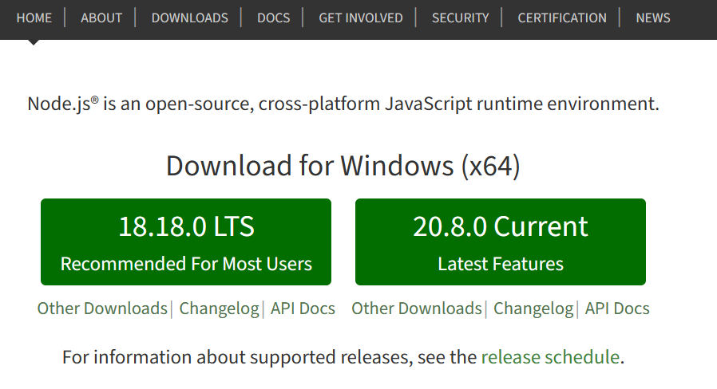

也可以通过 https://nodejs.org/en/download 下载

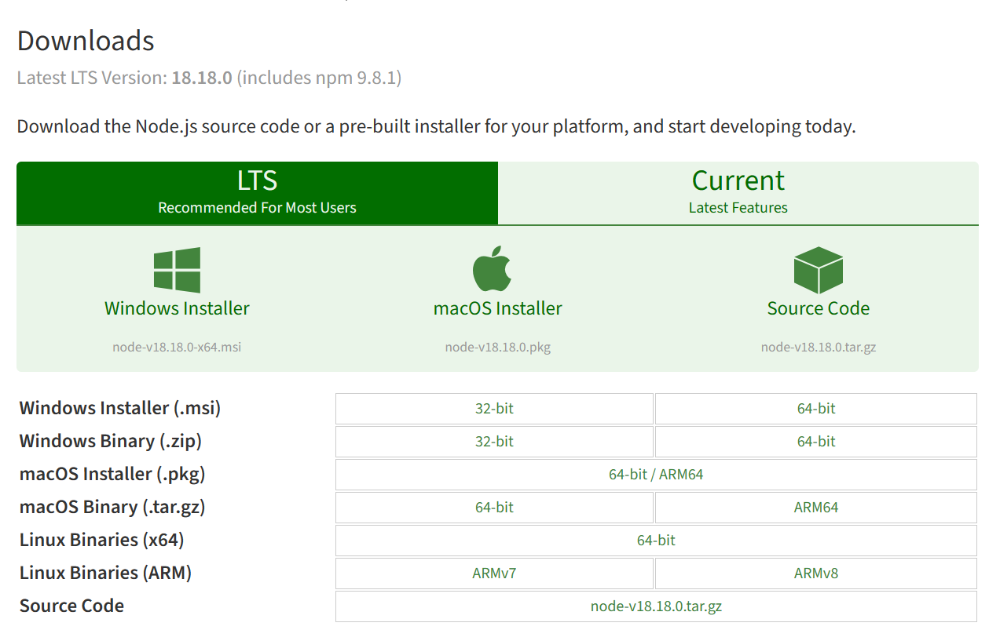

下载完毕后，双击安装Node.js

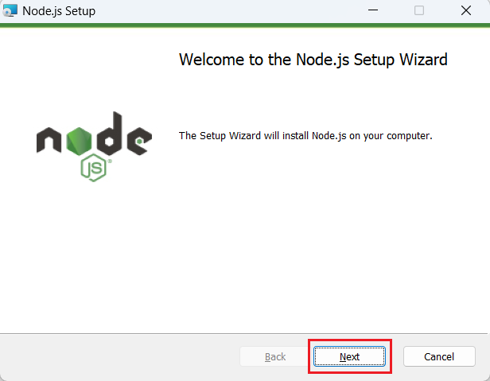

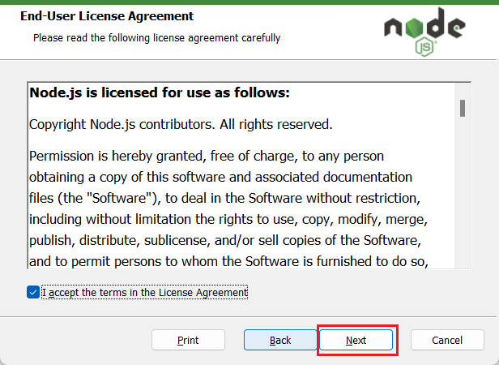

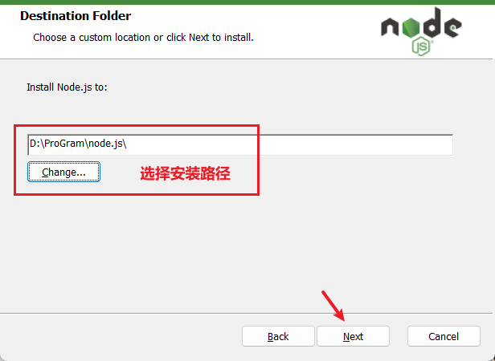

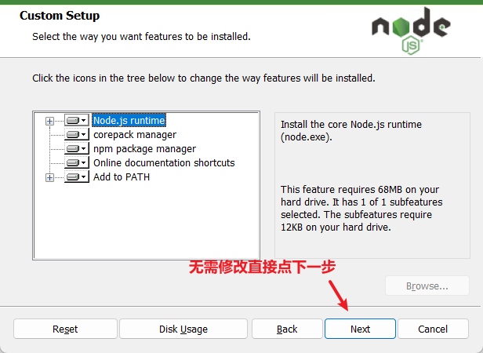

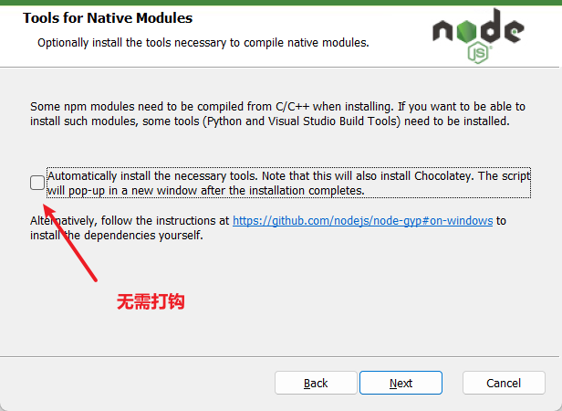

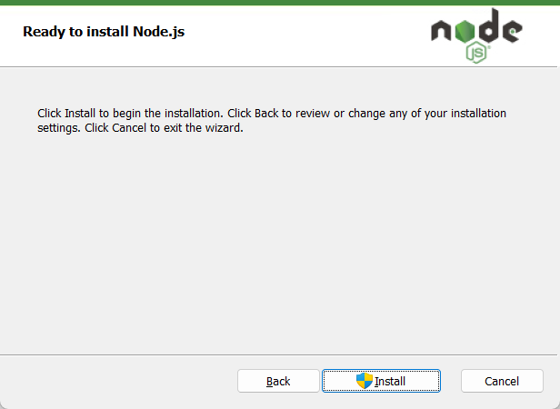

安装成功：

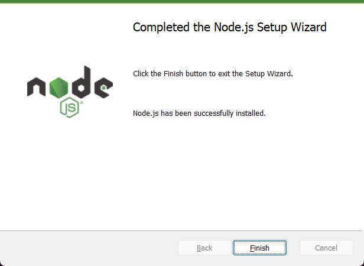

### 配置依赖库 (node_global)

- 创建node_global目录：

  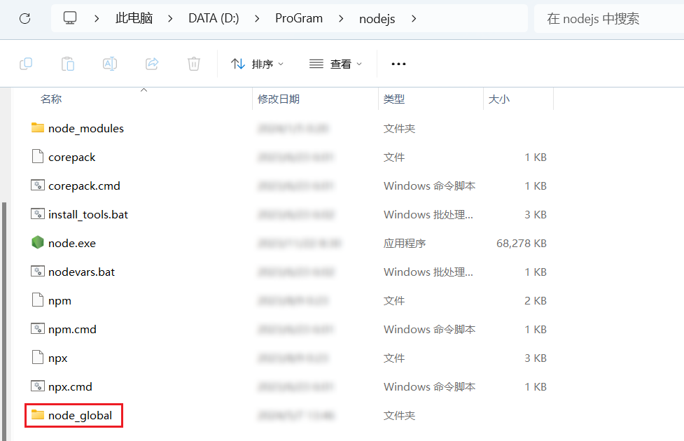

- 设置依赖库：

  ```shell
  npm config set prefix "D:\ProGram\nodejs\node_global"
  ```

  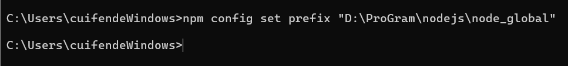

- 查看设置成功：

  ```shell
  npm config get prefix
  ```

  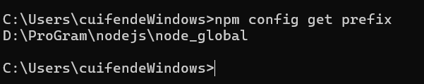

- 设置环境变量：

  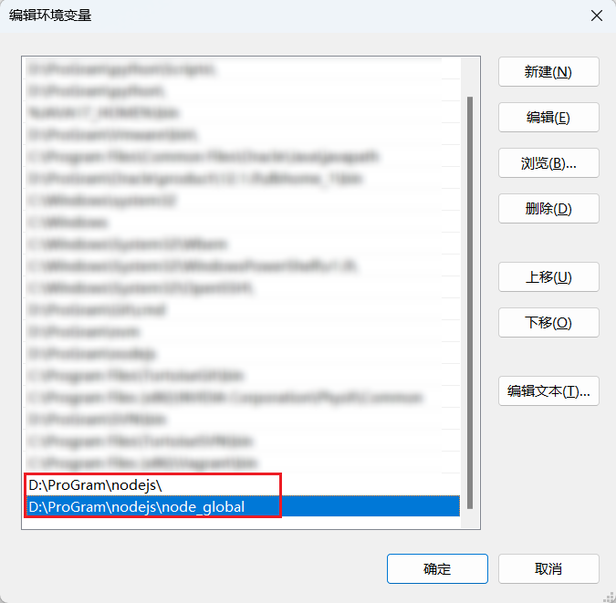

### 配置缓存 (node_cache)

- 创建node_cache目录：

  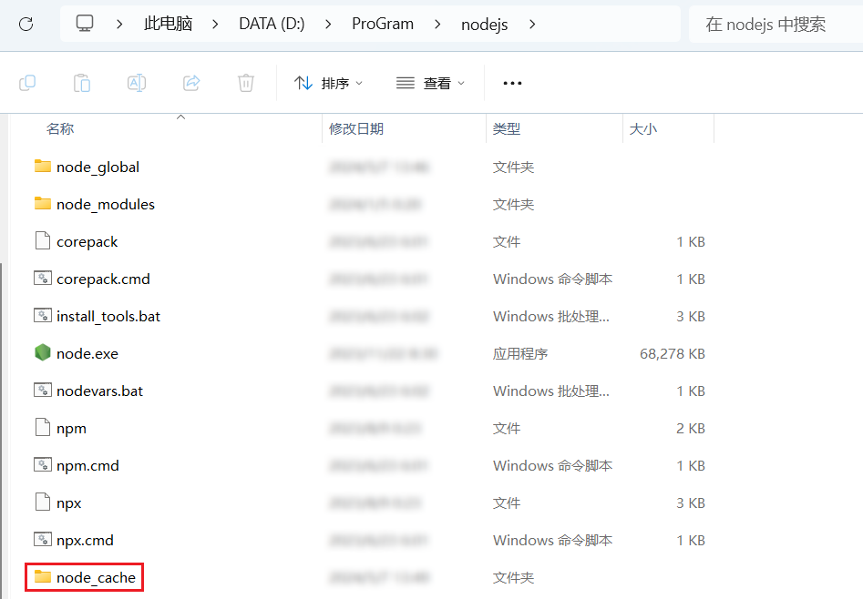

- 设置依赖库：

  ```shell
  npm config set cache "D:\ProGram\nodejs\node_cache"
  ```

  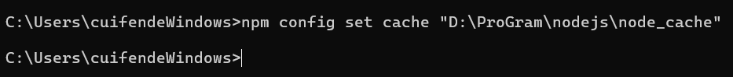

- 查看设置成功：

  ```shell
  npm config get cache
  ```

  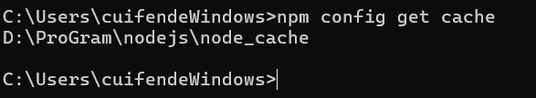

### 验证安装

Win+R 输入cmd，在cmd中输入 `node -v`

```bash
node -v
```

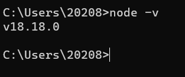

## Mac 安装

打开 [Node.js官网](http://nodejs.org) 下载Node.js

- Node.js 官网：http://nodejs.org
- Node.js 中文站下载：http://nodejs.cn/download
- Node.js 历史版本：https://registry.npmmirror.com/binary.html?path=node

**注意**：

- LTS：长期支持版本
- Current：最新版

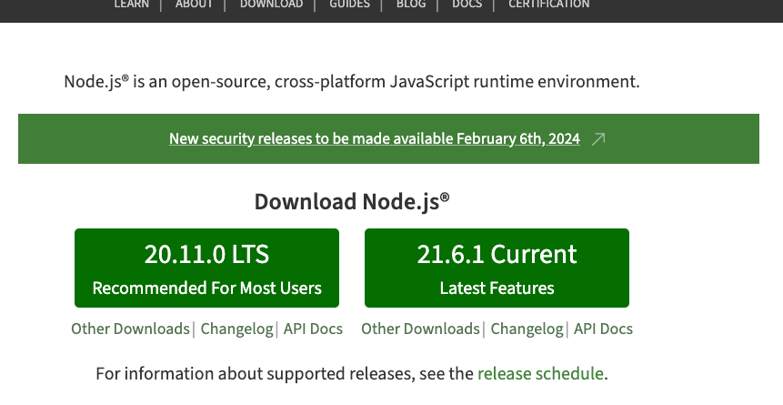

也可以通过 https://nodejs.org/en/download 下载

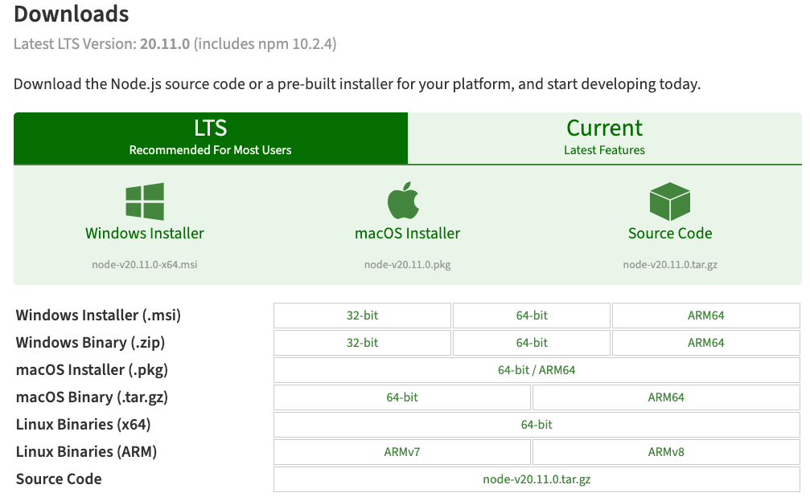

下载完毕后，双击安装Node.js

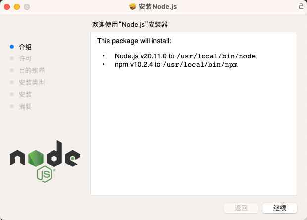

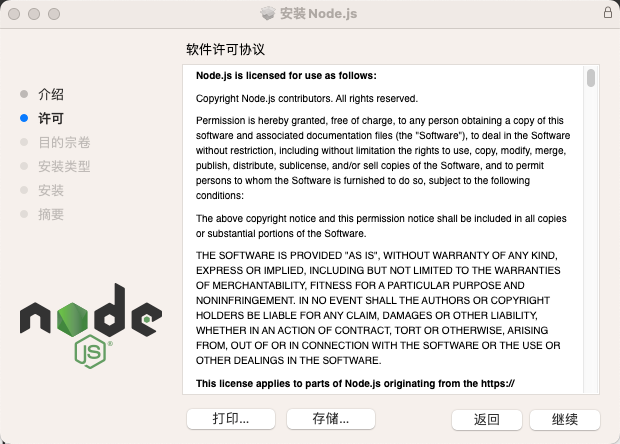

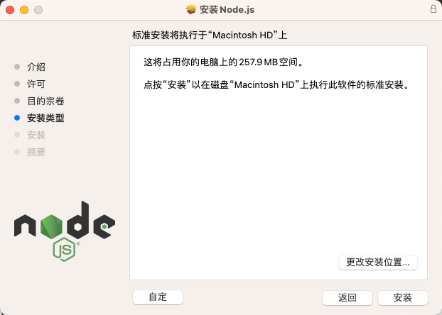

安装成功：

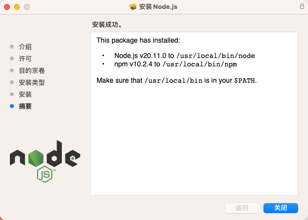

### 环境配置

打开Mac 终端，配置全局环境变量，键盘输入 `vim .bash_profile`进入编辑状态，打开之后添加一行代码：`PATH=$PATH:/usr/local/bin/`。点击 esc 退出编辑状态，此时无法对内容进行修改。键盘输入 `:wq!` 强制保存并退出vim，回到终端的界面

### 验证安装

在Mac 终端，键盘输入 `node -v`验证安装成功：

```bash
node -v
```

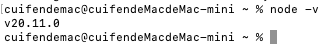

## 简单使用

安装完成后，新建一个js文件并输入：

```js [demo.js]
console.log('hello Node.js')
```

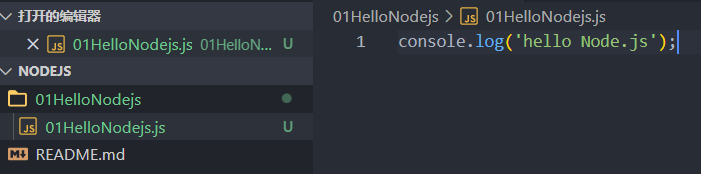

在CMD中输入：

```bash
node 文件名.js
```

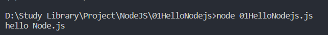

## 注意事项

### 1. BOM 和 DOM API 不可用

Node.js 中不能使用 BOM 和 DOM 的 API (Node.js 并没有包含BOM 和 DOM)

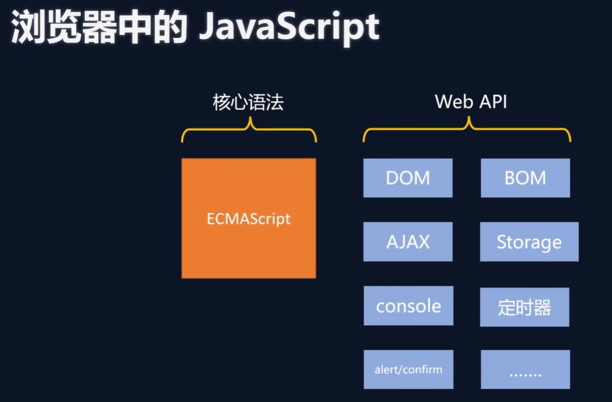


```js [test-bom-dom.js]
//测试 以下命令 程序会报异常
//BOM
console.log(window)
console.log(history)
console.log(navigator)
console.log(location)
//DOM
console.log(document)
//AJAX
let xhr = new XMLHttpRequest()
```

```js [test-timer.js]
//测试 以下命令 程序不会报异常 正常输出
console.log('1')

setTimeout(() => {
  console.log('love')
}, 1000)
```

### 2. 顶级对象

Node.js 的顶级对象并不是window对象 而是 global对象，也可以用globalThis 访问顶级对象

```js [global-object.js]
console.log(global)
console.log(globalThis)
console.log(global == globalThis) //ES2020引入的新特性 用globalThis指向顶级对象 Node.js支持此特性
```

## Linux 安装

### Ubuntu/Debian

```bash
# 使用 NodeSource 仓库
curl -fsSL https://deb.nodesource.com/setup_20.x | sudo -E bash -
sudo apt-get install -y nodejs

# 验证安装
node -v
npm -v
```

### CentOS/RHEL

```bash
# 使用 NodeSource 仓库
curl -fsSL https://rpm.nodesource.com/setup_20.x | sudo bash -
sudo yum install -y nodejs

# 验证安装
node -v
npm -v
```

### 使用 NVM 安装（推荐）

```bash
# 安装 NVM
curl -o- https://raw.githubusercontent.com/nvm-sh/nvm/v0.39.0/install.sh | bash

# 重新加载配置
source ~/.bashrc

# 安装 Node.js
nvm install 20

# 验证安装
node -v
npm -v
```

::: tip 提示
- 推荐使用 LTS 版本用于生产环境
- 开发环境可以使用 Current 版本体验最新特性
- 使用 NVM 可以方便地管理多个 Node.js 版本
:::
