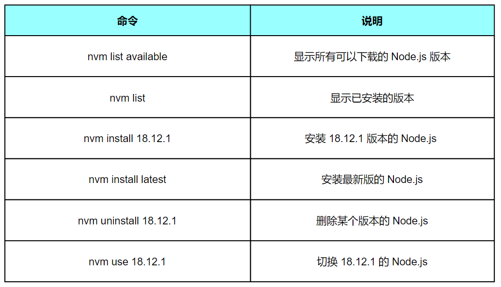

# NVM 版本管理

nvm(`Node Version Manager`) 顾名思义它是用来管理 node 版本的工具，方便切换不同版本的 Node.js


## 下载安装

### Windows

下载地址 https://github.com/coreybutler/nvm-windows/releases ， 选择 nvm-setup.exe 下载即可

### macOS/Linux

```bash
# 安装 NVM
curl -o- https://raw.githubusercontent.com/nvm-sh/nvm/v0.39.0/install.sh | bash

# 重新加载配置
source ~/.bashrc
# 或者
source ~/.zshrc
```

## 常用命令



### 安装 Node.js 版本

```bash
# 安装最新版本
nvm install latest

# 安装指定版本
nvm install 20.10.0
nvm install 18.19.0
nvm install 16.20.0

# 安装 LTS 版本
nvm install --lts
```

### 切换版本

```bash
# 使用指定版本
nvm use 20.10.0

# 查看当前使用版本
nvm current
```

### 查看已安装版本

```bash
# 列出所有已安装的版本
nvm list

# 查看可安装的版本
nvm ls-remote
```

### 卸载版本

```bash
# 卸载指定版本
nvm uninstall 16.20.0
```

### 设置默认版本

```bash
# 设置默认使用的版本
nvm alias default 20.10.0
```

## 常见问题

### 问题1：安装 nvm 后 node 和 npm 命令无法使用

**说明**：安装nvm后需要执行`nvm use xxx` 进行安装，否则node 和 npm命令无法使用

### 问题2：node 命令仍然无法使用

如果已经执行了上述命令但还是报node不是内部命令，那么先检查 C:\Program Files\nodejs文件是否可用，一般来说应该是不可用的，删除即可。

打开nvm文件夹，在nvm下面建一个文件夹nodejs，这个nodejs文件夹下面不要放任何东西，保持为空即可。

高级系统设置环境变量NVM_SYMLINK路径都改成自己node的所在路径，设置好之后请务必关掉终端后，再打开。总之一定要重新进cmd

### 问题3：版本切换后仍显示旧版本

此时，进到终端执行`node -v`估计还是之前的样子，此时需要先 `nvm uninstall v10.15.3`（上面安装的nodejs），也就是最好卸载掉之前用nvm安装的node，然后再重新安装你所需要的各种版本的node。

安装好node后，使用 `nvm use [your node version]`

此时执行`node -v`，就正常显示版本了。

## 多版本管理场景

### 场景1：项目需要不同版本

```bash
# 项目A需要 Node.js 16
cd project-a
nvm use 16.20.0

# 项目B需要 Node.js 20
cd ../project-b
nvm use 20.10.0
```

### 场景2：测试兼容性

```bash
# 测试代码在不同版本的兼容性
nvm use 16.20.0
npm test

nvm use 18.19.0
npm test

nvm use 20.10.0
npm test
```

## nvm-windows 配置

### settings.txt 配置

位于 nvm 安装目录下，可以配置：

```txt
root: D:\nvm
path: D:\nodejs
arch: 64
proxy: none
```

### 环境变量

- `NVM_HOME`：nvm 安装路径
- `NVM_SYMLINK`：当前使用的 Node.js 路径

::: tip 提示
- 使用 nvm 可以轻松管理多个 Node.js 版本
- 不同项目可以使用不同的 Node.js 版本
- 建议在安装新包前先确认当前 Node.js 版本
:::
