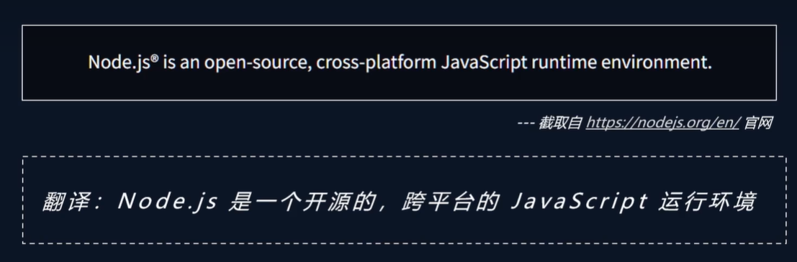

# Node.js 概述

Node.js 是一个事件驱动 I/O 服务端 JavaScript 环境，基于 Google 的 V8 引擎，V8 引擎执行 JavaScript 的速度非常快，性能非常好。

简单的说 Node.js 就是运行在服务端的 JavaScript。

## 什么是 Node.js

Node.js 是一个开源与跨平台的 JavaScript 运行时环境。它是一个可用于轻松构建快速、可扩展的网络应用的平台。

- **基于 V8 引擎**：Google Chrome 使用的 JavaScript 引擎，执行速度极快
- **事件驱动**：采用事件驱动的编程范式，通过回调函数处理异步操作
- **非阻塞 I/O**：I/O 操作不会阻塞主线程，提高并发处理能力
- **单线程**：主线程是单线程的，但通过事件循环和异步 I/O 实现高并发

## Node.js 的作用

### 1. 服务器应用开发

运行在服务器端，对用户的请求做处理，并且把资源返回给用户。

- 构建 Web 服务器
- 构建 API 服务
- 构建实时应用（如聊天室、游戏服务器）
- 构建微服务架构

### 2. 工具类应用开发

Webpack、Vite、Babel 都是借助于 Node.js，也可以自己开发工具类应用。

- 前端构建工具（Webpack、Vite、Rollup）
- 代码转换工具（Babel、TypeScript 编译器）
- 脚手架工具（Create React App、Vue CLI）
- 代码检查工具（ESLint、Prettier）

### 3. 桌面端应用开发

VSCode、Figma 等工具使用的 Electron，而 Electron 借助于 Node.js。

- Electron 桌面应用
- NW.js 桌面应用
- 跨平台桌面工具开发

## Node.js 的特点

### 高性能

- V8 引擎优化：即时编译（JIT）技术
- 事件循环机制：高效处理并发请求
- 异步 I/O：避免阻塞操作

### 跨平台

- Windows、macOS、Linux 全平台支持
- 统一的 API 接口
- 社区生态完善

### 丰富的生态系统

- npm：全球最大的包管理器
- 超过 200 万个开源包
- 活跃的开发者社区

## Node.js 与 JavaScript 的关系

| 特性 | JavaScript | Node.js |
|------|-----------|---------|
| 运行环境 | 浏览器 | 服务器/本地 |
| 引擎 | 各浏览器引擎 | V8 引擎 |
| API | DOM、BOM | fs、http、path 等 |
| 用途 | 前端交互 | 后端服务、工具链 |
| 全局对象 | window | global |

## 适用场景

### 适合使用 Node.js 的场景

- **实时应用**：聊天应用、在线游戏、协作工具
- **API 服务**：RESTful API、GraphQL 服务
- **微服务**：轻量级服务架构
- **工具链**：构建工具、CLI 工具
- **流式应用**：文件上传下载、视频处理

### 不适合使用 Node.js 的场景

- **CPU 密集型任务**：图像处理、视频编码
- **复杂计算**：科学计算、机器学习
- **关系型数据库操作**：虽然有驱动，但不是最优选择

## 历史与发展

- **2009 年**：Ryan Dahl 创建 Node.js
- **2010 年**：npm 包管理器发布
- **2011 年**：Windows 版本发布
- **2015 年**：Node.js 基金会成立
- **2018 年**：Node.js 10 LTS 发布
- **2023 年**：Node.js 20 LTS 发布

::: tip 提示
Node.js 不是 JavaScript 框架，也不是编程语言，而是一个 JavaScript 运行时环境。
:::
