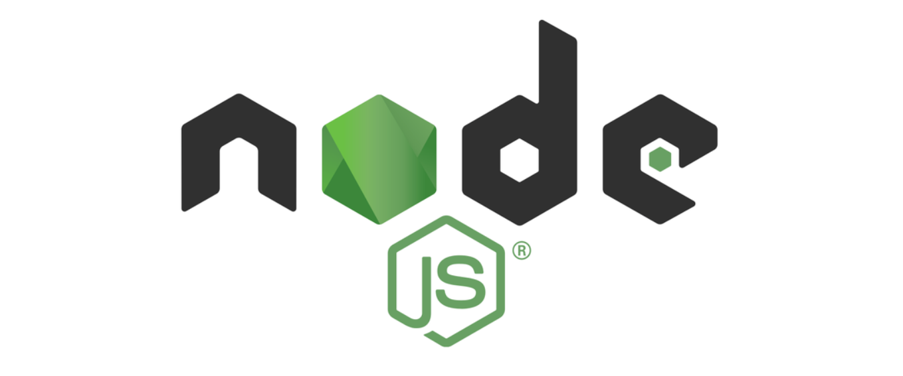

# Node.js

## 基础

- [Node.js 概述](Overview/index.md)
- [Node.js 安装](Install/index.md)

> 安装：Windows安装、Mac安装、Linux安装

- [Node.js Buffer](Buffer/index.md)

> Buffer：创建Buffer、Buffer操作、注意问题

- [NVM 版本管理](NVM/index.md)

> NVM：安装、常用命令、版本切换

## 核心模块

- [模块化](Modules/index.md)
- [fs 模块](Modules/fs/index.md)
- [path 模块](Modules/path/index.md)
- [http 模块](Modules/http/index.md)
- [url 模块](Modules/url/index.md)

## 高级特性

- [全局对象](GlobalObjects/index.md)

> 全局对象：global、__dirname、__filename、process、console

- [异步编程](AsyncProgramming/index.md)

> 异步编程：回调函数、Promise、async/await、事件循环

- [EventEmitter 事件模块](EventEmitter/index.md)

> EventEmitter：事件监听、事件触发、错误处理

- [Stream 流模块](Stream/index.md)

> Stream：可读流、可写流、双工流、转换流、管道

## 包管理

- [包管理工具](PackageManagementTool/index.md)

> 包管理工具：npm包管理工具、cnpm包管理工具、yarn包管理工具、管理发布包

## 框架

- [Express 框架](Frame/express/index.md)

> Express：概述、基础操作、中间件、Router、EJS、静态文件、错误处理、安全、部署

- [Koa 框架](Frame/koa/index.md)

> Koa：概述、基础操作、中间件、洋葱模型

- [Fastify 框架](Frame/fastify/index.md)

> Fastify：概述、基础操作、Schema验证、插件系统

- [NestJS 框架](Frame/nestjs/index.md)

> NestJS：概述、基础操作、控制器、服务、依赖注入

- [Hapi 框架](Frame/hapi/index.md)

> Hapi：概述、基础操作、配置优先、Joi验证

## 整合

- 整合 MongoDB

## 拓展

- [HTTP 协议](../../Others/HTTP/index.md)
