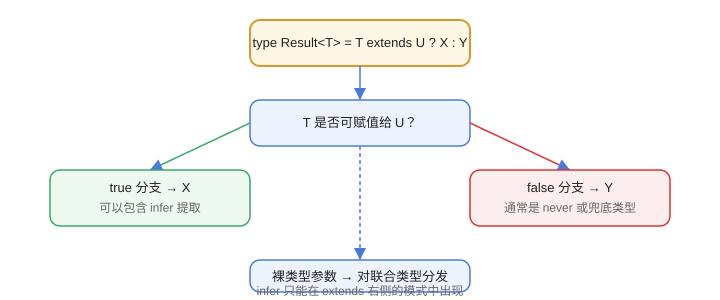

# 条件类型与 infer

条件类型（Conditional Types）让类型具备“逻辑判断”能力；`infer` 则能从类型中**提取**内部结构。二者是编写高级类型工具的基础。

## 基本语法

```typescript
type IsString<T> = T extends string ? true : false;

type A = IsString<"hello">;   // true
type B = IsString<42>;        // false
```

## 分配律（Distributive）

条件类型作用于**裸类型参数**时会对联合类型逐个分发：

```typescript [ConditionalTypes/DistributiveDemo.ts]
type ToArray<T> = T extends unknown ? T[] : never;

type Result = ToArray<string | number>;   // string[] | number[]（分发）

// 用方括号包住 T 可关闭分发
type ToArrayNonDist<T> = [T] extends [unknown] ? T[] : never;
type Result2 = ToArrayNonDist<string | number>;   // (string | number)[]
```

## 内置条件工具的实现

```typescript [ConditionalTypes/ExcludeDemo.ts]
type MyExclude<T, U> = T extends U ? never : T;

type A = "a" | "b" | "c";
type B = MyExclude<A, "b">;   // "a" | "c"

type MyExtract<T, U> = T extends U ? T : never;
type C = MyExtract<A, "a" | "b">;   // "a" | "b"
```

`Exclude` / `Extract` 正是利用分配律实现的。

## infer：提取类型

```typescript [ConditionalTypes/InferDemo.ts]
type ReturnTypeOf<T> = T extends (...args: any[]) => infer R ? R : never;

type Fn = () => string;
type R = ReturnTypeOf<Fn>;   // string

type ParamOf<T> = T extends (arg: infer P) => any ? P : never;
type P = ParamOf<(name: string) => void>;   // string

type ArrayItem<T> = T extends Array<infer E> ? E : never;
type Item = ArrayItem<string[]>;   // string
```

`infer R` 声明一个“待推断的类型变量”，条件成立时由编译器推导。

## 实战：从 Promise 中解包

```typescript [ConditionalTypes/UnwrapDemo.ts]
type Awaited<T> = T extends Promise<infer U>
  ? U extends Promise<infer V>
    ? V
    : U
  : T;

type Result = Awaited<Promise<Promise<string>>>;   // string
```

## 实战：递归模板字面量解析

```typescript [ConditionalTypes/RouteDemo.ts]
type ParseRoute<T extends string> =
  T extends `${infer _Prefix}/:${infer Param}/${infer Rest}`
    ? { [K in Param | keyof ParseRoute<Rest>]: string }
    : T extends `${infer _Prefix}/:${infer Param}`
      ? { [K in Param]: string }
      : {};

type Params = ParseRoute<"/user/:id/order/:orderId">;   // { id: string; orderId: string }
```

## 解析流程



## 易错点

::: danger 常见错误
1. 忘记分配律：联合类型传入裸类型参数时结果可能是联合而不是整体判断，需要时用 `[T]` 包裹。
2. `infer` 位置写错：只能出现在 `extends` 右侧的类型模式中，不能随意声明。
3. 递归条件类型无限展开：解析字符串/数组要保证每次递归都“消费”一段输入，否则类型实例化过深报错。
4. 用 `any` 破坏推断：`(...args: any[]) => infer R` 中 `any` 只用于匹配签名，不要到处替换。
5. 条件类型写得太复杂：优先拆成多个具名类型，保持可读性。
:::

## 验证方式

1. 运行 `npx tsc --noEmit ConditionalTypes/*.ts`，确认类型全部成立。
2. 把 `RouteDemo` 的递归模板换成不消费前缀的写法，观察 `Type instantiation is excessively deep` 报错。
3. 在 IDE 中悬停 `ParseRoute<...>` 的展开结果，对照预期。

## 参考资料

- 条件类型手册：https://www.typescriptlang.org/docs/handbook/2/conditional-types.html
- infer 说明：https://www.typescriptlang.org/docs/handbook/2/conditional-types.html#inferring-within-conditional-types
- 模板字面量类型：https://www.typescriptlang.org/docs/handbook/2/template-literal-types.html
