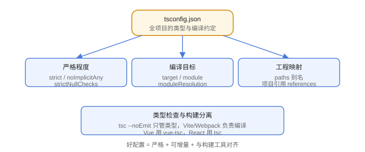

# 工程化配置

TypeScript 工程化的核心是 **tsconfig.json**：它决定编译目标、模块方案、严格程度、路径别名和项目引用。配置得当，类型检查才能在团队中真正生效。

## tsconfig 的职责



## 一份生产级 tsconfig

```json [tsconfig.json]
{
  "compilerOptions": {
    "target": "ES2022",
    "module": "ESNext",
    "moduleResolution": "Bundler",
    "lib": ["ES2022", "DOM", "DOM.Iterable"],
    "strict": true,
    "noUnusedLocals": true,
    "noUnusedParameters": true,
    "noFallthroughCasesInSwitch": true,
    "esModuleInterop": true,
    "skipLibCheck": true,
    "resolveJsonModule": true,
    "isolatedModules": true,
    "verbatimModuleSyntax": true,
    "noEmit": true,
    "paths": {
      "@/*": ["./src/*"]
    }
  },
  "include": ["src"],
  "exclude": ["node_modules", "dist"]
}
```

## strict 模式包含什么

| 选项 | 作用 |
| --- | --- |
| `strictNullChecks` | null/undefined 不能随意赋值（最有价值） |
| `noImplicitAny` | 禁止隐式 any |
| `strictFunctionTypes` | 函数参数逆变检查 |
| `strictBindCallApply` | bind/call/apply 类型校验 |
| `strictPropertyInitialization` | 类属性必须初始化 |
| `noImplicitThis` | 禁止不明确的 this |
| `useUnknownInCatchVariables` | catch 变量为 unknown |

新项目一律 `"strict": true`。

## 路径别名

```json
{
  "compilerOptions": {
    "baseUrl": ".",
    "paths": {
      "@/*": ["src/*"],
      "@components/*": ["src/components/*"]
    }
  }
}
```

::: warning 说明
自 TypeScript 5.0 起，`paths` 可以不依赖 `baseUrl`（相对 tsconfig 位置解析），新项目建议省略 `baseUrl`；运行时的路径转换还需要 Vite/Webpack 的别名配置配合。
:::

## 类型检查与构建分离

现代工程通常让打包器负责编译，tsc 只做类型检查：

```json
{
  "compilerOptions": {
    "noEmit": true
  }
}
```

```shell
# 类型检查
npx tsc --noEmit

# 构建由 Vite / Webpack / esbuild 完成
npm run build
```

Vue 项目用 `vue-tsc --noEmit` 同时检查模板类型。

## 项目引用（Project References）

大型 monorepo 可以按包拆分 tsconfig，用 `tsc -b` 增量构建：

```json [packages/core/tsconfig.json]
{
  "compilerOptions": {
    "composite": true,
    "declaration": true,
    "outDir": "dist"
  },
  "references": [
    { "path": "../utils" }
  ]
}
```

```shell
tsc -b packages/core
```

## 常见配置组合

| 场景 | 关键配置 |
| --- | --- |
| Vite + Vue | `moduleResolution: "Bundler"`、`vue-tsc --noEmit` |
| Node.js 服务端 | `module: "NodeNext"`、`moduleResolution: "NodeNext"` |
| 库开发 | `declaration: true`、`composite: true` |
| 仅类型检查 | `noEmit: true` + CI 脚本 |

## 易错点

::: danger 常见错误
1. 关闭 strictNullChecks “图省事”：等于放弃 TS 最核心的安全保障。
2. paths 配了但打包器没配：IDE 不报错、运行时找不到模块。
3. `skipLibCheck: false` 时被第三方类型拖累：一般应开启，但不要顺手关掉对自己的检查。
4. moduleResolution 用旧值（`node`）配合现代打包器：新项目用 `Bundler` 或 `NodeNext`。
5. 把 `noEmit` 与 `outDir` 同时配置：noEmit 生效时不会产出文件，容易误以为构建成功。
6. 多人共用一个宽松 tsconfig：类型检查形同虚设，严格程度应写入评审标准。
:::

## 验证方式

1. 运行 `npx tsc --noEmit`，确认项目类型检查通过。
2. 故意写一个 `null` 赋值，确认 strictNullChecks 报错。
3. 用 `npx tsc --showConfig` 查看最终生效的配置（包含继承内容）。

## 参考资料

- tsconfig 参考：https://www.typescriptlang.org/tsconfig/
- TypeScript 5.0 发布说明（paths/baseUrl）：https://devblogs.microsoft.com/typescript/announcing-typescript-5-0/
- 项目引用：https://www.typescriptlang.org/docs/handbook/project-references.html
