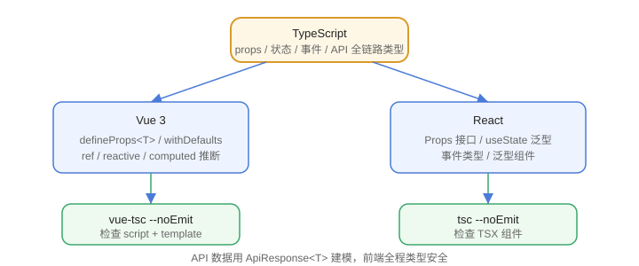

# 与 Vue / React 结合

TypeScript 在前端框架中的价值是：组件 props、状态、事件、API 响应全链路有类型。Vue 用 `vue-tsc` 检查模板，React 用 `tsc` 检查 JSX，两者都依赖良好的类型设计。



## Vue 3 + TypeScript

### 组合式 API 与 props 类型

```vue [FrameworkIntegration/UserCard.vue]
<script setup lang="ts">
import { ref, computed } from "vue";

interface Props {
  name: string;
  age?: number;
  tags?: string[];
}

const props = withDefaults(defineProps<Props>(), {
  age: 0,
  tags: () => [],
});

const count = ref(0);
const label = computed(() => `${props.name}（${props.age}岁）`);

function add() {
  count.value++;
}
</script>

<template>
  <div>
    <p>{{ label }}</p>
    <button @click="add">+1</button>
  </div>
</template>
```

要点：

1. `defineProps<Props>()` 声明 props 类型。
2. `withDefaults` 提供默认值，并保证可选属性收窄。
3. `ref(0)` 自动推断 `Ref<number>`。
4. 模板里的 `{{ label }}` 会被 `vue-tsc` 检查。

### 泛型组件

```vue [FrameworkIntegration/GenericList.vue]
<script setup lang="ts" generic="T">
defineProps<{ items: T[]; render: (item: T) => string }>();
</script>

<template>
  <ul>
    <li v-for="item in items" :key="String(item)">
      {{ render(item) }}
    </li>
  </ul>
</template>
```

### 检查命令

```shell
npx vue-tsc --noEmit
```

`vue-tsc` 会同时检查 `<script>` 和 `<template>` 中的类型。

## React + TypeScript

### 函数组件与 Props

```tsx [FrameworkIntegration/UserCard.tsx]
import { useState } from "react";

interface UserCardProps {
  name: string;
  age?: number;
  onFollow?: (userId: string) => void;
}

export function UserCard({ name, age = 0, onFollow }: UserCardProps) {
  const [followed, setFollowed] = useState(false);

  return (
    <div>
      <p>{name}（{age}岁）</p>
      <button
        disabled={followed}
        onClick={() => {
          setFollowed(true);
          onFollow?.(name);
        }}
      >
        {followed ? "已关注" : "关注"}
      </button>
    </div>
  );
}
```

### 泛型组件

```tsx [FrameworkIntegration/List.tsx]
interface ListProps<T> {
  items: T[];
  render: (item: T) => React.ReactNode;
}

export function List<T>({ items, render }: ListProps<T>) {
  return <ul>{items.map((item, i) => <li key={i}>{render(item)}</li>)}</ul>;
}
```

### 常用类型

| 场景 | 类型 |
| --- | --- |
| 子节点 | `React.ReactNode` |
| 事件对象 | `React.MouseEvent<HTMLButtonElement>` |
| 表单事件 | `React.ChangeEvent<HTMLInputElement>` |
| ref | `React.RefObject<HTMLDivElement>` / `useRef<HTMLDivElement>(null)` |
| 组件 props 含 children | `React.PropsWithChildren<T>` |

### 检查命令

```shell
npx tsc --noEmit
```

## API 数据建模

```typescript [FrameworkIntegration/ApiModel.ts]
interface ApiResponse<T> {
  code: number;
  message: string;
  data: T;
}

interface User {
  id: string;
  name: string;
}

async function fetchUser(id: string): Promise<User> {
  const res = await fetch(`/api/users/${id}`);
  const json = await res.json() as ApiResponse<User>;
  if (json.code !== 0) {
    throw new Error(json.message);
  }
  return json.data;
}
```

把接口返回建模成泛型，前端调用处全程类型安全。

## 易错点

::: danger 常见错误
1. Vue 项目用 `tsc` 而不是 `vue-tsc`：模板里的类型错误检查不到。
2. React 事件类型写成 `any`：事件对象类型推断失效，用 `React.ChangeEvent<...>`。
3. `useRef<HTMLDivElement>(null)` 忘记初始 null：ref 类型推导为 `RefObject<HTMLDivElement>` 但运行时空引用，配合可选链使用。
4. props 默认值用 `withDefaults`（Vue）或解构默认值（React），不要在子组件里改 props。
5. 第三方组件库类型缺失：先查 @types，再考虑自定义声明，不要全局 any。
6. 泛型组件在 `.tsx` 里用 `<T,>` 写法：`<T>` 会被解析成 JSX，必须加逗号。
:::

## 验证方式

1. Vue 项目运行 `npx vue-tsc --noEmit`，确认 script 与 template 均无类型错误。
2. 故意把 `defineProps<Props>()` 的字段名写错并在模板中使用，确认 vue-tsc 报错。
3. React 项目运行 `npx tsc --noEmit`，把 `onClick` 事件参数标注错误类型，确认报错。

## 参考资料

- Vue 3 + TS 指南：https://vuejs.org/guide/typescript/overview
- vue-tsc：https://github.com/vuejs/language-tools
- React TypeScript Cheatsheet：https://react-typescript-cheatsheet.netlify.app/
