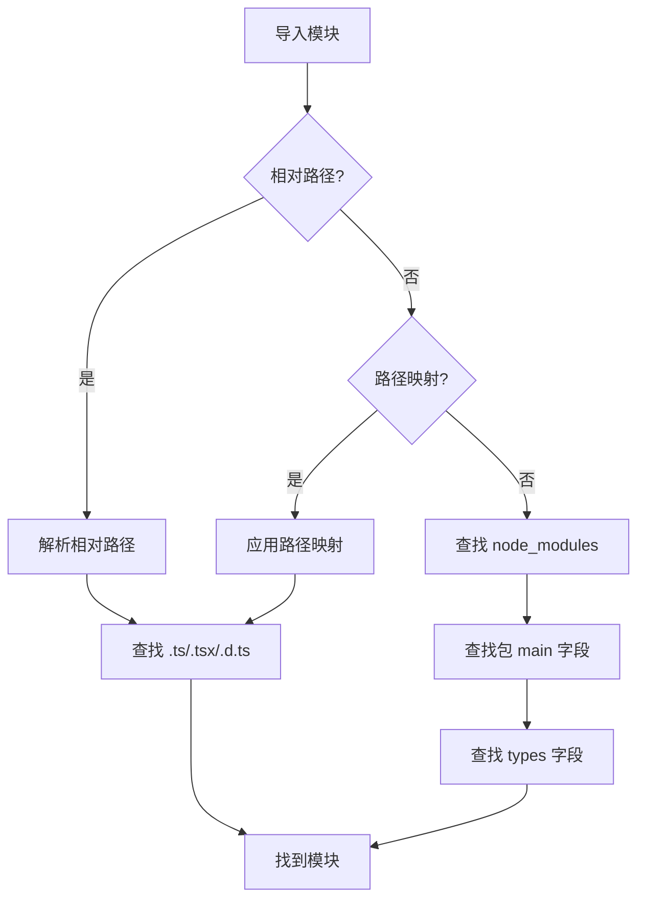

# TypeScript 模块解析

## 模块解析策略

TypeScript 支持两种模块解析策略：Classic 和 Node。

```json [tsconfig.json]
{
  "compilerOptions": {
    "moduleResolution": "node"
  }
}
```

## 相对路径导入

```typescript [relative-import.ts]
// 相对路径导入
import { User } from './models/User'
import { UserService } from '../services/UserService'
import { Config } from '../../config'

// 导入目录
import { Router } from './routes'
// 实际解析：./routes/index.ts 或 ./routes/index.js

// 导入 JSON 文件
import config from './config.json'

// 导入 CSS 文件
import './styles/main.css'
```

## 非相对路径导入

```typescript [non-relative-import.ts]
// 从 node_modules 导入
import express from 'express'
import lodash from 'lodash'

// 从路径映射导入
import { User } from '@models/User'
import { Config } from '@config'

// 从类型声明导入
import type { User } from '@types/User'
```

## 路径映射

```json [tsconfig-paths.json]
{
  "compilerOptions": {
    "baseUrl": ".",
    "paths": {
      "@/*": ["src/*"],
      "@models/*": ["src/models/*"],
      "@services/*": ["src/services/*"],
      "@utils/*": ["src/utils/*"],
      "@config": ["src/config/index.ts"]
    }
  }
}
```

## 类型声明文件

```typescript [type-declarations.ts]
// 导入类型声明
import type { User, UserRole } from './types'

// 仅导入类型
import { type User, type UserRole } from './types'

// 声明模块
declare module 'express' {
  interface Request {
    user?: User
  }
}

// 全局类型声明
declare global {
  interface Window {
    API_URL: string
  }
}
```

## 模块解析过程



## CommonJS 模块

```typescript [commonjs.ts]
// 导出
export = UserService

// 导入
import UserService = require('./UserService')

// 混合使用
import express = require('express')
const app = express()
```

## ES 模块

```typescript [es-modules.ts]
// 默认导出
export default class UserService {
  getUsers() {
    return []
  }
}

// 命名导出
export interface User {
  id: string
  name: string
}

export const API_URL = '/api'

// 导入
import UserService, { User, API_URL } from './UserService'

// 重命名导入
import { User as UserType } from './UserService'

// 命名空间导入
import * as UserService from './UserService'
```

## 动态导入

```typescript [dynamic-import.ts]
// 动态导入
async function loadModule() {
  const module = await import('./heavy-module')
  module.init()
}

// 条件导入
async function loadAdminPanel() {
  if (user.isAdmin) {
    const admin = await import('./admin-panel')
    admin.init()
  }
}

// 路由懒加载
const routes = {
  home: () => import('./pages/Home'),
  about: () => import('./pages/About'),
  dashboard: () => import('./pages/Dashboard')
}
```

## 模块解析配置

```json [module-resolution.json]
{
  "compilerOptions": {
    "module": "ESNext",
    "moduleResolution": "bundler",
    "baseUrl": ".",
    "paths": {
      "@/*": ["src/*"]
    },
    "types": ["node", "jest"],
    "typeRoots": ["./node_modules/@types", "./types"],
    "allowSyntheticDefaultImports": true,
    "esModuleInterop": true,
    "isolatedModules": true
  }
}
```

## 类型声明文件编写

```typescript [declaration-file.d.ts]
// 声明第三方库
declare module 'third-party-lib' {
  export interface Config {
    apiKey: string
    timeout?: number
  }

  export function init(config: Config): void
  export function getData(): Promise<any>
  export default class ThirdPartyLib {
    constructor(config: Config)
    fetchData(): Promise<any>
  }
}

// 声明全局变量
declare const API_URL: string
declare const VERSION: string

// 声明全局函数
declare function log(message: string): void
declare function format(date: Date): string
```

::: tip 提示
- 使用路径映射简化导入
- 优先使用 ES 模块语法
- 动态导入实现代码分割
- 编写类型声明文件支持第三方库
- 使用 type-only 导入减少打包体积
:::
