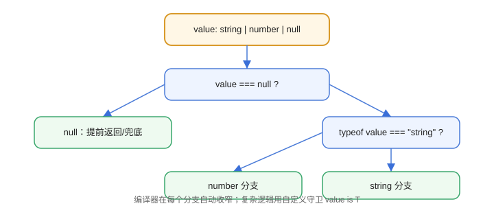

# 类型守卫与收窄

类型收窄（Narrowing）是 TypeScript 在运行时判断之后“自动缩小类型范围”的能力。掌握类型守卫，才能写出既安全又让编译器放心的分支逻辑。

::: info 版本现状（2026-08 核对）
TypeScript 当前稳定版为 **7.0**（2026-07 发布，Go 原生编译器，与 6.0 类型语义兼容）；本文示例兼容 5.x / 6.x / 7.x。
:::

## 什么是类型收窄

```typescript [TypeGuards/NarrowingDemo.ts]
function print(value: string | number) {
  if (typeof value === "string") {
    console.log(value.toUpperCase());   // 此处 value 收窄为 string
  } else {
    console.log(value.toFixed(2));      // 此处 value 收窄为 number
  }
}
```

编译器根据 `typeof` 判断自动收窄，不需要手动断言。

## 常用收窄手段

| 手段 | 适用场景 | 示例 |
| --- | --- | --- |
| `typeof` | 基本类型 | `typeof x === "string"` |
| `instanceof` | 类实例 | `x instanceof Date` |
| `in` | 对象属性 | `"name" in obj` |
| 真值判断 | 排除 null/undefined | `if (value)` |
| 字面量判断 | 可辨识联合 | `if (user.role === "admin")` |
| 自定义守卫 | 复杂逻辑 | `isUser(x)` |

## 自定义类型守卫

```typescript [TypeGuards/UserGuard.ts]
interface User {
  name: string;
  age: number;
}

function isUser(value: unknown): value is User {
  return (
    typeof value === "object" &&
    value !== null &&
    "name" in value &&
    "age" in value
  );
}

function handle(data: unknown) {
  if (isUser(data)) {
    console.log(data.name);   // data 收窄为 User
  }
}
```

`value is User` 是**类型谓词（Type Predicate）**：告诉编译器“函数返回 true 时，参数就是该类型”。

## 断言函数：asserts

```typescript [TypeGuards/AssertDemo.ts]
function assertUser(value: unknown): asserts value is User {
  if (!isUser(value)) {
    throw new Error("不是合法的 User");
  }
}

function process(data: unknown) {
  assertUser(data);
  console.log(data.name);   // 断言通过后自动收窄
}
```

## 可辨识联合（Discriminated Union）

```typescript [TypeGuards/DiscriminatedUnion.ts]
type Shape =
  | { kind: "circle"; radius: number }
  | { kind: "square"; side: number }
  | { kind: "rect"; width: number; height: number };

function area(shape: Shape): number {
  switch (shape.kind) {
    case "circle":
      return Math.PI * shape.radius ** 2;
    case "square":
      return shape.side ** 2;
    case "rect":
      return shape.width * shape.height;
  }
}
```

`kind` 字段就是“判别式”，每个分支都能精确收窄。

## 收窄流程



## 易错点

::: danger 常见错误
1. `typeof null === "object"`：判断对象前必须先排除 null。
2. 自定义守卫的谓词写错：`value is User` 只在返回 true 时收窄，逻辑错误会让类型“说谎”。
3. 在 `else` 分支里假设剩下的类型：联合类型可能还有第三个成员，编译器会报错或收窄不完整。
4. 滥用 `as` 断言绕过收窄：等于放弃类型检查，优先用类型守卫。
5. 可辨识联合的判别字段类型写成宽泛的 `string`：收窄失效，必须用字面量联合。
:::

## 验证方式

1. 运行 `npx tsc --noEmit TypeGuards/DiscriminatedUnion.ts`，确认无类型错误。
2. 把 `area` 的 `case "rect"` 删除，确认编译器提示“函数缺少返回语句”或联合未穷尽。
3. 在自定义守卫里故意返回 `true`，用错误数据调用，观察运行时逻辑错误（类型层面无法兜底）。

## 参考资料

- TypeScript 收窄手册：https://www.typescriptlang.org/docs/handbook/2/narrowing.html
- 类型谓词说明：https://www.typescriptlang.org/docs/handbook/2/narrowing.html#using-type-predicates
- 可辨识联合：https://www.typescriptlang.org/docs/handbook/2/narrowing.html#discriminated-unions
