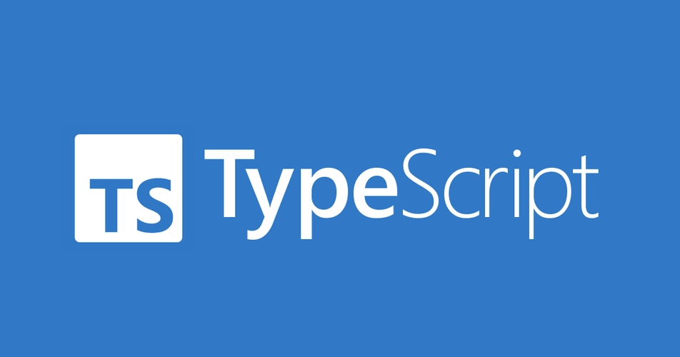

# TypeScript

## 基础入门

- [TypeScript 概述](Overview/index.md)
- [TypeScript 编译](Compile/index.md)
- [TypeScript 基本使用](BasicUse/index.md)
- [TypeScript 基本类型](BasicType/index.md)
- [TypeScript 内置函数](BuiltinFunction/index.md)
- [TypeScript 类型别名](TypeAlias/index.md)
- [TypeScript 面向对象](ObjectOriented/index.md)

## 核心特性

- [TypeScript 接口](Interface/index.md)
- [TypeScript 泛型](Generics/index.md)
- [TypeScript 类型推断](TypeInference/index.md)
- [TypeScript 类型兼容性](TypeCompatibility/index.md)

## 高级类型

- [TypeScript 高级类型](AdvancedTypes/index.md)
- [TypeScript 工具类型](UtilityTypes/index.md)
- [TypeScript 装饰器](Decorators/index.md)

## 模块与组织

- [TypeScript 模块解析](ModuleResolution/index.md)
- [TypeScript 命名空间](Namespaces/index.md)
