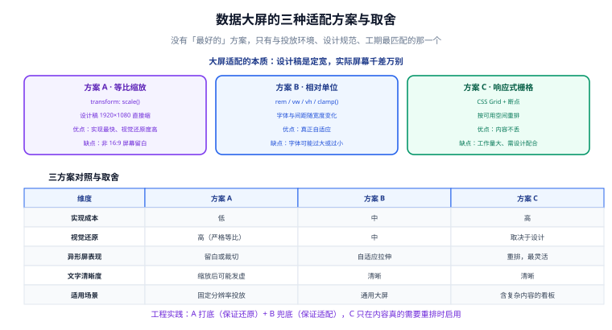
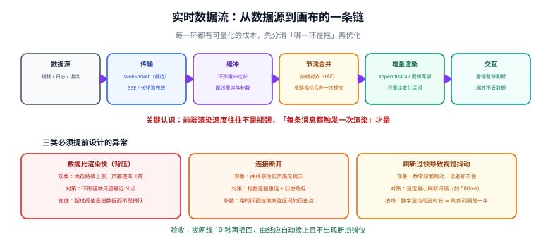

# 数据大屏工程

数据大屏（Dashboard）是可视化里一个很特殊的交付形态：**固定分辨率、被动观看、长时间运行、通常没有鼠标**。这些约束让它和普通后台页面的做法几乎相反——普通页面追求自适应与可交互，大屏追求**在确定的屏幕上一眼看清**。

::: tip 一句话定位
大屏的第一原则不是「好看」，而是**「三米之外能看清、连续开一周不崩」**。所有的适配、动效、刷新策略都要服从这两条。
:::

## 大屏与普通页面的五个差异

| 维度 | 普通后台页面 | 数据大屏 |
| --- | --- | --- |
| 分辨率 | 千差万别，必须自适应 | 通常固定（1920×1080 或 3840×2160） |
| 观看距离 | 0.5 米（鼠标前） | 2~8 米（会议室 / 展厅） |
| 交互 | 大量交互（筛选、下钻） | **几乎没有**，鼠标通常不可达 |
| 运行时长 | 几十分钟 | 7×24 连续运行 |
| 内容密度 | 高（信息越多越好） | 低（一屏只放关键结论） |
| 失效成本 | 刷新页面即可 | 现场无人会修，可能影响对外形象 |

::: danger 把后台页面直接投到大屏上是最常见的失败
典型症状：字太小（按 0.5 米距离设计的 14px 字号，在 3 米外完全看不清）、信息太密（一屏 30 个数字，看完需要 2 分钟）、有交互但没人能操作（筛选下拉框摆在那里没人点）。

**正确做法**：从「三米外能看清什么」倒推内容与字号，而不是把已有页面的数据搬过来。
:::

## 三种适配方案



### 方案 A：等比缩放（最常用）

按设计稿尺寸（如 1920×1080）写死布局，然后用 `transform: scale()` 整体缩放。**实现最快，视觉还原度最高**。

```javascript [fit-scale.js]
/**
 * 等比缩放适配：把设计稿尺寸的容器缩放到当前视口。
 * 采用 "contain" 语义（完整显示、可能有留白），而不是 "cover"（铺满、可能裁切）。
 */
export function createScaler(designWidth = 1920, designHeight = 1080) {
  const el = document.getElementById('screen');
  el.style.width = designWidth + 'px';
  el.style.height = designHeight + 'px';
  el.style.transformOrigin = 'left top';

  function apply() {
    const vw = window.innerWidth;
    const vh = window.innerHeight;
    const scale = Math.min(vw / designWidth, vh / designHeight);
    el.style.transform = `scale(${scale})`;
    // 居中：把剩余空间对半分给两侧
    el.style.left = (vw - designWidth * scale) / 2 + 'px';
    el.style.top = (vh - designHeight * scale) / 2 + 'px';
  }

  // 节流：拖拽窗口时 resize 会高频触发
  let timer = null;
  const onResize = () => {
    clearTimeout(timer);
    timer = setTimeout(apply, 150);
  };

  window.addEventListener('resize', onResize);
  apply();

  return {
    apply,
    destroy() {
      window.removeEventListener('resize', onResize);
      clearTimeout(timer);
    },
  };
}
```

```css [screen.css]
/* 缩放容器需要绝对定位才能做居中计算 */
#screen {
  position: absolute;
  background: #0b1220;
  transform-origin: left top;
  will-change: transform; /* 提示浏览器提升为合成层，避免缩放时重排 */
}
```

**验证方式**：把浏览器窗口从 1920×1080 逐步缩到 1366×768，内容应整体等比缩小、**布局不错乱**，四周出现均匀留白（而不是被裁切）。

::: danger 等比缩放的三个坑
1. **文字在高分屏上发虚**。缩放后文字由浏览器重新光栅化，某些倍率（如 1.33）下会明显模糊。**缓解**：在高分屏上确认实际观感，必要时给关键文字加 `transform: translateZ(0)` 强制独立层。
2. **非 16:9 屏幕留白难看**。1920×1080 的设计稿投到 21:9 的拼接屏上会出现大片黑边。**缓解**：给外层加一个与背景同色的渐变底色，或改用下面方案 B。
3. **`scale` 会影响鼠标坐标**。如果大屏上还有少量可点区域，`getBoundingClientRect()` 拿到的是缩放后的尺寸，坐标换算要除以 scale。**正确做法**：用 `el.getBoundingClientRect()` 反算比例，不要直接用 `event.clientX`。
:::

### 方案 B：相对单位（真正自适应）

用 `vw` / `vh` / `clamp()` 让尺寸随视口变化：

```css [responsive.css]
:root {
  /* 1 个单位 = 视口宽度的 1/100，设计稿 1920 宽时，1 单位 = 19.2px */
  font-size: calc(100vw / 1920 * 16); /* 以 16px 为基准的根字号 */
}

.card-title {
  /* 关键：字号用 clamp 设上下限，避免超宽屏上大到离谱 */
  font-size: clamp(14px, 1.6rem, 28px);
}
.card-value {
  font-size: clamp(24px, 3.2rem, 64px);
  font-variant-numeric: tabular-nums; /* 等宽数字，避免跳动 */
}
```

::: tip `tabular-nums` 是大屏的必备细节
实时数字每秒更新时，如果数字宽度不等宽，整个数字块会左右抖动，非常刺眼。

**正确做法**：给所有数字加 `font-variant-numeric: tabular-nums`（或使用等宽字体）。这一条能显著提升「稳定感」。
:::

### 方案 C：响应式栅格（内容不丢）

当大屏内容复杂、且需要兼容多种屏幕比例时，用 CSS Grid + 断点重排：

```css [grid.css]
.screen-grid {
  display: grid;
  /* 12 列栅格，配合断点改变布局 */
  grid-template-columns: repeat(12, 1fr);
  gap: 16px;
  padding: 16px;
}
.panel-main { grid-column: span 8; }
.panel-side { grid-column: span 4; }

@media (max-aspect-ratio: 16/9) {
  /* 屏幕比 16:9 更「方」时，主区收窄，侧栏变宽 */
  .panel-main { grid-column: span 7; }
  .panel-side { grid-column: span 5; }
}
```

### 怎么选

| 判断条件 | 选择 |
| --- | --- |
| 投放屏幕尺寸固定（专用显示器 / 拼接屏） | **方案 A**，实现最快、还原度最高 |
| 需要在多种尺寸的屏幕上投放 | **方案 A（打底）+ 方案 B（字号兜底）** |
| 内容复杂、不能裁切、比例多变 | **方案 C** |
| 一次性活动、工期很紧 | **方案 A** |

::: tip 实践中的推荐组合
**方案 A 打底 + 方案 B 兜底**：

- 布局与图形位置用方案 A（严格的等比缩放，设计稿怎么画就怎么显示）；
- 关键文字（标题、数字）额外用 `clamp()` 设上下限，防止极端比例下文字过大或过小。

理由是：大屏最怕「设计稿还原不出来」，方案 A 在这点上最可靠；而文字是最容易出问题的一环，单独用 clamp 兜住即可。
:::

## 实时数据流



大屏的数据大多是**推**过来的，这条链上每一环都可能成为问题。

### 连接方式选择

| 方式 | 实时性 | 实现复杂度 | 适用 |
| --- | --- | --- | --- |
| **WebSocket** | 双向、最低延迟 | 中 | 首选：需要服务端主动推 |
| **SSE**（Server-Sent Events） | 单向推送 | 低 | 只需服务端推、无需客户端上行 |
| **轮询** | 取决于间隔 | 最低 | 数据变化不频繁、或内网环境不支持长连接 |
| **长轮询** | 较好 | 中 | 兼容性要求高时的折中 |

### 关键设计：别让「每条消息都触发一次渲染」

```javascript [realtime.js]
/**
 * 实时数据接入层：把「可能很高的推送频率」收敛成「受控的渲染频率」。
 */
export function createRealtimeStream({ url, sampleInterval = 1000, maxPoints = 2000, onRender }) {
  let ws = null;
  let retry = 0;
  let closed = false;
  const buffer = [];      // 环形缓冲：只保留最近 maxPoints 个点
  let dirty = false;

  // ---- 渲染节流：按固定间隔提交，而不是每条消息提交 ----
  const renderTimer = setInterval(() => {
    if (!dirty) return;
    dirty = false;
    onRender(buffer.slice()); // 传副本，避免下游修改内部状态
  }, sampleInterval);

  function push(point) {
    buffer.push(point);
    // 超过上限丢最旧的：大屏看的是「近来趋势」，不是完整历史
    if (buffer.length > maxPoints) buffer.shift();
    dirty = true;
  }

  function connect() {
    ws = new WebSocket(url);

    ws.onopen = () => {
      retry = 0;
      console.log('[ws] 已连接');
    };

    ws.onmessage = (ev) => {
      try {
        const msg = JSON.parse(ev.data);
        // 协议里带时间戳：断线重连后可用它判断是否漏数据
        push({ t: msg.timestamp ?? Date.now(), v: Number(msg.value) });
      } catch (err) {
        console.warn('[ws] 报文解析失败，已跳过', err);
      }
    };

    ws.onclose = () => {
      if (closed) return;
      // 指数退避重连：1s → 2s → 4s → … 上限 30s
      const delay = Math.min(1000 * 2 ** retry++, 30000);
      console.warn(`[ws] 断开，${delay}ms 后重连`);
      setTimeout(connect, delay);
    };

    ws.onerror = () => ws && ws.close();
  }

  connect();

  return {
    getBuffer: () => buffer.slice(),
    destroy() {
      closed = true;
      clearInterval(renderTimer);
      ws && ws.close();
    },
  };
}
```

::: danger 大屏实时数据的四个致命写法
1. **每条消息都 `setOption`**。推送 50 条/秒就渲染 50 次，主线程直接占满。**正确做法**：按固定间隔（如 1s）合并提交，如上例。
2. **缓冲区不设上限**。7×24 运行意味着数组会无限增长，几天后内存吃满、页面崩掉。**必须设上限并丢弃旧数据**。
3. **断线后不重连、或立即紧密重连**。前者表现为「数据停在某一刻」，后者在服务端故障时把服务端打垮。**正确做法**：指数退避 + 界面上明确显示连接状态。
4. **解析失败的报文直接抛异常**。一条脏数据能让整个 `onmessage` 抛错，后续消息全部处理不了。**正确做法**：`try/catch` 包住解析，跳过坏报文并计数（计数超标时告警）。
:::

### 断线与补数

大屏现场最常见的故障是「网线松了」。设计上要做到：

1. **状态可见**：右上角有一个连接状态角标（已连接 / 重连中 / 断开），现场人员一眼能看出异常。
2. **自动恢复**：指数退避重连，恢复后不需要人工刷新页面。
3. **补数**：重连后按最后一条数据的时间戳，向服务端拉取断连区间内的历史点，避免曲线上出现一段「平直的假线」。

```javascript [backfill.js]
// 重连成功后的补数：用最后时间戳请求缺失区间
async function backfill(lastTimestamp) {
  const res = await fetch(`/api/metrics?from=${lastTimestamp}&to=${Date.now()}`);
  const points = await res.json();
  // 只补真正缺失的部分，避免重复点
  return points.filter((p) => p.t > lastTimestamp);
}
```

::: warning 补数不是必须项，但「假装没断过」是必须避免的
如果后端没有补数接口，**至少要在曲线上把断连区间留空**（用 `null` 断开折线），而不是让前后两点直接连起来——后者会在图上画出一段根本不存在的「平滑趋势」。
:::

## 视觉规范：为「三米外」设计

| 项 | 具体要求 | 原因 |
| --- | --- | --- |
| 正文字号 | ≥ 24px（1 米外）~ 36px（3 米外） | 观看距离决定字号 |
| 关键数字 | 48~96px，等宽数字 | 一眼抓住 |
| 对比度 | 正文与背景对比度 ≥ 4.5:1 | 投影仪亮度低，暗色文字在深底上几乎看不见 |
| 一屏结论数 | ≤ 7 个 | 超过 7 个就抓不住重点 |
| 动效时长 | 200~400ms，只用于「数据更新」 | 长动效会让人误以为页面在加载 |
| 背景 | 纯深色或极简渐变，**不要复杂纹理** | 纹理与图形抢视觉焦点 |

::: danger 大屏配色最常犯的两个错
1. **深色背景 + 深色文字**。办公室显示器上能看清，投到投影仪上就是一片黑。**正确做法**：深色底上的文字至少用 `#E2E8F0` 这一档亮度，数值用纯白或高饱和亮色。
2. **用颜色表达「好坏」却不符合本地习惯**。指标上升用红色还是绿色，在金融、IT 运维、生产制造里含义完全不同。**正确做法**：把颜色语义写进设计说明，不要沿用某个库的默认色。
:::

## 稳定性：7×24 运行的注意事项

| 风险 | 表现 | 对策 |
| --- | --- | --- |
| 内存泄漏 | 运行几小时后卡顿、崩溃 | 图表实例复用不重建；定时器随组件销毁清理；缓冲区设上限 |
| 定时器漂移 | 刷新间隔越来越不准 | 用 `setInterval` 而非递归 `setTimeout`；间隔不低于 500ms |
| 浏览器休眠 | 屏保后数据冻结、画面撕裂 | 监听 `visibilitychange`，恢复可见时主动 `resize` + 重连 |
| 连接数累积 | 服务端连接数持续上涨 | 页面销毁时显式关闭连接；避免因异常反复新建未关闭的连接 |
| 磁盘写满（工控机） | 日志把磁盘写满后服务崩溃 | 前端不写本地日志文件；控制台输出通过 `console` 级别限制 |

```javascript [visibility.js]
// 屏幕休眠恢复后，浏览器可能已丢失连接或尺寸变化，需要主动校正
document.addEventListener('visibilitychange', () => {
  if (document.visibilityState === 'visible') {
    scaler.apply();     // 重新计算缩放
    chart.resize();     // 修正画布尺寸
    reconnectIfNeeded(); // 检查连接
  }
});
```

## 实战：1920×1080 大屏的最小骨架

```html [index.html]
<!DOCTYPE html>
<html lang="zh-CN">
  <head>
    <meta charset="UTF-8" />
    <meta name="viewport" content="width=device-width, initial-scale=1" />
    <title>实时监控大屏</title>
    <link rel="stylesheet" href="./screen.css" />
  </head>
  <body>
    <div id="screen">
      <header class="topbar">
        <h1>核心业务实时监控</h1>
        <div class="status"><span id="conn-dot" class="dot"></span><span id="conn-text">连接中…</span></div>
      </header>
      <main class="grid">
        <section class="panel span-8">
          <h2>近 30 分钟请求量</h2>
          <div id="chart-line" class="chart"></div>
        </section>
        <section class="panel span-4">
          <h2>当前关键指标</h2>
          <ul class="kpi">
            <li><span>QPS</span><strong id="kpi-qps">--</strong></li>
            <li><span>P99 延迟</span><strong id="kpi-p99">--</strong></li>
            <li><span>错误率</span><strong id="kpi-err">--</strong></li>
          </ul>
        </section>
        <section class="panel span-12">
          <h2>各接口耗时分布</h2>
          <div id="chart-bar" class="chart short"></div>
        </section>
      </main>
    </div>
    <script type="module" src="./main.js"></script>
  </body>
</html>
```

```css [screen.css]
* { margin: 0; padding: 0; box-sizing: border-box; }

body {
  background: #0b1220;
  color: #e2e8f0;
  overflow: hidden;                 /* 大屏不滚动 */
  font-family: "Microsoft YaHei", "PingFang SC", system-ui, sans-serif;
}

#screen {
  position: absolute;
  width: 1920px;
  height: 1080px;
  transform-origin: left top;
  display: flex;
  flex-direction: column;
  padding: 24px 32px;
  will-change: transform;
}

.topbar { display: flex; justify-content: space-between; align-items: center; height: 72px; }
.topbar h1 { font-size: 36px; letter-spacing: 4px; color: #f8fafc; }

.status { display: flex; align-items: center; gap: 10px; font-size: 20px; color: #94a3b8; }
.dot { width: 14px; height: 14px; border-radius: 50%; background: #64748b; }
.dot.ok { background: #22c55e; }
.dot.bad { background: #ef4444; }

.grid {
  flex: 1;
  display: grid;
  grid-template-columns: repeat(12, 1fr);
  grid-auto-rows: minmax(0, 1fr);
  gap: 20px;
  min-height: 0;                    /* 关键：允许 grid 子项收缩，否则图表高度溢出 */
}
.panel {
  background: rgba(30, 41, 59, 0.6);
  border: 1px solid rgba(148, 163, 184, 0.2);
  border-radius: 10px;
  padding: 16px 20px;
  display: flex;
  flex-direction: column;
  min-height: 0;                    /* 关键：同上，否则内部图表撑破面板 */
}
.span-8 { grid-column: span 8; }
.span-4 { grid-column: span 4; }
.span-12 { grid-column: span 12; }
.panel h2 { font-size: 22px; color: #cbd5e1; margin-bottom: 8px; }
.chart { flex: 1; min-height: 0; }
.chart.short { flex: 0 0 240px; }

.kpi { list-style: none; display: flex; flex-direction: column; justify-content: space-around; flex: 1; }
.kpi li { display: flex; justify-content: space-between; align-items: baseline; }
.kpi span { font-size: 22px; color: #94a3b8; }
.kpi strong {
  font-size: 56px;
  color: #38bdf8;
  font-variant-numeric: tabular-nums; /* 等宽数字，避免刷新时抖动 */
}
```

```javascript [main.js]
import { createScaler } from './fit-scale.js';
import { createRealtimeStream } from './realtime.js';

const scaler = createScaler(1920, 1080);

// 图表初始化（细节见「ECharts 深入」页）
const lineChart = echarts.init(document.getElementById('chart-line'), 'dark');
const barChart = echarts.init(document.getElementById('chart-bar'), 'dark');

lineChart.setOption({
  grid: { left: 56, right: 24, top: 16, bottom: 32 },
  tooltip: { trigger: 'axis', animation: false },
  xAxis: { type: 'time' },
  yAxis: { type: 'value' },
  series: [{ type: 'line', showSymbol: false, animation: false, lineStyle: { width: 2 }, areaStyle: { opacity: 0.15 } }],
});

const stream = createRealtimeStream({
  url: 'ws://localhost:8080/metrics',
  sampleInterval: 1000,
  maxPoints: 2000,
  onRender(points) {
    lineChart.setOption({
      series: [{
        data: points.map((p) => [p.t, p.v]),
        // 刷新时只更新最后一点，避免整条线重绘
        animationDurationUpdate: 0,
      }],
    });
    document.getElementById('kpi-qps').textContent = Math.round(points.at(-1)?.v ?? 0);
  },
});

// 屏幕休眠恢复后的校正
document.addEventListener('visibilitychange', () => {
  if (document.visibilityState === 'visible') {
    scaler.apply();
    lineChart.resize();
    barChart.resize();
  }
});

window.addEventListener('beforeunload', () => stream.destroy());
```

**验证方式（七项清单，全部可执行）**：

1. 打开页面，10 秒内两张图都有数据，控制台无报错。
2. 把窗口从 1920×1080 缩到 1366×768，内容等比缩小且不变形。
3. 断开网络 10 秒再恢复，右上状态角标从「断开」变回「已连接」，曲线自动续上。
4. 打开性能面板录 5 分钟，内存曲线平稳（不单调上涨）。
5. 切到别的标签页停留 1 分钟再切回，图表尺寸与数据都正常。
6. 悬停折线图能显示 tooltip，且时间格式正确。
7. 关闭页面后，在服务端确认 WebSocket 连接数归零。

## 参考资料

- [MDN · CSS transform](https://developer.mozilla.org/zh-CN/docs/Web/CSS/transform)（等比缩放的实现基础）
- [MDN · resize 事件与防抖](https://developer.mozilla.org/zh-CN/docs/Web/API/Window/resize_event)
- [MDN · WebSocket API](https://developer.mozilla.org/zh-CN/docs/Web/API/WebSocket)
- [MDN · Page Visibility API](https://developer.mozilla.org/zh-CN/docs/Web/API/Page_Visibility_API)（休眠恢复处理）
- [MDN · font-variant-numeric](https://developer.mozilla.org/zh-CN/docs/Web/CSS/font-variant-numeric)（等宽数字）
- [ECharts · 响应式与 resize](https://echarts.apache.org/handbook/zh/basics/import)（与实例生命周期相关）
