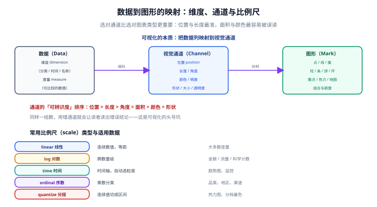

# 数据到图形的映射

图表库决定了你**能画什么**，而「数据到图形的映射」决定了你**画得对不对**。这一页讲的是可视化的核心方法论：一列数据该怎么落到视觉通道上，比例尺怎么选，颜色怎么用才不会误导人。

::: tip 一句话定位
可视化的本质是一次**编码**：把数据列编码成视觉通道。编码错了，图形再漂亮也是错的——而且**错得更隐蔽**，因为读者更相信自己眼睛看到的东西。
:::

## 维度与度量

任何图表数据都能拆成两类列：

| 类型 | 英文 | 特征 | 例子 | 典型通道 |
| --- | --- | --- | --- | --- |
| **维度** | dimension | 分类或时间，用来分组 | 产品线、地区、日期 | 位置（分类轴）、颜色、形状 |
| **度量** | measure | 可比较、可计算的数值 | 销售额、时长、次数 | 位置（数值轴）、长度、面积、大小 |

::: danger 最常见的分类错误：把「编码过的 ID」当度量
「用户 ID = 10086」看起来是数字，但**它是编号，不是数量**。把它放数值轴会导致 X 轴被拉出巨大的空白。

**判断方法**：问自己「两个值相加有没有意义？」`10086 + 10087` 没有意义 → 它是维度；`销售额` 相加有意义 → 它是度量。

**正确做法**：ID 类字段用 `type: 'category'`，或者在数值轴前先做归一化 / 分桶。
:::

## 视觉通道与可辨识度



同一个度量可以映射到多种通道。它们的**可辨识度差异巨大**，这是排版顺序的依据：

| 通道 | 人的分辨能力 | 适用 | 注意事项 |
| --- | --- | --- | --- |
| **位置**（在轴上的位置） | 最高，可分辨 1% 以内的差异 | 主度量 | 最精确，优先使用 |
| **长度**（柱长、线长） | 很高 | 主度量 | 必须从 0 开始，否则比例失真 |
| **角度 / 斜率** | 中 | 饼图扇区、趋势陡缓 | 人眼对角度不敏感，饼图不宜超过 6 项 |
| **面积** | 低 | 气泡大小 | 人的感知近似于「按面积」，故半径应按数值的**平方根**映射 |
| **颜色明度** | 低 | 第三、第四度量 | 需考虑色盲；不要用于需要精确比较的场合 |
| **颜色色相** | 很低 | 分类标识 | 只能区分「不同」，不能表达「多少」 |
| **形状** | 很低 | 分类标识 | 类别数超过 6 后基本认不出 |

::: danger 五条被违反最多的规则
1. **柱状图必须从 0 起**。纵轴从 95 起、把 5% 的差画成 3 倍的高度差，是最常见的「无意造假」。
2. **气泡大小要开平方根**。用半径直接映射数值，会让大值在视觉上被放大到平方倍。ECharts 的气泡图默认会做这个处理，手写 Canvas 时要自己做。
3. **颜色分类型与顺序型，不能混用**。「北京 / 上海 / 广州」用同一条顺序色带（浅蓝 → 深蓝）会让人误以为「北京 < 上海 < 广州」。
4. **不要用色相表达数值大小**。红黄蓝绿表达「从高到低」，读者无法排序。
5. **颜色超过 7 类就难以分辨**。类别多时应该改用「分组小倍数图」（每个类别一张小图），而不是硬塞进一张图。
:::

## 比例尺（Scale）

比例尺负责「数值 → 屏幕坐标」的转换。ECharts 里对应坐标轴或视觉映射的 `type`：

| 比例尺 | ECharts 里的写法 | 适用数据 | 典型场景 |
| --- | --- | --- | --- |
| 线性 linear | `yAxis: { type: 'value' }` | 连续数值、分布均匀 | 大多数度量 |
| 对数 log | `yAxis: { type: 'log' }` | 跨数量级 | 金额、流量、科学计数 |
| 时间 time | `xAxis: { type: 'time' }` | 时间戳 | 趋势、监控（自动选刻度粒度） |
| 序数 ordinal | `xAxis: { type: 'category' }` | 离散分类 | 品类、地区、渠道 |
| 分段 quantize | `visualMap: { type: 'piecewise' }` | 连续值切区间 | 热力图、分档着色 |

```javascript [scale-demo.js]
// 对比：同一组数据在 linear 与 log 下的观感差异
const data = [10, 50, 120, 300, 1500, 9000];

const baseOption = {
  xAxis: { type: 'category', data: ['A', 'B', 'C', 'D', 'E', 'F'] },
  series: [{ type: 'bar', data }],
};

// 线性轴：小值几乎贴地为 0，看不出差异
const linear = { ...baseOption, yAxis: { type: 'value' } };

// 对数轴：小值之间的差异被拉开，但 0 与负数无法显示
const log = { ...baseOption, yAxis: { type: 'log' } };
```

::: danger 对数轴的两条硬约束
1. **不能包含 0 或负数**（`log(0)` 无定义）。数据里有 0 时必须先替换为极小正数，或改用「对称对数」（`log1p`），并在图注中说明。
2. **必须标注「对数刻度」**。没有标注的对数轴会让读者把「差一个数量级」读成「差一点点」。
:::

## 颜色的三种用途

颜色是**信息密度最高也最容易出错**的通道。使用前先判断属于哪一类：

| 用途 | 类型 | 取值方式 | 例子 |
| --- | --- | --- | --- |
| 区分类别 | **分类色**（categorical） | 选取亮度接近、色相分散的 5~7 色 | 产品线 A / B / C |
| 表达大小 | **顺序色**（sequential） | 单色相从浅到深，或双色渐变 | 温度、密度、转化率 |
| 表达偏离 | **发散色**（diverging） | 中间为中性，两端为对比色 | 同比增长（有正有负） |

```javascript [visual-map.js]
// 顺序色：用 visualMap 把数值映射到颜色深浅（适用于热力图 / 地图）
visualMap: {
  type: 'continuous',
  min: 0,
  max: 100,
  dimension: 2,           // 用第 3 个维度（索引 2）决定颜色
  inRange: { color: ['#EFF6FF', '#2563EB', '#1E3A8A'] }, // 浅 → 深
  text: ['高', '低'],
}
```

::: danger 颜色使用中最致命的三个错误
1. **彩虹色带（rainbow）**。红黄绿蓝紫的色带在亮度上非单调，读者会用「亮度」判断大小，于是排序被打乱。**正确做法**：用单色相的深浅渐变，或经科学设计的色带（如 viridis）。
2. **红绿对比**。约 8% 的男性有红绿色觉障碍，红绿对比图在他们眼里几乎同色。**正确做法**：改用蓝橙对比，或同时用形状/纹理辅助区分。
3. **顺序色用于分类**。如前述，会让读者以为类别之间有大小关系。
:::

::: tip 三个可直接用的配色方案
- **分类（6 色以内）**：`#2563EB`（蓝）、`#EA580C`（橙）、`#059669`（绿）、`#9333EA`（紫）、`#DC2626`（红）、`#0891B2`（青）。亮度接近、色相分散，红绿色盲也能区分。
- **顺序（单色相）**：`#EFF6FF → #93C5FD → #3B82F6 → #1D4ED8 → #1E3A8A`。
- **发散（有正有负）**：`#1D4ED8 ← #93C5FD ← #F1F5F9 → #FDBA74 → #C2410C`。
:::

## 宽表与长表：数据结构怎么影响代码

同一份数据有两种排法，选错了代码会变得极难维护。

**宽表（wide）**：一行一个时间点，每个指标一列。

| month | online | offline |
| --- | --- | --- |
| 一月 | 120 | 60 |
| 二月 | 200 | 90 |

**长表（long）**：一行一个「时间点 + 指标 + 值」。

| month | channel | value |
| --- | --- | --- |
| 一月 | 线上 | 120 |
| 一月 | 线下 | 60 |
| 二月 | 线上 | 200 |
| 二月 | 线下 | 90 |

| 场景 | 推荐 | 理由 |
| --- | --- | --- |
| 系列数量固定（2~3 个指标） | 宽表 | 一眼能看懂，`dataset.source` 直接吃 |
| 系列数量由数据决定（如「各渠道」） | 长表 | 不用为「新增一个渠道」改代码 |
| 需要聚合 / 筛选 / 排序 | 长表 | 配合 `dataset.transform` 做管道处理 |
| 后端接口返回 | 通常是长表 | 前端按需转宽表（`reduce` 一行搞定） |

长表 → 宽表的转换（图表库通常都支持直接吃长表，但有时需要手动转）：

```javascript [long-to-wide.js]
const long = [
  { month: '一月', channel: '线上', value: 120 },
  { month: '一月', channel: '线下', value: 60 },
  { month: '二月', channel: '线上', value: 200 },
  { month: '二月', channel: '线下', value: 90 },
];

const months = [...new Set(long.map((d) => d.month))];
const channels = [...new Set(long.map((d) => d.channel))];
const index = new Map(long.map((d) => [`${d.month}|${d.channel}`, d.value]));

// 转成 ECharts 需要的「维度在前、系列分列」结构
const source = [['month', ...channels], ...months.map((m) => [m, ...channels.map((c) => index.get(`${m}|${c}`) ?? 0)])];
console.log(source);
// [['month','线上','线下'], ['一月',120,60], ['二月',200,90]]
```

## 数据清洗：画之前必须做的四件事

图表不会告诉你数据有问题，它只会把问题画出来。

| 检查项 | 常见问题 | 处理方式 |
| --- | --- | --- |
| **缺失值** | `null` / `undefined` / `''` / `-` 混用 | 统一为 `null`，ECharts 会**断开**折线而不是连成直线 |
| **数值类型** | 接口返回字符串 `"1200"` | `Number()` 显式转换；`NaN` 会静默丢点 |
| **时区** | 时间戳与本地时间混用 | 全部统一为 UTC 时间戳，展示层再格式化 |
| **异常值** | 测试数据、脏数据造成极端值 | 决定是「截断显示」还是「保留但标注」，**不要静默删除** |

::: danger `null` 与 `0` 的区别会改变结论
「当日无数据」与「当日数据为 0」是两件事，但很多接口都用 `0` 表示前者。

- 用 `null`：折线在缺失处**断开**，读者知道这里没数据。
- 用 `0`：折线**掉到谷底**，读者会以为那天的业务量真的是 0。

**正确做法**：接口层就要区分「无数据」与「零值」；前端不要把缺失值补成 0。
:::

## 实战：把一张「会误导人的图」改正

需求：展示「五个渠道的转化率」，原始数据如下（转化率差异很小）。

```javascript
const raw = [
  { channel: '搜索', rate: 0.052 },
  { channel: '推荐', rate: 0.055 },
  { channel: '社群', rate: 0.054 },
  { channel: '广告', rate: 0.049 },
  { channel: '直访', rate: 0.061 },
];
```

**错误画法一**：纵向柱状图 + 截断纵轴。

```javascript
// 纵轴从 0.04 起 → 0.049 与 0.061 在视觉上差出 4 倍
yAxis: { type: 'value', min: 0.04, max: 0.065 }
series: [{ type: 'bar', data: raw.map((d) => d.rate) }]
```

**错误画法二**：用饼图表达转化率。饼图表达的是「构成」，而转化率之间**不构成一个整体**，画成饼图毫无意义。

**正确画法**：横向条形图，从 0 起，并把「目标线」标出来。

```javascript [fix-misleading.js]
const TARGET = 0.05; // 业务基准线

chart.setOption({
  grid: { left: 80, right: 40, top: 48, bottom: 40 },
  tooltip: {
    trigger: 'axis',
    axisPointer: { type: 'shadow' },
    // 用 formatter 把小数转成百分比，避免读者自己换算
    valueFormatter: (v) => (v * 100).toFixed(1) + '%',
  },
  xAxis: {
    type: 'value',
    min: 0,                                  // 必须从 0 起
    max: 0.08,
    axisLabel: { formatter: (v) => (v * 100).toFixed(0) + '%' },
  },
  yAxis: {
    type: 'category',
    data: raw.map((d) => d.channel),
    inverse: true,                           // 第一项在最上面，符合阅读顺序
  },
  series: [
    {
      type: 'bar',
      data: raw.map((d) => d.rate),
      barWidth: '50%',
      // 用颜色区分「达标 / 未达标」——这是有意义的分类，不是装饰
      itemStyle: {
        color: (p) => (p.value >= TARGET ? '#059669' : '#DC2626'),
      },
      markLine: {
        silent: true,
        symbol: 'none',
        data: [{ xAxis: TARGET, label: { formatter: '基准 5%' }, lineStyle: { color: '#475569', type: 'dashed' } }],
      },
    },
  ],
});
```

**为什么这么改**：

| 改动 | 解决的问题 |
| --- | --- |
| 改为横向条形图 | 中文渠道名不用旋转，可读性提升 |
| `xAxis.min = 0` | 消除纵轴截断带来的视觉夸张 |
| `inverse: true` | 类目顺序与阅读顺序一致（从上往下） |
| 颜色区分达标 / 未达标 | 颜色承载**有意义的分类**，而不是随机装饰 |
| `markLine` 标基准线 | 读者不用自己心算「比 5% 高还是低」 |
| `valueFormatter` 转百分比 | 消除「0.052 是多少」的换算负担 |

**验证方式**：把最终图给一位不了解业务的同事看 3 秒，然后问他「哪一个渠道最好、有几个达标」。如果他能立刻答出，说明编码是有效的。

## 参考资料

- [ECharts 配置项手册 · visualMap](https://echarts.apache.org/zh/option.html#visualMap)（颜色映射的官方用法）
- [ECharts 配置项手册 · dataset / transform](https://echarts.apache.org/zh/option.html#dataset)（数据管道）
- [Data Visualization Catalogue](https://datavizcatalogue.com/)（按表达目标反查图形）
- [ColorBrewer](https://colorbrewer2.org/)（分类 / 顺序 / 发散三类配色的权威来源，可按色盲友好筛选）
- [Material Design · 数据可视化色彩](https://m2.material.io/design/color/data-visualization.html)（配色与可访问性）
- [Datawrapper Academy](https://academy.datawrapper.de/)（大量「同一份数据的多种画法对比」实例）
