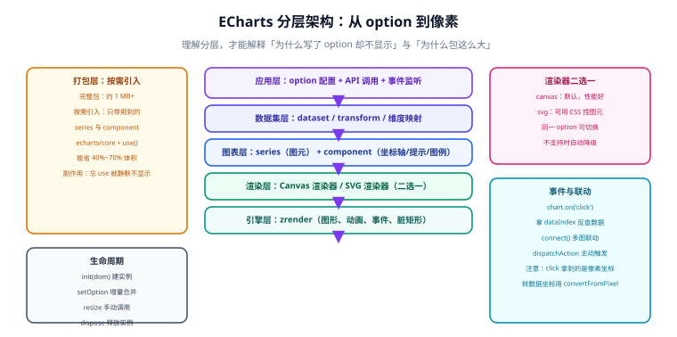

# ECharts 深入：从 option 到像素

ECharts 是国内使用最广的声明式图表库：**你描述「要什么」，它负责「怎么画」**。这一页讲它的能力模型——option 的合并语义、数据的三种给法、按需引入的边界、事件与生命周期。这些决定了你能不能写出一个可维护、不泄漏、体积可控的图表层。

::: info 与相邻页面的分工
本页讲 **ECharts 本身**（模型、数据、事件、体积、生命周期）。

如果你的问题是「在 Vue 项目里怎么封装 ECharts 组件」，看 [Vue3 · ECharts](../../Frame/Vue/Vue3/ECharts/index.md)；如果是「图表怎么选、怎么画对」，看 [数据可视化概述与选型](../Overview/index.md) 与 [数据到图形的映射](../DataMapping/index.md)。
:::

## 分层架构：option 是怎么变成像素的



理解这个分层，能解释两类最常见的问题：

- **「为什么写了 option 却不显示」**：多半是「打包层漏了 `use()`」或「容器高度为 0」，而不是 option 写错。
- **「为什么包这么大」**：完整包包含了所有图表类型与组件，而你的项目通常只用 3~5 种。

自上而下五层：

| 层 | 职责 | 你要关心的 |
| --- | --- | --- |
| 应用层 | `option` 配置、API 调用、事件监听 | 你的业务代码在这一层 |
| 数据集层 | `dataset` / `transform` / 维度映射 | 决定数据结构与编码方式 |
| 图表层 | `series`（图元）+ `component`（坐标轴、提示、图例） | 决定画什么 |
| 渲染层 | Canvas 渲染器 / SVG 渲染器 | 决定画在哪 |
| 引擎层 | zrender：图形、动画、事件、脏矩形 | 性能调优的着力点 |

## 核心模型：series 与 component

ECharts 的配置项只有两大类：

- **`series`（系列）**：真正画出来的东西。`type` 决定图形类型（`line` / `bar` / `pie` / `scatter` / `map` …）。
- **`component`（组件）**：辅助元素。`xAxis`、`yAxis`、`grid`、`tooltip`、`legend`、`title`、`dataZoom`、`visualMap` 等。

```javascript [option-skeleton.js]
const option = {
  // ---- 组件：坐标轴（直角坐标系图表的必需品）----
  xAxis: { type: 'category', data: ['一月', '二月', '三月', '四月'] },
  yAxis: { type: 'value', name: '万元' },
  grid: { left: 60, right: 24, top: 48, bottom: 40 }, // 留白不够会被标签撑破
  tooltip: { trigger: 'axis' },
  legend: { top: 8 },

  // ---- 系列：画什么 ----
  series: [
    { name: '线上', type: 'bar', data: [120, 200, 150, 80] },
    { name: '线下', type: 'bar', data: [60, 90, 110, 130] },
  ],
};
```

::: tip 记住这个判断口诀
**「坐标轴、提示框、图例」是组件，「柱子、线、点、饼」是系列。** 找不到配置项时先判断它属于哪一类，再去对应的配置手册章节找。
:::

## option 的合并语义（最容易踩的坑）

`setOption` 默认**不是替换，而是深度合并**。这个设计让「只更新数据」很方便，但也带来一个经典 bug：上一次的 series 没被清掉。

```javascript
// 第一次：3 个系列
chart.setOption({ series: [{ type: 'line', data: [1, 2, 3] },
                           { type: 'line', data: [3, 2, 1] },
                           { type: 'line', data: [2, 2, 2] }] });

// 第二次：只写了 1 个系列 → 后两个系列会「残留」在图上
chart.setOption({ series: [{ type: 'line', data: [5, 5, 5] }] });
// 现象：图上有 3 条线，第一条是新数据，后两条还是旧数据
```

三种处理方式：

| 方式 | 写法 | 语义 | 适用 |
| --- | --- | --- | --- |
| 深度合并（默认） | `setOption(opt)` | 按索引合并，多余的保留 | 只改数据、改样式 |
| 全量替换 | `setOption(opt, true)` | `notMerge = true`，整体重建 | 图表类型会变的场景 |
| 按组件替换 | `setOption(opt, { replaceMerge: ['series'] })` | 只替换指定组件 | **推荐**：既不残留，也不重建坐标轴 |

::: danger 三种写法都别乱用
1. **数字参数的可读性陷阱**：`setOption(opt, true)` 里的 `true` 是 `notMerge`。这个位置还可以传对象，两种形态混用极易看错。**建议**：需要替换语义时统一写对象形式 `{ notMerge: true }` 或 `{ replaceMerge: ['series'] }`，可读性远好于裸 `true`。
2. **`notMerge: true` 的副作用**：它会丢弃所有未在新 option 中出现的配置，包括你之前设过的主题与 `dataZoom` 状态。切换图表类型时用它没问题，**高频刷新时用它会导致状态抖动**。
3. **全量替换 + 高频刷新 = 闪屏**。实时曲线每帧 `notMerge` 会重建整图，视觉上出现闪烁。**正确做法**：用 `replaceMerge: ['series']`，或直接更新 `series.data`。
:::

## 数据的三种给法

### 写法一：`series.data`（最直接）

```javascript
series: [{ type: 'line', data: [820, 932, 901, 1290] }]
```

适合数据量小、结构简单、不需要多系列共享同一份数据的场景。

### 写法二：`dataset.source`（推荐）

```javascript [dataset-source.js]
const option = {
  dataset: {
    // 二维数组：第一行是表头
    source: [
      ['月份', '线上', '线下'],
      ['一月', 120, 60],
      ['二月', 200, 90],
      ['三月', 150, 110],
    ],
  },
  xAxis: { type: 'category' },
  yAxis: { type: 'value' },
  series: [
    { type: 'bar', encode: { x: '月份', y: '线上' } }, // 用列名绑定，而不是索引
    { type: 'bar', encode: { x: '月份', y: '线下' } },
  ],
};
```

也可以给对象数组，此时 `encode` 用字段名即可：

```javascript
dataset: { source: [{ month: '一月', online: 120 }, { month: '二月', online: 200 }] },
series: [{ type: 'bar', encode: { x: 'month', y: 'online' } }],
```

**为什么推荐 dataset**：① 数据与配置分离，换一份数据不用改 series；② 用**列名**而非下标绑定，插入新列时不会错位；③ 可以用 `transform` 做管道式数据加工。

### 写法三：`dataset` + `transform`（数据加工）

```javascript [dataset-transform.js]
const option = {
  dataset: [
    { source: rawData },
    // 管道一：按维度聚合求和
    {
      id: 'agg',
      fromDatasetId: 'raw',
      transform: { type: 'ecSimpleTransform:aggregate', config: { resultDimensions: [{ name: 'total', from: 'amount', method: 'sum' }], groupBy: 'region' } },
    },
    // 管道二：按总额降序
    { fromDatasetId: 'agg', transform: { type: 'sort', config: { dimension: 'total', order: 'desc' } } },
  ],
  series: [{ type: 'bar', datasetId: 'agg', encode: { x: 'region', y: 'total' } }],
};
```

::: warning `ecSimpleTransform` 需要额外引入
`ecSimpleTransform:aggregate` / `sort` / `filter` 等内置变换**不在核心包里**，需要单独注册：

```javascript
import { use } from 'echarts/core';
import { aggregate, sort, filter } from 'echarts/features';

use([aggregate, sort, filter]);
```

漏了这一步，表现同样是**静默不生效**（图表为空白或数据未变换）。
:::

## 按需引入：把包减下来

```javascript [echarts-setup.js]
import * as echarts from 'echarts/core';
import { BarChart, LineChart, PieChart, ScatterChart } from 'echarts/charts';
import {
  GridComponent, TooltipComponent, LegendComponent,
  TitleComponent, DataZoomComponent, VisualMapComponent,
} from 'echarts/components';
import { LabelLayout, UniversalTransition } from 'echarts/features';
import { CanvasRenderer } from 'echarts/renderers';

echarts.use([
  BarChart, LineChart, PieChart, ScatterChart,
  GridComponent, TooltipComponent, LegendComponent, TitleComponent,
  DataZoomComponent, VisualMapComponent,
  LabelLayout, UniversalTransition,
  CanvasRenderer,
]);

export default echarts;
```

**验证方式**：构建后对比体积。以 Vite 为例，看 `dist/assets/*.js` 的实际 gzip 大小，或本地跑 `npx vite-bundle-visualizer` 查看 `echarts` 占比。

::: danger 按需引入的三个静默失败
1. **漏 `use()` 不报错**。图表不显示，只在控制台留一条 `Series xxx is used but not imported` 之类的提示（很容易被过滤掉）。**排查**：保留控制台所有 `echarts` 相关输出。
2. **地图需要单独注册**。用 `type: 'map'` 必须 `echarts.registerMap('china', geoJson)`，且 GeoJSON 要自己准备。
3. **`LabelLayout` / `UniversalTransition` 属于 `features` 而非 `components`**，从 `echarts/components` 里 import 会直接编译失败。
:::

## 事件、交互与联动

```javascript [echarts-event.js]
// 1. 监听图表事件：params 里带 seriesName、dataIndex、value
chart.on('click', (params) => {
  if (params.componentType !== 'series') return; // 点在图例/坐标轴上也会触发
  console.log(params.seriesName, params.dataIndex, params.value);
});

// 2. 主动触发行为（例如用外部按钮控制缩放、高亮）
chart.dispatchAction({ type: 'highlight', seriesIndex: 0, dataIndex: 3 });
chart.dispatchAction({ type: 'showTip', seriesIndex: 0, dataIndex: 3 });

// 3. 多图联动：把多个实例的坐标轴缩放/高亮同步
echarts.connect([chartA, chartB]);

// 4. 像素坐标 → 数据坐标（自定义标记、点击定位的必备）
const point = [400, 200]; // 画布上的 CSS 像素坐标
const dataCoord = chart.convertFromPixel({ seriesIndex: 0 }, point);
console.log('对应的数据坐标：', dataCoord);
```

::: danger 事件参数里的坐标是像素，不是数据
`params.event.offsetX` 这类是**画布像素坐标**。要拿到业务含义的数值必须用 `convertFromPixel`。

常见错误：直接把 `offsetX` 当数据值上报埋点，结果不同屏幕分辨率上报的数值不同——因为像素坐标与屏幕尺寸强相关。
:::

## 主题、暗色与响应式

```javascript [echarts-theme.js]
// 内置主题：'light' / 'dark'（dark 需显式传入）
const chart = echarts.init(dom, 'dark');

// 自定义主题：先在 ECharts 主题编辑器里配好，导出 JSON 后注册
import myTheme from './theme/my-theme.json';
echarts.registerTheme('my-brand', myTheme);
echarts.init(dom, 'my-brand');

// 暗色跟随：主题只能在 init 时生效，切换要重建实例
function reinit(dom, theme) {
  const old = echarts.getInstanceByDom(dom);
  if (old) old.dispose();
  return echarts.init(dom, theme);
}
```

**响应式**（容器尺寸变化）必须手动处理：

```javascript [echarts-resize.js]
const chart = echarts.init(dom);

// 方案 A：监听窗口（简单，但容器变化不会触发）
window.addEventListener('resize', () => chart.resize());

// 方案 B：ResizeObserver（推荐，能感知容器自身尺寸变化，如侧边栏折叠）
const ro = new ResizeObserver(() => chart.resize());
ro.observe(dom);

// 清理时两者都要解除
// ro.disconnect(); window.removeEventListener('resize', handler);
```

::: tip 侧边栏折叠导致图表变形？用 ResizeObserver
后台系统常见：菜单折叠后内容区变宽，但 `window` 尺寸没变，于是图表停在旧尺寸上被拉伸变形。

**正确做法**：用 `ResizeObserver` 监听图表容器本身。注意回调里加一层防抖（`requestAnimationFrame` 或 100ms 节流），否则连续拖拽窗口时会高频 `resize`。
:::

## 生命周期：不 dispose 就会泄漏

```javascript [echarts-lifecycle.js]
const chart = echarts.init(dom);
chart.setOption(option);

// 卸载时必须做的事
function cleanup() {
  chart.dispose();       // 释放实例、解绑 canvas 上的原生监听
  // 如果用了 ResizeObserver / window.resize，也要一并解除
}

// 取回已存在的实例（避免重复 init 同一个 DOM）
const existed = echarts.getInstanceByDom(dom);
```

::: danger 内存泄漏的三个来源
1. **只清 DOM 不 `dispose()`**。反复切换路由 / 开关弹窗，会累积实例与事件监听，表现为「用得越久越卡」。
2. **`window.resize` 监听没解绑**。组件已销毁，回调仍在执行，引用被闭包持有无法回收。
3. **定时器驱动 `setOption` 没停**。实时图表里最常见，页面切走后定时器继续跑。

**验证方式**：在浏览器开发者工具里用「Performance → Memory」录一段「反复打开关闭图表页 20 次」的堆快照，观察 `ECharts` 相关对象数量是否随次数线性增长。零增长才说明清理正确。
:::

## 实战：一个可复用的图表封装（框架无关）

```javascript [create-chart.js]
import * as echarts from './echarts-setup.js';

/**
 * 创建一个受管图表实例：自动处理初始化、option 合并语义、resize 与销毁。
 * @param {HTMLElement} dom 容器
 * @param {object} options
 * @param {'merge'|'replace-series'} options.mode 更新语义
 */
export function createChart(dom, { mode = 'replace-series' } = {}) {
  const chart = echarts.init(dom, null, { renderer: 'canvas' });
  const ro = new ResizeObserver(() => {
    // 用 rAF 合并同一帧内的多次触发
    requestAnimationFrame(() => chart.resize());
  });
  ro.observe(dom);

  const update = (option) => {
    // 统一语义：永远替换 series，其余配置走合并
    chart.setOption(option, { replaceMerge: ['series'], lazyUpdate: true });
  };

  const dispose = () => {
    ro.disconnect();
    chart.dispose();
  };

  return { chart, update, dispose };
}
```

用法：

```javascript
const { chart, update, dispose } = createChart(document.getElementById('app'));

update({
  tooltip: { trigger: 'axis' },
  xAxis: { type: 'category', data: ['一月', '二月', '三月'] },
  yAxis: { type: 'value' },
  series: [{ type: 'bar', data: [120, 200, 150] }],
});

// 换数据：不会残留上一次的系列
update({ series: [{ type: 'bar', data: [80, 90, 100] }] });

// 组件卸载时
dispose();
```

**验证方式**：连续调用 `update` 五次，每次传入不同数量的 series（1 个 → 3 个 → 2 个 → 1 个），确认图上系列数量与每次传入一致，**没有残留**；再调用 `dispose()`，确认控制台无报错且 `echarts.getInstanceByDom(dom)` 返回 `undefined`。

## 易错点速查

::: danger 十个高频问题
1. **容器高度为 0** → 图表不显示。给容器明确高度，或确保父链每层都有高度。
2. **`setOption` 系列残留** → 用 `replaceMerge: ['series']`。
3. **`notMerge` 导致状态丢失**（缩放、图例勾选被重置）→ 高频更新别用它。
4. **按需引入漏 `use()`** → 检查控制台的 `not imported` 提示。
5. **地图未 `registerMap`** → `type: 'map'` 必然不显示。
6. **`dataset` 用对象数组却没配 `encode`** → 系列不知道取哪一列，画出空图。
7. **`dark` 主题不生效** → 主题要在 `init` 第二个参数传，`setOption` 里设没用。
8. **没 `dispose()`** → 内存线性增长。
9. **`window.resize` 覆盖不到容器变化** → 用 `ResizeObserver`。
10. **点击事件把 `params.event.offsetX` 当数据** → 需要 `convertFromPixel` 转换。
:::

## 参考资料

- [Apache ECharts 官方文档](https://echarts.apache.org/zh/index.html)
- [ECharts 配置项手册](https://echarts.apache.org/zh/option.html)（按「组件 / 系列」两大部分组织，与本文的分层对应）
- [ECharts 使用手册 · 在项目中引入 ECharts](https://echarts.apache.org/handbook/zh/basics/import/)（按需引入的官方写法）
- [ECharts API 手册](https://echarts.apache.org/zh/api.html)（`setOption`、`convertFromPixel`、`dispose` 等）
- [ECharts 主题编辑器](https://echarts.apache.org/zh/theme-builder.html)
- [ECharts 版本记录](https://echarts.apache.org/zh/changelog.html)
