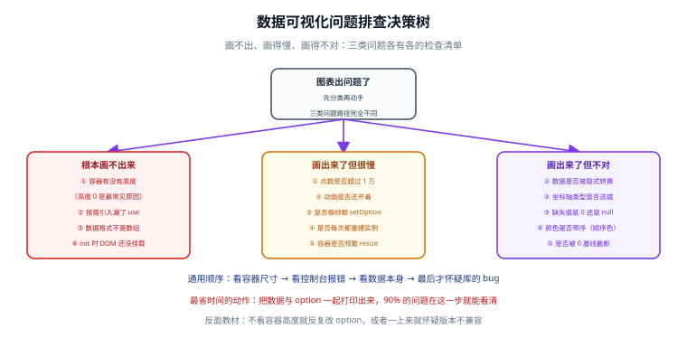

# 常见问题与最佳实践

这一页把数据可视化里出现频率最高的问题按**现象**归类：画不出来、画得慢、画得不对。每一条都给出「怎么定位」与「怎么修」，而不是只给结论。

::: tip 一句话定位
可视化的排查有一条捷径：**先把容器尺寸、控制台报错、数据本身这三样看清楚**，90% 的问题在这一步就能定位，剩下的 10% 才需要怀疑库。
:::

## 排查入口



三类问题的路径完全不同，先分类再动手：

| 现象 | 大概率原因 | 第一个要看的 |
| --- | --- | --- |
| 容器空白，什么都没有 | 容器尺寸为 0 / 脚本未执行 / 按需引入漏注册 | 容器实际高度 |
| 有坐标轴但没有图形 | 数据格式不对 / `encode` 配错 / 类别名对不上 | 打印 `option` 与数据 |
| 有图形但很慢 | 点数过多 / 动画未关 / 每帧重建实例 | 点数与 FPS |
| 图形对了但结论错 | 通道映射错 / 纵轴截断 / `null` 补成 0 | 纵轴起点与空值处理 |

## 一类：根本画不出来

### 1. 容器高度为 0（第一高频）

**现象**：页面上什么都没有，控制台无报错，`init()` 也执行了。

**原因**：图表初始化时读取容器尺寸，高度为 0 时会创建一块 0 像素高的画布。

```html
<!-- 反例：设了宽度没设高度，且没有内容撑开 -->
<div id="chart" style="width: 100%;"></div>
```

```html
<!-- 正确：明确高度 -->
<div id="chart" style="width: 100%; height: 360px;"></div>
```

**定位方法**：在控制台执行 `document.getElementById('chart').clientHeight`，返回 `0` 就是它。

**为什么 flex 布局下更容易出问题**：flex 子项的默认 `min-height` 是 `auto`，会被内容撑开或压扁，而图表容器的内容（canvas）是绝对定位的，撑不开父元素，于是高度塌成 0。

```css
/* 正确：flex 布局里要显式允许收缩 */
.panel { display: flex; flex-direction: column; min-height: 0; }
.chart { flex: 1; min-height: 0; }
```

### 2. 按需引入漏了注册

**现象**：图表不显示，或只有部分组件显示（比如有坐标轴没有图例）。

**原因**：`echarts.use()` 里没注册对应的 `XxxChart` / `XxxComponent`。这类错误**不会抛异常**，只在控制台留一条提示。

**定位方法**：在控制台搜索 `not imported` / `not exists`。

**正确写法**：

```javascript
import * as echarts from 'echarts/core';
import { LineChart } from 'echarts/charts';
import { GridComponent, TooltipComponent } from 'echarts/components';
import { CanvasRenderer } from 'echarts/renderers';
echarts.use([LineChart, GridComponent, TooltipComponent, CanvasRenderer]);
```

::: danger 「静默失败」为什么危险
按需引入的漏注册是**没有异常**的——开发时看到的只是一个空白容器，很容易被误判成「数据没到」，从而浪费大量时间在数据层排查。

**建议**：新建图表时先把 `use()` 列表写全（宁可多写几个），等页面正常后再逐个删掉验证。
:::

### 3. 初始化时机太早

**现象**：首次渲染空白，切走再切回来就正常。

**原因**：在框架的「创建」阶段取 DOM 拿不到元素（Vue 的 `setup`、React 的函数组件体）。

```javascript
// Vue 3：正确
onMounted(() => { chart = echarts.init(chartRef.value); });

// React：正确
useEffect(() => { const chart = echarts.init(ref.current); return () => chart.dispose(); }, []);
```

### 4. `dataset` 用对象数组却没配 `encode`

**现象**：坐标轴出来了，图形是空的。

**原因**：用二维数组时 ECharts 能按顺序推断；用**对象数组**时必须用 `encode` 指明取哪些字段。

```javascript
dataset: { source: [{ month: '一月', online: 120 }] },
series: [{ type: 'bar', encode: { x: 'month', y: 'online' } }], // 缺这行就画不出来
```

## 二类：画出来了但很慢

### 5. 点数超过一万还没采样

**现象**：首屏渲染卡顿几秒；拖动缩放时掉到 10 fps 以下。

**定位方法**：把 series 的 `data.length` 打印出来。

**修复**：见 [大数据量下的性能工程](../LargeData/index.md)。最快的三个动作：

```javascript
series: [{
  type: 'line',
  showSymbol: false,        // 关掉每个点的圆点
  animation: false,         // 关掉动画
  sampling: 'lttb',         // 内置降采样
  large: true,              // 大数据量模式
  largeThreshold: 2000,
}]
```

### 6. 每次都重建实例

**现象**：切换筛选条件时页面闪烁；操作几十次后越来越卡。

**原因**：每次更新数据都 `echarts.init()` 一遍，旧实例没有 `dispose()`。

```javascript
// 反例
function update(data) {
  const c = echarts.init(dom);  // 每次都新建，旧的没释放
  c.setOption({ series: [{ data }] });
}

// 正确：复用实例，只更新 option
const chart = echarts.init(dom);
function update(data) {
  chart.setOption({ series: [{ data }] });
}
```

### 7. 每帧都提交全量数据

**现象**：实时曲线页面 CPU 持续 100%，风扇狂转。

**原因**：推送频率高于渲染需要，每条消息都触发一次完整重绘。

**修复**：按固定间隔合并提交（如 1 秒一次），参考 [数据大屏工程](../Dashboard/index.md) 的 `createRealtimeStream`。

### 8. `tooltip` 的 `axis` 触发在大数据量下很贵

**现象**：鼠标在图上移动时明显卡顿，移出后恢复正常。

**原因**：`trigger: 'axis'` 需要每次移动都计算最近的轴位置并重绘提示框。

**修复**：

```javascript
tooltip: {
  trigger: 'axis',
  animation: false,          // 提示框自身动画关掉
  transitionDuration: 0,     // 移动时的过渡关闭，避免连续重绘
}
```

## 三类：画出来了但不对

### 9. 纵轴截断

**现象**：两个数值相差 5% 的柱子，看起来差了三四倍。

**定位方法**：看 `yAxis.min` 是否大于 0。

**修复**：数值轴默认从 0 起（ECharts 的 `value` 轴会自动包含 0）。**如果业务上确实必须截断**（例如全部数值都在 1000 附近），必须做两件事：① 在图注或副标题里明确写出「纵轴不从 0 起」；② 使用 `markLine` 或断裂标记提示读者。

### 10. `null` 被补成 `0`

**现象**：折线在某个时间段突然掉到谷底。

**原因**：接口返回缺失数据，前端 `data.map((d) => d.value || 0)` 把 `undefined` 变成了 `0`。

**修复**：

```javascript
// 正确：保留空值，让折线断开
const series = raw.map((d) => (d.value == null ? null : d.value));
```

::: danger `|| 0` 是 JavaScript 里最危险的默认值写法之一
`0 || 0` 也会得到 `0`，这没问题；但 `null || 0`、`undefined || 0`、`'' || 0` 都会静默变成 0，把「没有数据」伪装成「数据是 0」。

**正确写法**：用 `??`（空值合并）替代 `||`，或者显式判断 `== null`。
:::

### 11. 时间轴用了分类轴

**现象**：时间顺序错乱，`2026-10` 排在 `2026-2` 前面。

**原因**：`xAxis: { type: 'category' }` 会按**字符串**排序。

**修复**：改用 `type: 'time'`（接受时间戳或日期字符串），或先把时间转成时间戳再按数值排序。

### 12. 颜色误导

**现象**：读者从图上读出了「A 比 B 大」的结论，但实际上没有大小关系。

**原因**：顺序色（浅到深）被用在**分类**数据上。

**修复**：见 [数据到图形的映射](../DataMapping/index.md)。记住三类颜色的用途：分类用**色相分散、亮度接近**的色板；表达大小用**单色相深浅**；表达偏离用**两端对比色**。

## 通用排查流程

```
① 容器有尺寸吗？        → clientHeight / clientWidth
② 控制台报错了吗？      → 全部级别打开，搜 echarts
③ 数据对得上吗？        → console.log(option)，看 series.data 长度与内容
④ 只有这一页有问题吗？  → 新建一个最小复现页，逐步加回配置
⑤ 才怀疑库版本 / 兼容性
```

::: tip 最省时间的动作
**把数据与 option 一起打印出来。** 90% 的问题在打印出来的那一刻就能看清——比如 `data` 是长度为 0 的数组，或者 `xAxis.data` 是 12 个中文月份但 `series.data` 只有 8 个值。

```javascript
console.log(JSON.stringify({ data: option.series[0].data.slice(0, 5), len: option.series[0].data.length }));
```
:::

## 三句通用追问

遇到任何可视化需求，先用这三句把需求问清楚：

1. **「这张图要回答哪一个问题？」** —— 答不上来说明结论还没形成，此时画图是浪费。
2. **「谁在看、离屏幕多远、看多久？」** —— 决定字号、信息密度与刷新频率。
3. **「数据量多大、多久更新一次？」** —— 决定渲染路线与是否需要采样、WebGL。

这三句能提前拦掉大部分返工。

## 快速自查表

| 检查项 | 判定标准 | 怎么查 |
| --- | --- | --- |
| 容器尺寸 | 宽高都 > 0 | `el.clientWidth / clientHeight` |
| 图表类型已注册 | 控制台无 `not imported` | 搜控制台输出 |
| 数据非空 | `series.data.length > 0` | `console.log` |
| 数据格式正确 | 数组元素类型一致（不要数字与字符串混用） | `data.every((v) => typeof v === 'number')` |
| 坐标轴类型匹配 | 时间是 `time`，分类是 `category` | 看 option |
| 纵轴起点 | 数值轴从 0 起，或已显著标注 | 看 `yAxis.min` |
| 空值处理 | 缺失是 `null` 而不是 `0` | 看数据加工代码 |
| 颜色语义 | 分类色与顺序色没有混用 | 对照色板定义 |
| 实例已释放 | 组件卸载时调用 `dispose()` | 看清理逻辑 |
| 大数据有采样 | 点数 > 1 万时有采样或分片 | 看 `sampling` / `dataZoom` |

## 最佳实践清单

::: tip 十条落地建议
1. **先画对，再画美**。用默认主题确认结论无误，再调样式。
2. **一图一结论**。展示场景下，一张图只承载一个信息。
3. **数值轴从 0 起**；确实要截断时必须显著标注。
4. **类别名用横向条形图**。中文标签横排可读性远好于旋转 45°。
5. **颜色带语义**。达标 / 未达标用颜色区分是有意义的，随机上色不是。
6. **数字用等宽字体**（`tabular-nums`）。实时刷新时不会抖动。
7. **默认关动画**，只在「数据更新」这一件事上用短动效。
8. **实例复用不重建**，卸载时 `dispose()`。
9. **把性能指标显示在页面上**（FPS、点数、延迟），大屏尤其需要。
10. **写清「这张图要回答什么」**，把它放进页面的副标题里——读者和未来的你都会感谢这个决定。
:::

## 参考资料

- [Apache ECharts 官方文档](https://echarts.apache.org/zh/index.html)｜[常见问题 FAQ](https://echarts.apache.org/zh/faq.html)
- [ECharts · 使用手册](https://echarts.apache.org/handbook/zh/get-started/)（从安装到进阶的完整路径）
- [Datawrapper Academy](https://academy.datawrapper.de/)（图形选择与配色的大量实例）
- [ColorBrewer](https://colorbrewer2.org/)（分类 / 顺序 / 发散三类配色）
- [web.dev · 优化长任务](https://web.dev/articles/optimize-long-tasks)
