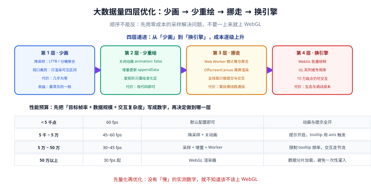

# 大数据量下的性能工程

当点数是十万、百万级时，图表卡顿不再是一个「优化项」，而是**能不能用**的问题。这一页给出一条可执行的优化路径：从零成本的采样开始，逐级上升到 Web Worker 与 WebGL。

::: tip 一句话定位
可视化的性能问题有一条铁律：**屏幕上能画出来的点，最多只有画布宽度那么多**。1920 宽的画布，横轴最多 1920 列——超出这个数的数据点在物理上就是冗余的。先从这个事实出发，再谈其他优化。
:::

## 第一步：把预算写成数字

不要凭感觉说「有点卡」。先写下三个数：

| 项 | 目标值 | 怎么测 |
| --- | --- | --- |
| 数据规模 | 原始点数 / 每秒新增点数 | 从接口返回值与刷新频率读出 |
| 目标帧率 | 交互时 ≥ 45 fps，静态渲染 ≥ 30 fps | `requestAnimationFrame` 采样 |
| 长任务上限 | 单次主线程阻塞 < 50 ms | `PerformanceObserver` 监听 `longtask` |

```javascript [perf-observer.js]
// 在任何优化动手之前，先把「卡在哪」测出来
const observer = new PerformanceObserver((list) => {
  for (const entry of list.getEntries()) {
    if (entry.duration > 50) {
      console.warn('[长任务]', entry.duration.toFixed(1) + 'ms', entry.name);
    }
  }
});
observer.observe({ entryTypes: ['longtask'] });

// 简单 FPS 采样
let frames = 0;
let last = performance.now();
function tick() {
  frames++;
  const now = performance.now();
  if (now - last >= 1000) {
    console.log('[FPS]', frames);
    frames = 0;
    last = now;
  }
  requestAnimationFrame(tick);
}
requestAnimationFrame(tick);
```

::: danger 不要跳过这一步
跳过测量直接上 WebGL，通常会得到两个结果：① 问题没解决（因为瓶颈其实在数据聚合，不在绘制）；② 引入了新的维护成本。

**正确顺序**：先用上面的代码确认「卡在绘制」还是「卡在计算」，再对症下药。
:::

## 四层优化路径



### 第 1 层：少画（成本最低，收益最大）

#### 1.1 视口裁剪

只渲染当前可见区间。带 `dataZoom` 的图表，用户通常只看一小段：

```javascript [viewport-clip.js]
// 只把可见区间交给图表，而不是把 10 万点全塞进去
function clipToViewport(allData, start, end) {
  // allData 按时间升序，用二分查找定位边界（O(log n)，远快于 filter 的 O(n)）
  const lo = lowerBound(allData, start);
  const hi = upperBound(allData, end);
  // 两侧各多取一个点，保证线能连到视图外，视觉不断裂
  return allData.slice(Math.max(0, lo - 1), Math.min(allData.length, hi + 1));
}

function lowerBound(arr, t) {
  let l = 0, r = arr.length;
  while (l < r) {
    const m = (l + r) >> 1;
    if (arr[m][0] < t) l = m + 1;
    else r = m;
  }
  return l;
}
function upperBound(arr, t) {
  let l = 0, r = arr.length;
  while (l < r) {
    const m = (l + r) >> 1;
    if (arr[m][0] <= t) l = m + 1;
    else r = m;
  }
  return l;
}
```

#### 1.2 降采样：LTTB 算法

**LTTB（Largest-Triangle-Three-Buckets，最大三角形三桶）** 是目前最常用的降采样算法：把数据分成 N 个桶（N = 目标点数），每桶取一个点，选点依据是「与前后已选点构成的三角形面积最大」。

它的好处是**保留了视觉上的极值特征**——峰值与谷值不会被抹平，而简单的等间隔抽稀会把尖刺全部丢掉。

```javascript [lttb.js]
/**
 * LTTB 降采样：把 data 降到 threshold 个点，尽量保留形状特征。
 * @param {[number, number][]} data [[x, y], ...]，必须按 x 升序
 * @param {number} threshold 目标点数（应 < data.length）
 */
export function lttb(data, threshold) {
  const n = data.length;
  if (threshold >= n || threshold === 0) return data.slice();

  const sampled = [data[0]];               // 第一个点必留
  const every = (n - 2) / (threshold - 2); // 每个桶的平均跨度（首尾各占一个点）
  let a = 0;                               // 上一个被选中的点（桶 A）

  for (let i = 0; i < threshold - 2; i++) {
    // ---- 下一个桶的平均点（作为三角形的第三个顶点）----
    let avgX = 0, avgY = 0, avgCount = 0;
    const rangeStart = Math.floor((i + 1) * every) + 1;
    const rangeEnd = Math.min(Math.floor((i + 2) * every) + 1, n);
    for (let j = rangeStart; j < rangeEnd; j++) {
      avgX += data[j][0];
      avgY += data[j][1];
      avgCount++;
    }
    avgX /= avgCount || 1;
    avgY /= avgCount || 1;

    // ---- 当前桶的区间 ----
    const curStart = Math.floor(i * every) + 1;
    const curEnd = Math.floor((i + 1) * every) + 1;

    // ---- 在当前桶里选「与 A、平均点构成面积最大」的那个点 ----
    const pointA = data[a];
    let maxArea = -1;
    let nextA = curStart;
    for (let j = curStart; j < curEnd; j++) {
      const area = Math.abs(
        (pointA[0] - avgX) * (data[j][1] - pointA[1]) -
        (pointA[0] - data[j][0]) * (avgY - pointA[1])
      );
      if (area > maxArea) {
        maxArea = area;
        nextA = j;
      }
    }

    sampled.push(data[nextA]);
    a = nextA;
  }

  sampled.push(data[n - 1]);               // 最后一个点必留
  return sampled;
}
```

用法与效果验证：

```javascript
const raw = Array.from({ length: 100000 }, (_, i) => [i, Math.sin(i / 800) * 50 + Math.random() * 5]);

// 画布宽 1920 → 采样到约 2000 个点，视觉上几乎无差别
const display = lttb(raw, 2000);

console.log('原始点数', raw.length, '→ 采样后', display.length);
// 关键验证：极值必须保留（等间隔抽稀会让峰值消失）
console.log('原始最大值', Math.max(...raw.map((d) => d[1])).toFixed(2));
console.log('采样最大值', Math.max(...display.map((d) => d[1])).toFixed(2));
```

::: danger 降采样最容易犯的三个错
1. **把采样后数据用于计算**。采样只用于**显示**，统计（总量、平均值、P99）必须用全量数据算。用显示数据算总数会得到错误结果。
2. **在降采样后做数据点查询**。用户点击某个点想查明细时，拿到的可能是「被抽稀出来的代表点」，与原始记录对不上。**正确做法**：显示层用采样，交互层用全量索引反查。
3. **每次刷新都重新采样同一份数据**。历史区间的采样结果是不变的，应当缓存；只对新到的点做增量处理。
:::

#### 1.3 分桶聚合

如果图本身就是「看趋势」而不是「看每个点」，可以直接在后端或 Worker 里按时间桶聚合：

```sql
-- 后端聚合：按分钟桶取均值与极值，返回行数从百万降到千级
SELECT
  DATE_FORMAT(created_at, '%Y-%m-%d %H:%i:00') AS bucket,
  AVG(latency_ms)  AS avg_latency,
  MAX(latency_ms)  AS max_latency,
  COUNT(*)         AS samples
FROM api_log
WHERE created_at >= ? AND created_at < ?
GROUP BY bucket
ORDER BY bucket;
```

::: tip 画「均值 + 极值带」比画「全部原始点」信息量更大
对监控场景，常见做法是画一条均值线 + 一条最大值线（或极值区间带）。这样既保留了「有没有尖刺」的信息，又把点数降了两个数量级。
:::

### 第 2 层：少重绘

#### 2.1 关掉动画

动画是最容易被忽略的开销。大数据量下渲染一帧本身就慢，再叠加缓动动画会成倍放大。

```javascript
series: [{
  type: 'line',
  data: bigData,
  animation: false,        // 大数据量下直接关掉
  // 也可以只关「首次渲染动画」，保留「更新动画」
  // animationDurationUpdate: 0,
}]
```

#### 2.2 增量追加，而不是整体替换

实时曲线的时间窗滚动，如果每次都 `setOption` 全量数据，等于每帧重建一次。ECharts 提供了增量接口：

```javascript [append-data.js]
// 增量追加：只把新点推进去，不重建整个系列
chart.appendData({ seriesIndex: 0, data: [[t, v]] });

// 当点数超过窗口上限时，配合 shift 丢弃最旧的点
// ECharts 5+ 的 appendData 不自动裁剪，需自己在数据层维护定长窗口
const WINDOW = 2000;
if (buffer.length > WINDOW) buffer.shift();
```

#### 2.3 ECharts 的渐进渲染（progressive）

ECharts 内置了渐进渲染机制：当系列图元数超过阈值时，分帧绘制，避免一次阻塞主线程。

```javascript
series: [{
  type: 'scatter',
  data: millionPoints,
  progressive: 2000,          // 每帧渲染的图元数
  progressiveThreshold: 3000, // 超过这个数量才启用渐进
}]
```

::: danger `progressive` 不是万能的
1. **它会让交互变「钝」**。渐进渲染期间图形是逐步出现的，看起来像「加载中」，不适合需要即时反馈的交互。
2. **它对部分系列类型无效**。`line` 系列在超大点数下仍要靠采样，不能只依赖 progressive。
3. **阈值设太小反而更慢**。每帧提交的次数变多，调度开销上升。**建议**：从默认值开始调，每次翻倍观察。
:::

### 第 3 层：移出主线程

#### 3.1 用 Web Worker 做计算

聚合、采样、排序这些纯计算密集的操作非常适合放进 Worker：

```javascript [sampling.worker.js]
// Worker 里只做计算，不碰 DOM
import { lttb } from './lttb.js';

self.onmessage = (e) => {
  const { id, data, threshold } = e.data;
  const result = lttb(data, threshold);
  // transferable 转移所有权，避免结构化克隆的复制开销
  self.postMessage({ id, result }, []);
};
```

```javascript [main.js]
const worker = new Worker(new URL('./sampling.worker.js', import.meta.url), { type: 'module' });
let seq = 0;
const pending = new Map();

worker.onmessage = (e) => {
  const { id, result } = e.data;
  pending.get(id)?.({ result });
  pending.delete(id);
};

export function sampleInWorker(data, threshold) {
  return new Promise((resolve) => {
    const id = ++seq;
    pending.set(id, resolve);
    worker.postMessage({ id, data, threshold });
  });
}
```

::: danger Worker 通信的两个代价
1. **结构化克隆是深拷贝**。把 10 万个点 `postMessage` 过去，本身就是一次几十毫秒的开销，可能比计算还贵。**缓解**：用 `Float64Array` / `ArrayBuffer` 并在 `postMessage` 的第二个参数里作为 transferable 转移，或干脆把**原始数据的持有**也放进 Worker。
2. **每个消息都可能触发一次渲染**。如果 Worker 每秒回 60 次，就会渲染 60 次。**缓解**：在 Worker 侧做节流，或主线程侧按 `requestAnimationFrame` 合并结果。
:::

#### 3.2 OffscreenCanvas

`OffscreenCanvas` 允许在 Worker 里直接绘制，把渲染也移出主线程：

```javascript [offscreen-main.js]
const canvas = document.getElementById('chart');
// 把画布控制权交给 Worker
const offscreen = canvas.transferControlToOffscreen();
const worker = new Worker('./render.worker.js');
worker.postMessage({ canvas: offscreen }, [offscreen]);
```

::: warning 兼容性与库支持要先确认
`transferControlToOffscreen` 一旦调用，主线程就**不能再操作这块画布**。ECharts 对 OffscreenCanvas 的支持需要通过其自身的适配方案（如在 Worker 里 `init` 并把 `devicePixelRatio` 等参数一并传入），并非所有版本与系列都完整支持。

**建议**：先确认目标浏览器与图表库版本的支持情况，再决定是否采用；离线环境下不建议作为首选方案。
:::

### 第 4 层：换渲染器

如果前三层都做完仍达不到目标，才考虑 WebGL。

```javascript [echarts-gl.js]
import * as echarts from 'echarts/core';
import { ScatterChart, LinesChart } from 'echarts/charts';
import { GridComponent } from 'echarts/components';
import { CanvasRenderer } from 'echarts/renderers';
// GL 系列来自独立的 echarts-gl 包
import 'echarts-gl';

echarts.use([ScatterChart, LinesChart, GridComponent, CanvasRenderer]);

chart.setOption({
  series: [{
    type: 'scatterGL',   // 与 scatter 的 option 结构基本一致
    data: hundredThousandPoints,
    progressive: 1e5,
  }],
});
```

::: danger 上 WebGL 之前先算一笔账
- **包体积**：`echarts-gl` 会额外增加可观的体积，首屏加载变慢。
- **样式能力受限**：GL 系列的样式、标签、提示框能力弱于普通系列，很多精细交互做不了。
- **降级路径**：必须准备「不支持 WebGL 时退回 Canvas」的分支，否则部分设备白屏。

**判据**：只有当「Canvas + 采样」在真实设备上仍达不到目标帧率时，才值得付这些代价。
:::

## 实战：10 万点折线从 8 fps 到 50 fps

**基线**：10 万个点、一次全量 `setOption`、开动画、无采样。

```javascript [before.js]
// 基线（慢）：约 8 fps
chart.setOption({
  xAxis: { type: 'value' },
  yAxis: { type: 'value' },
  series: [{ type: 'line', data: raw100k, animation: true, showSymbol: false }],
});
```

**优化后**：

```javascript [after.js]
import { lttb } from './lttb.js';

const WINDOW = 2000;

// ① 一次性准备：把数据转成按 x 升序的 [x, y] 数组
const sorted = raw100k.slice().sort((a, b) => a[0] - b[0]);

// ② 按容器宽度决定目标点数（宽 1920 → 取 1920，再留一点余量）
function targetPoints() {
  return Math.max(200, Math.round(chart.getWidth()));
}

// ③ 只在可见区间上采样（视口裁剪 + 降采样串联）
function visibleSampled(zoomStart, zoomEnd) {
  const total = sorted.length;
  const lo = Math.max(0, Math.floor(total * zoomStart) - 1);
  const hi = Math.min(total, Math.ceil(total * zoomEnd) + 1);
  const seg = sorted.slice(lo, hi);
  return lttb(seg, Math.min(WINDOW, targetPoints()));
}

let rafId = null;
let zoom = { start: 0, end: 1 };

chart.setOption({
  grid: { left: 56, right: 20, top: 32, bottom: 48 },
  tooltip: { trigger: 'axis', animation: false },  // 提示框动画也关掉
  dataZoom: [{ type: 'inside', start: 0, end: 100 }],
  xAxis: { type: 'value' },
  yAxis: { type: 'value' },
  series: [{
    type: 'line',
    data: [],
    showSymbol: false,
    animation: false,        // ④ 关动画
    sampling: 'lttb',        // ⑤ ECharts 内置 lttb，可直接用
    large: true,             // ⑥ 开启大数据量模式
    largeThreshold: 2000,
    lineStyle: { width: 1 },
  }],
});

// ⑦ 所有更新合并到同一帧，避免一次交互触发多次渲染
function scheduleRender() {
  if (rafId) return;
  rafId = requestAnimationFrame(() => {
    rafId = null;
    chart.setOption({ series: [{ data: visibleSampled(zoom.start, zoom.end) }] });
  });
}

chart.on('dataZoom', (e) => {
  const m = e.batch ? e.batch[0] : e;
  zoom = { start: m.start / 100, end: m.end / 100 };
  scheduleRender();
});

scheduleRender();
```

**优化点对照**：

| 优化 | 手段 | 主要收益 |
| --- | --- | --- |
| 少画 | 视口裁剪 + LTTB 采样到约 2000 点 | 图元数降 50 倍，这是最大的一档 |
| 少画 | `sampling: 'lttb'` | 由库内部完成采样，省掉自己维护的代码 |
| 少重绘 | `animation: false` + `showSymbol: false` | 消除动画与符号绘制的固定开销 |
| 少重绘 | rAF 合并更新 | 拖拽 dataZoom 时不会一次事件触发多次渲染 |
| 少重绘 | `large: true` | 启用大数据的内部优化路径 |

**验证方式**：

1. 用页面上的 FPS 采样代码读数，拖动 `dataZoom` 时应稳定在 45 fps 以上。
2. 用 `PerformanceObserver` 确认拖拽期间**没有超过 50ms 的长任务**。
3. **视觉校验**：切换采样开关，肉眼对比采样前后曲线的峰值位置是否一致（LTTB 应保留尖刺）。
4. **数值校验**：把 tooltip 显示的采样点值与原始数据对照，确认采样点确实取自原始集合（不是插值生成的新点）。

## 易错点速查

::: danger 八个高频问题
1. **用采样后的数据做统计** → 总数、均值全错。显示与计算必须分开。
2. **把 `null` 补成 `0`** → 折线掉到谷底，看起来像「业务量归零」。
3. **每帧都调 `setOption` 传全量数据** → 主线程被渲染占满。改用增量或 rAF 合并。
4. **`notMerge: true` + 高频刷新** → 状态抖动、闪屏。
5. **Worker 里 `postMessage` 传大数组** → 结构化克隆比计算还慢。用 transferable。
6. **`progressiveThreshold` 设得过小** → 调度开销上升，反而更慢。
7. **直接上 WebGL 却没做降级** → 部分设备白屏。
8. **只在开发机上测性能** → 开发机通常比用户设备强得多。**必须在目标设备上测**。
:::

## 参考资料

- [ECharts · 大数据量性能优化](https://echarts.apache.org/handbook/zh/best-practices/canvas-performance/)（官方性能实践）
- [ECharts 配置项 · series-line.sampling](https://echarts.apache.org/zh/option.html#series-line.sampling)（内置降采样）
- [ECharts 配置项 · series.progressive](https://echarts.apache.org/zh/option.html#series-scatter.progressive)（渐进渲染）
- [MDN · PerformanceObserver](https://developer.mozilla.org/zh-CN/docs/Web/API/PerformanceObserver)
- [MDN · OffscreenCanvas](https://developer.mozilla.org/zh-CN/docs/Web/API/OffscreenCanvas)
- [web.dev · 长任务与主线程调度](https://web.dev/articles/optimize-long-tasks)
- [sveinn-steinarsson · LTTB 算法原始说明](https://github.com/sveinn-steinarsson/flot-downsample)（算法出处与实现对照）
