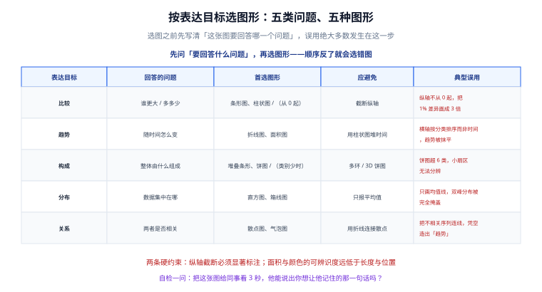

# 数据可视化概述与选型

数据可视化（Data Visualization）是把**数据编码成图形**、让人用眼睛完成一部分「分析」的技术。这一页回答两个问题：可视化到底在解决什么，以及项目里该选哪套技术方案。

::: tip 一句话定位
如果一件事情的结论可以写成一句话，那就不需要可视化；可视化真正的价值在于**让人在 3 秒内发现「哪一条不对」**——它是给眼睛用的，不是给打印机用的。
:::

## 可视化解决的是什么问题

人眼对**位置**和**长度**的差异极其敏感（可以分辨 1% 的长度差），但对**面积**和**颜色**的差异相当迟钝。可视化就是利用这个特点，把有意义的数值映射到人眼最擅长分辨的通道上。

这也解释了一个常见现象：同一组数据，换个图形给人的结论就变了。**这不是审美问题，是正确性问题。**

### 两类场景，做法完全不同

| 场景 | 探索式（Exploratory） | 展示式（Explanatory） |
| --- | --- | --- |
| 使用者 | 分析师自己 | 他人（老板、客户、运营） |
| 目标 | 找出「有什么异常」 | 传达「已经确定的一个结论」 |
| 交互重要性 | 极高（缩放、筛选、下钻） | 低（能看清就行） |
| 图形复杂度 | 可以很复杂 | 越简单越好，一图一结论 |
| 典型载体 | 分析工具、BI 看板 | 报告配图、数据大屏 |
| 常见错误 | 图形选得太简单，看不出问题 | 图形选得太花，看不出结论 |

::: danger 最常见的定位错误
把探索式的东西直接搬去展示。典型表现是：一张图上画 8 条线、6 种颜色、还带双 Y 轴，然后期待读者「自己看出来重点」——读者只会关掉它。

**正确做法**：展示场景下先写下你要传达的那一句话，再倒推需要什么图形。如果一句话说不出来，说明结论还没形成，此时不该画图。
:::

## 一个最小的可视化流程

不管用什么库，一次完整的可视化都是同一条链：

```text
原始数据  →  整理成「维度 + 度量」  →  选择视觉通道  →  选择比例尺  →  绘制  →  交互
(数组/对象)   (category + value)      (位置/长度/颜色)   (linear/log)   (Canvas/SVG)
```

其中真正决定成败的是**中间三步**，它们属于「设计」而不是「编码」。很多人跳过它们直接写 `option`，结果就是反复调样式却没有改善。

## 按表达目标选几何图形



上图是选图的第一层判断。把这五类记熟，可以避免 80% 的「图画错了」：

| 你要回答的问题 | 对应目标 | 首选图形 |
| --- | --- | --- |
| 谁排第一？ | 比较 | 条形图（横向，标签好读） |
| 这半年怎么变的？ | 趋势 | 折线图 |
| 总额由哪几块构成？ | 构成 | 堆叠条形图（类别多时优于饼图） |
| 用户时长集中在哪个区间？ | 分布 | 直方图 |
| 投入和产出有关系吗？ | 关系 | 散点图 |

## 图表库选型

### 一个轴：开箱程度与自由度的取舍

所有图表库都落在同一条轴的两端之间：

- **左端是「声明式、开箱即用」**：传数据 + 配置，图形自己出来。上手快，但遇到库没提供的图形就束手束脚。
- **右端是「图形语法、底层原语」**：你描述「用什么图元画什么数据」，几乎画什么都能画。自由度高，但开发成本与维护成本都显著上升。

**选择原则：先站在左端，只在被实际需求顶到右端去时才往右移。**「以后可能会用到复杂图形」不是理由——绝大多数项目的图表类型不超过 8 种。

### 主流方案对照

| 方案 | 定位 | 渲染方式 | 适合 | 主要代价 |
| --- | --- | --- | --- | --- |
| **Apache ECharts** | 声明式图表库（左端偏中） | Canvas / SVG 可切换 | 通用业务图表、大屏、地图 | 包体积较大（可摇树）；深度定制需理解系列与组件模型 |
| **AntV G2 / G2Plot** | 图形语法（中偏右） | Canvas | 需要定制图形与交互的中台 | 学习曲线陡于 ECharts |
| **D3.js** | 底层数据驱动 DOM（最右端） | SVG / Canvas 手写 | 高度定制的图形、教学 | 一切都要自己写，开发量最大 |
| **Chart.js** | 轻量开箱即用（最左端） | Canvas | 后台管理里的常规图表 | 图形类型与高级能力少 |
| **Highcharts** | 商业级开箱即用 | SVG / Canvas | 需要商业支持与合规报告 | 商业授权（非商用免费） |
| **Vega-Lite / Observable Plot** | 声明式语法（偏左） | SVG / Canvas | 数据分析、快速出图 | 交互定制受限，生态小于 ECharts |
| **Recharts / vue-chartjs** | 框架绑定层 | 依赖底层库 | 与 React / Vue 深度集成 | 能力上限取决于底层库 |

::: tip 大多数中文项目的现实答案
**ECharts**。理由不是它最好，而是：中文文档最全、地图与大数据场景有专门方案（GL 系列）、社区案例最多、招人时最不需要解释。除非团队已有明确的技术偏好，否则从这里起步的试错成本最低。
:::

### 版本现状（2026-09 核对）

| 项目 | 当前状态 | 说明 |
| --- | --- | --- |
| Apache ECharts | **6.1.0**（2026-05-19 发布）为主线 | 6.0.0 于 2025-07-30 发布；5.6.0（2024-12-11）是 5.x 末版，仅存量项目使用 |
| 其他库版本 | 本文不写死 | 版本变动频繁，请以注册表为准 |

查询任一库的实际版本（避免照抄本文的数字）：

```shell
# npm 生态
npm view echarts version
npm view chart.js version
npm view @antv/g2 version

# 查看某库的完整版本历史（含发布时间）
npm view echarts time --json | tail -20
```

::: danger 不要照抄博客里的版本号
本文写作时的 ECharts 主线是 6.1.0，但你读到这段时可能已经是 6.x 的更高补丁。**版本号请以 `npm view <pkg> version` 的输出为准**，功能差异以官方 changelog 为准。
:::

## 怎么选：四步法

1. **先定最大数据规模**。一万点以内随便选；十万点以上必须把 WebGL 能力纳入筛选条件（见 [大数据量下的性能工程](LargeData/index.md)）。
2. **再定图形自由度**。只用「柱、线、饼、散点、地图」这五类 → ECharts 足够；需要自定义图形语法 → 考虑 AntV 或 D3。
3. **再看框架与团队**。React 项目里 Recharts 的组件化体验更自然，但能力上限低；Vue 项目里直接用 ECharts 是主流做法。
4. **最后看交付形态**。要嵌进已有后台 → 关注包体积与按需引入；要做独立大屏 → 关注自适应与全屏能力。

## 实战：一个最小的可运行示例

### 方式一：CDN 直接引入（最快验证）

```html [index.html]
<!DOCTYPE html>
<html lang="zh-CN">
  <head>
    <meta charset="UTF-8" />
    <title>最小可视化示例</title>
    <!-- 容器必须有明确高度，否则图表高度为 0 -->
    <style>
      #chart {
        width: 720px;
        height: 360px;
      }
    </style>
  </head>
  <body>
    <div id="chart"></div>
    <script src="https://cdn.jsdelivr.net/npm/echarts@6/dist/echarts.min.js"></script>
    <script>
      const chart = echarts.init(document.getElementById('chart'));
      chart.setOption({
        title: { text: '一周访问量' },
        tooltip: { trigger: 'axis' },
        xAxis: { type: 'category', data: ['周一', '周二', '周三', '周四', '周五', '周六', '周日'] },
        yAxis: { type: 'value' },
        series: [{ type: 'line', smooth: true, data: [820, 932, 901, 1290, 1330, 1420, 1010] }],
      });
      // 窗口变化时手动触发，ECharts 不会自动跟随
      window.addEventListener('resize', () => chart.resize());
    </script>
  </body>
</html>
```

直接用浏览器打开该文件即可。

**验证方式**：页面出现一条折线，鼠标悬停任意点弹出「周一 820」这类提示；拖动窗口宽度，图表跟着缩放且不变形。

### 方式二：npm + 构建工具（项目里的做法）

```shell
# 安装（版本随主线演进，不要写死）
npm install echarts
```

```javascript [src/chart.js]
// 按需引入：只带用到的图表与组件，体积可降 40%~70%
import * as echarts from 'echarts/core';
import { LineChart } from 'echarts/charts';
import { GridComponent, TooltipComponent, TitleComponent } from 'echarts/components';
import { CanvasRenderer } from 'echarts/renderers';

echarts.use([LineChart, GridComponent, TooltipComponent, TitleComponent, CanvasRenderer]);

export function renderChart(dom, source) {
  const chart = echarts.init(dom);
  chart.setOption({
    dataset: { source }, // 二维数组或对象数组
    tooltip: { trigger: 'axis' },
    xAxis: { type: 'category' },
    yAxis: { type: 'value' },
    series: [{ type: 'line', encode: { x: 0, y: 1 } }],
  });
  return chart; // 交给调用方在组件卸载时 dispose
}
```

**验证方式**：执行 `npm run dev` 后打开页面，确认图表渲染成功、控制台无 `Series xxx not exists` 这类报错；再执行一次构建，对比 `dist` 体积是否明显小于引入完整包。

::: danger 「按需引入」最常见的坑
按需引入后**忘记 `echarts.use()` 注册**，图表会**静默不显示**——没有报错，只有一个空白容器或控制台里一条 `Component series.line not exists` 提示，很容易被忽略。

排查顺序：① 打开控制台看是否有 `not exists`；② 检查 `use()` 里是否漏了对应的 `XxxChart` 或 `XxxComponent`；③ 确认容器有非零高度。
:::

## 易错点

::: danger 五个高频错误
1. **容器没有高度**。给一个 `display:block` 的 `div` 设了 `width:100%` 却没设高度，`init()` 时读到高度为 0，图表不显示。**正确写法**：给容器明确的 `height`，或 `height: 100%` 且父链上每一层都有高度。
2. **在 DOM 还没挂载时初始化**。Vue 的 `setup` 里直接取 DOM、React 的函数组件里直接 `useRef.current` 都可能是 `null`。**正确写法**：在 `onMounted` / `useEffect` 里初始化。
3. **纵轴截断**。为了「看清差异」把纵轴从 95 起，读者会把 5% 的差异读成数倍。截断并非绝对禁止，但**必须显著标注**。
4. **把连续值当分类值**。`xAxis: { type: 'category' }` 配时间字符串，会按字符串顺序排列，2026-10 可能排在 2026-2 前面。**正确写法**：时间轴用 `type: 'time'`。
5. **用面积表达数量**。把圆的半径按数值等比放大，面积会按平方增长，视觉上放大失真。**正确写法**：气泡图用 `symbolSize` 的平方根映射，或改用条形图。
:::

::: tip 三条省事建议
- **先画对再画美**：用默认主题把数据画对，确认结论无误后再调样式。
- **能横向不要纵向**：类目名称是中文时，横向条形图的标签可读性远好于纵向柱状图。
- **一图一结论**：展示场景下，一张图只承载一个要传达的信息。
:::

## 参考资料

- [Apache ECharts 官方文档](https://echarts.apache.org/zh/index.html)（含「快速上手」与「配置项手册」）
- [Apache ECharts 版本记录](https://echarts.apache.org/zh/changelog.html)（核对版本与破坏性变更）
- [Apache ECharts 下载页](https://echarts.apache.org/zh/download.html)（含「在线定制」：可视化勾选所需功能生成精简包）
- [Data Visualization Catalogue](https://datavizcatalogue.com/)（按表达目标反查图形的目录）
- [AntV G2 官方文档](https://g2.antv.antgroup.com/)｜[D3.js 官方文档](https://d3js.org/)
