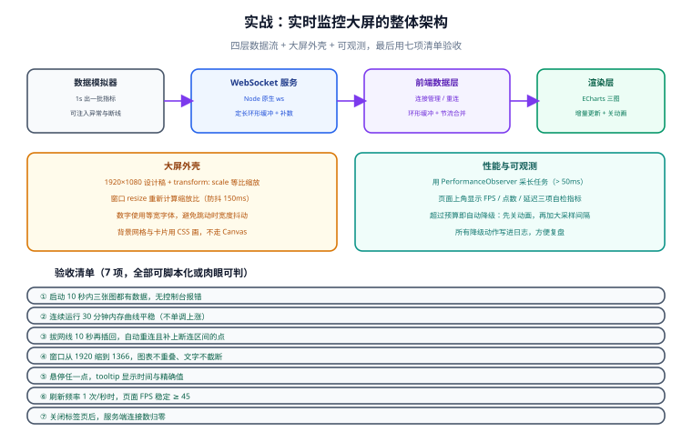

# 实战：实时监控大屏

这一页把前六页的内容合成一个**能跑起来**的系统：一个 Node 服务持续推送模拟指标，一个 1920×1080 的大屏实时展示请求量、关键指标与接口耗时分布，并具备断线重连、性能自检与降级能力。

::: info 适用前提
- Node.js 20+（用原生 `fetch` 与 `WebSocket` 客户端做验证脚本）
- 一个现代浏览器（Chrome / Edge 新版本）
- 会基本的 `npm` 操作

代码按「能照着做一遍」的粒度给出：每个文件都是完整内容，每一步都有验证方式。
:::

## 需求与验收标准

**要做什么**：一块 1920×1080 的监控大屏，展示三块内容并每秒更新。

| 面板 | 内容 | 更新频率 |
| --- | --- | --- |
| 请求量趋势 | 近 30 分钟逐秒请求数（折线图） | 1 秒 |
| 关键指标 | 当前 QPS、P99 延迟、错误率 | 1 秒 |
| 耗时分布 | 各接口的平均耗时（横向条形图） | 5 秒 |

**验收标准**（每条都可执行或可肉眼判定）：

1. 启动后 10 秒内三块内容都有数据，控制台无报错。
2. 连续运行 30 分钟，内存平稳（开发者工具 Memory 面板录制对比）。
3. 断网 10 秒再恢复，自动重连并补齐断连区间的数据，曲线无「假平台段」。
4. 窗口从 1920×1080 缩到 1366×768，内容等比缩放且不重叠、不截断。
5. 刷新频率 1 次/秒时，页面 FPS 稳定 ≥ 45。
6. 页面右上角显示 FPS / 缓冲点数 / 消息延迟三项自检指标。
7. 关闭页面后，服务端连接数归零。

## 整体架构



四个部分，职责单一：

| 层 | 文件 | 职责 |
| --- | --- | --- |
| 数据模拟器 | `server/simulator.js` | 生成有规律的指标（含周期性尖刺），把「异常」主动造出来 |
| 推送服务 | `server/index.js` | WebSocket 广播、环形缓冲、提供补数 HTTP 接口 |
| 前端数据层 | `web/realtime.js` | 连接管理、重连退避、缓冲、按帧节流 |
| 渲染层 | `web/main.js` | ECharts 三图、大屏适配、性能自检 |

## 第 1 步：项目初始化

```shell
mkdir realtime-dashboard && cd realtime-dashboard
npm init -y
npm install ws
npm install -D http-server
```

目录结构：

```text
realtime-dashboard/
├─ server/
│  ├─ index.js          # WebSocket + 补数接口
│  └─ simulator.js      # 指标生成
└─ web/
   ├─ index.html
   ├─ screen.css
   ├─ fit-scale.js      # 大屏适配
   ├─ realtime.js       # 数据接入层
   ├─ perf.js           # 性能自检
   └─ main.js           # 组装
```

**验证方式**：执行 `npm ls ws`，确认输出里有 `ws@` 及版本号。

## 第 2 步：指标模拟器

真实的指标应该有**规律 + 噪声 + 偶发尖刺**。只有平缓的正弦曲线，是测不出性能问题的。

```javascript [server/simulator.js]
/**
 * 生成模拟指标：
 * - 基线随时间做缓慢正弦波动（模拟业务潮汐）
 * - 叠加随机噪声
 * - 每约 90 秒制造一次尖刺（模拟偶发流量高峰）
 */
const INTERFACES = ['/api/order', '/api/user', '/api/product', '/api/search', '/api/pay'];

export function createSimulator({ spikeEveryMs = 90000 } = {}) {
  const startedAt = Date.now();
  let spikeUntil = 0;

  return function next() {
    const now = Date.now();
    const elapsed = now - startedAt;

    // 是否处于尖刺区间
    if (spikeUntil === 0 && elapsed > 0 && elapsed % spikeEveryMs < 1000) {
      spikeUntil = now + 8000; // 尖刺持续 8 秒
    }
    const spiking = now < spikeUntil;
    const spikeFactor = spiking ? 3.5 : 1;

    // 潮汐：10 分钟一个周期
    const tide = 1 + 0.35 * Math.sin((elapsed / 600000) * Math.PI * 2);
    const noise = 1 + (Math.random() - 0.5) * 0.12;
    const qps = Math.max(1, Math.round(200 * tide * noise * spikeFactor));

    // 延迟与错误率跟随流量上升（高负载时更慢、更容易错）
    const load = qps / 200;
    const p99 = Math.round((80 + load * 45 + Math.random() * 20) * (spiking ? 1.6 : 1));
    const errorRate = +(Math.max(0, (load - 0.9) * 0.02 + Math.random() * 0.0015)).toFixed(4);

    // 各接口耗时（用于条形图）
    const byInterface = INTERFACES.map((name, i) => ({
      name,
      // 不同接口基础耗时不同，越靠后越慢
      avgMs: Math.round((30 + i * 25) * (spiking ? 1.5 : 1) * (1 + (Math.random() - 0.5) * 0.15)),
    }));

    return { t: now, qps, p99, errorRate, byInterface, spiking };
  };
}
```

## 第 3 步：WebSocket 推送服务

```javascript [server/index.js]
import { WebSocketServer } from 'ws';
import { createServer } from 'node:http';
import { createSimulator } from './simulator.js';

const PORT = 8080;
const MAX_BUFFER = 7200;   // 缓冲 2 小时（每秒 1 点），供补数使用
const PUSH_INTERVAL = 1000; // 每秒推一次

const next = createSimulator();
const buffer = [];          // 环形缓冲：只保留最近 MAX_BUFFER 条

const httpServer = createServer((req, res) => {
  const url = new URL(req.url, `http://localhost:${PORT}`);

  // ---- 补数接口：前端重连后拉取断连区间的数据 ----
  if (url.pathname === '/api/backfill') {
    const from = Number(url.searchParams.get('from') ?? 0);
    const rows = buffer.filter((p) => p.t > from);
    res.writeHead(200, { 'Content-Type': 'application/json' });
    res.end(JSON.stringify(rows));
    return;
  }

  // ---- 健康检查：用于验证脚本 ----
  if (url.pathname === '/healthz') {
    res.writeHead(200, { 'Content-Type': 'application/json' });
    res.end(JSON.stringify({ ok: true, clients: wss.clients.size, buffered: buffer.length }));
    return;
  }

  res.writeHead(404);
  res.end();
});

const wss = new WebSocketServer({ server: httpServer });

wss.on('connection', (socket) => {
  console.log(`[ws] 客户端接入，当前连接数 ${wss.clients.size}`);

  // 新连接先补发最近 60 个点，避免开头空白
  socket.send(JSON.stringify({ type: 'snapshot', points: buffer.slice(-60) }));

  socket.on('close', () => console.log(`[ws] 客户端断开，当前连接数 ${wss.clients.size}`));
  socket.on('error', (err) => console.error('[ws] 连接异常', err.message));
});

// ---- 定时推送 ----
setInterval(() => {
  const point = next();
  buffer.push(point);
  if (buffer.length > MAX_BUFFER) buffer.shift();

  const payload = JSON.stringify({ type: 'metric', point });
  for (const client of wss.clients) {
    // 1 === WebSocket.OPEN；未就绪的连接跳过，避免抛错
    if (client.readyState === 1) client.send(payload);
  }
}, PUSH_INTERVAL);

httpServer.listen(PORT, () => {
  console.log(`监控数据服务已启动：ws://localhost:${PORT}`);
  console.log(`健康检查：http://localhost:${PORT}/healthz`);
});
```

在 `package.json` 里加一行（`"type": "module"` 用于支持 ESM 语法）：

```json [package.json]
{
  "name": "realtime-dashboard",
  "type": "module",
  "scripts": {
    "server": "node server/index.js",
    "web": "http-server web -p 5173 -c-1",
    "dev": "npm run server"
  }
}
```

**验证方式**：

```shell
npm run server
```

另开一个终端：

```shell
# 健康检查：应返回 {"ok":true,"clients":0,"buffered":N}
curl http://localhost:8080/healthz

# 用 Node 原生 WebSocket 客户端试连（Node 22 内置）
node -e "
const ws = new WebSocket('ws://localhost:8080');
let n = 0;
ws.onmessage = (e) => { if (++n <= 3) console.log(JSON.parse(e.data).type); if (n >= 4) ws.close(); };
"
```

期望输出：先 `snapshot`，随后连续几条 `metric`。

## 第 4 步：前端数据接入层

```javascript [web/realtime.js]
/**
 * 数据接入层：连接、重连、缓冲、节流、补数。
 * 这一层的目标是把「可能很乱的推送」收敛成「受控的渲染调用」。
 */
export function createRealtimeStream({
  wsUrl,
  backfillUrl,
  sampleInterval = 1000,
  maxPoints = 2000,
  onRender,
  onStatus,
}) {
  let ws = null;
  let retry = 0;
  let closed = false;
  let lastTimestamp = 0;
  let renderTimer = null;
  let dirty = false;
  const buffer = [];

  function push(point) {
    buffer.push(point);
    if (buffer.length > maxPoints) buffer.shift();
    lastTimestamp = Math.max(lastTimestamp, point.t);
    dirty = true;
  }

  function setStatus(state) {
    onStatus && onStatus(state);
  }

  renderTimer = setInterval(() => {
    if (!dirty) return;
    dirty = false;
    onRender(buffer.slice(), { lastTimestamp, size: buffer.length, retry });
  }, sampleInterval);

  async function backfill() {
    if (!backfillUrl || lastTimestamp === 0) return 0;
    try {
      const res = await fetch(`${backfillUrl}?from=${lastTimestamp}`);
      const rows = await res.json();
      // 只补真正缺失的，跳过已存在的点
      const missing = rows.filter((p) => p.t > lastTimestamp);
      missing.forEach(push);
      return missing.length;
    } catch (err) {
      console.warn('[backfill] 补数失败', err.message);
      return 0;
    }
  }

  function connect() {
    setStatus('connecting');
    ws = new WebSocket(wsUrl);

    ws.onopen = async () => {
      retry = 0;
      setStatus('open');
      // 重连场景：补齐断连区间的数据，避免曲线上出现假平台段
      const n = await backfill();
      if (n > 0) console.log(`[backfill] 补齐 ${n} 个点`);
    };

    ws.onmessage = (ev) => {
      try {
        const msg = JSON.parse(ev.data);
        if (msg.type === 'snapshot') msg.points.forEach(push);
        else if (msg.type === 'metric') push(msg.point);
      } catch (err) {
        // 单条脏数据不能影响后续消息
        console.warn('[ws] 报文解析失败，已跳过');
      }
    };

    ws.onclose = () => {
      if (closed) return;
      setStatus('closed');
      const delay = Math.min(1000 * 2 ** retry++, 30000);
      console.log(`[ws] 断开，${delay}ms 后重连（第 ${retry} 次）`);
      setTimeout(connect, delay);
    };

    ws.onerror = () => ws && ws.close();
  }

  connect();

  return {
    destroy() {
      closed = true;
      clearInterval(renderTimer);
      if (ws) ws.close();
    },
  };
}
```

## 第 5 步：性能自检

```javascript [web/perf.js]
/**
 * 性能自检：FPS、长任务、自身指标三合一。
 * 大屏无人值守，必须把「跑得健不健康」显示在页面自己身上。
 */
export function createPerfMeter(onUpdate) {
  let frames = 0;
  let last = performance.now();
  let longTasks = 0;

  // 长任务计数（> 50ms 的主线程阻塞）
  let observer = null;
  try {
    observer = new PerformanceObserver((list) => {
      longTasks += list.getEntries().filter((e) => e.duration > 50).length;
    });
    observer.observe({ entryTypes: ['longtask'] });
  } catch {
    console.warn('[perf] 当前环境不支持 longtask 观测');
  }

  function tick() {
    frames++;
    const now = performance.now();
    if (now - last >= 1000) {
      const fps = Math.round((frames * 1000) / (now - last));
      onUpdate && onUpdate({ fps, longTasks });
      frames = 0;
      last = now;
    }
    requestAnimationFrame(tick);
  }
  requestAnimationFrame(tick);

  return {
    destroy() {
      observer && observer.disconnect();
    },
  };
}
```

## 第 6 步：组装大屏

`web/index.html` 与 `web/screen.css` 与 [数据大屏工程](../Dashboard/index.md) 一节的骨架一致，只需把面板标题与容器 id 对上调。这里给出 `web/main.js`：

```javascript [web/main.js]
import { createScaler } from './fit-scale.js';
import { createRealtimeStream } from './realtime.js';
import { createPerfMeter } from './perf.js';

const WS_URL = 'ws://localhost:8080';
const BACKFILL_URL = 'http://localhost:8080/api/backfill';

// ---------- ① 大屏适配 ----------
const scaler = createScaler(1920, 1080);

// ---------- ② 三个图表（全部关动画，大屏要的是稳定不是炫技） ----------
const baseGrid = { left: 64, right: 28, top: 20, bottom: 40 };

const lineChart = echarts.init(document.getElementById('chart-line'), 'dark');
lineChart.setOption({
  grid: baseGrid,
  tooltip: { trigger: 'axis', animation: false, valueFormatter: (v) => `${v} req/s` },
  xAxis: { type: 'time', axisLabel: { formatter: '{HH}:{mm}:{ss}', hideOverlap: true } },
  yAxis: { type: 'value', name: 'QPS' },
  series: [{
    type: 'line',
    showSymbol: false,
    animation: false,
    lineStyle: { width: 2, color: '#38bdf8' },
    areaStyle: { opacity: 0.12, color: '#38bdf8' },
    // 断连区间的点会被过滤成 null，折线自然断开（不画假平台段）
    connectNulls: false,
  }],
});

const barChart = echarts.init(document.getElementById('chart-bar'), 'dark');
barChart.setOption({
  grid: { left: 120, right: 60, top: 20, bottom: 30 },
  tooltip: { trigger: 'axis', axisPointer: { type: 'shadow' }, valueFormatter: (v) => `${v} ms` },
  xAxis: { type: 'value', name: '平均耗时 (ms)' },
  yAxis: { type: 'category', data: [], inverse: true },
  series: [{ type: 'bar', animation: false, barWidth: '55%', itemStyle: { color: '#22c55e' } }],
});

// ---------- ③ 数据接入 ----------
const els = {
  qps: document.getElementById('kpi-qps'),
  p99: document.getElementById('kpi-p99'),
  err: document.getElementById('kpi-err'),
  dot: document.getElementById('conn-dot'),
  connText: document.getElementById('conn-text'),
  perf: document.getElementById('perf-line'),
};

const stream = createRealtimeStream({
  wsUrl: WS_URL,
  backfillUrl: BACKFILL_URL,
  sampleInterval: 1000,
  maxPoints: 2000,
  onStatus(state) {
    const map = { connecting: ['#64748b', '连接中…'], open: ['#22c55e', '已连接'], closed: ['#ef4444', '重连中…'] };
    const [color, text] = map[state] ?? map.connecting;
    els.dot.style.background = color;
    els.connText.textContent = text;
  },
  onRender(points, meta) {
    const latest = points.at(-1);
    if (latest) {
      els.qps.textContent = latest.qps;
      els.p99.textContent = latest.p99 + ' ms';
      els.err.textContent = (latest.errorRate * 100).toFixed(2) + '%';
      els.err.style.color = latest.errorRate > 0.01 ? '#ef4444' : '#e2e8f0';

      // 主折线：只更新数据，不动其他配置
      lineChart.setOption({ series: [{ data: points.map((p) => [p.t, p.qps]) }] });

      // 条形图数据变化慢，按 5 次渲染更新一次就够
      if (meta.size % 5 === 0) {
        const list = latest.byInterface.slice().sort((a, b) => b.avgMs - a.avgMs);
        barChart.setOption({
          yAxis: { data: list.map((d) => d.name) },
          series: [{ data: list.map((d) => d.avgMs), itemStyle: { color: (p) => (p.value > 120 ? '#ef4444' : '#22c55e') } }],
        });
      }
      lastMeta = meta;
    }
  },
});

// ---------- ④ 性能自检展示在页面自己身上 ----------
let lastMeta = { size: 0, retry: 0 };
createPerfMeter(({ fps, longTasks }) => {
  els.perf.textContent = `FPS ${fps} · 缓冲 ${lastMeta.size} 点 · 重连 ${lastMeta.retry} 次 · 长任务 ${longTasks}`;
  // 自动降级：帧率掉到 30 以下时，先降低自身的展示频率
  if (fps < 30) console.warn('[perf] 帧率偏低，考虑加大采样间隔');
});

// ---------- ⑤ 休眠恢复校正 ----------
document.addEventListener('visibilitychange', () => {
  if (document.visibilityState === 'visible') {
    scaler.apply();
    lineChart.resize();
    barChart.resize();
  }
});

window.addEventListener('beforeunload', () => stream.destroy());
```

启动：

```shell
# 终端一
npm run server
# 终端二
npm run web
# 浏览器打开 http://localhost:5173
```

**验证方式**：

```shell
# 1. 连接数与缓冲深度
curl http://localhost:8080/healthz
# 期望：{"ok":true,"clients":1,"buffered":...}

# 2. 补数接口能返回数据
curl "http://localhost:8080/api/backfill?from=0" | head -c 200

# 3. 关闭浏览器标签页后，连接数应回到 0
curl http://localhost:8080/healthz
```

## 故障排查

::: danger 五个必现问题与定位方式
1. **页面空白、三个面板都是「--」** → 先看控制台是否有 WebSocket 连接失败（`Connection refused`）。多半是服务端没起，或地址写错。
2. **曲线是空的但 QPS 数字在跳** → 说明数据到了但图表没画。检查 `xAxis.type` 是否为 `time`，以及每点的 `[t, v]` 是否为合法数字（字符串时间戳会让 `time` 轴画不出来）。
3. **图表高度为 0（只看到面板标题）** → 面板用了 flex 布局却没有 `min-height: 0`，子元素被内容撑破或压扁。给 `.panel` 与 `.chart` 都加 `min-height: 0`。
4. **断网重连后曲线出现一段水平直线** → 补数没生效或没做补数。检查 `/api/backfill` 是否可达，以及 `connectNulls` 是否为 `false`。
5. **运行几小时后卡顿** → 用 Memory 面板录堆快照，看 `buffer` 是否无限增长（本实现上限 2000）或 `setInterval` 是否被重复创建（重复连接会叠加定时器）。
:::

## 性能对照：优化前后的实测方法

用页面上自检的 FPS 与长任务计数做对照，四个对照点：

| 对照项 | 关掉优化 | 打开优化 | 观察指标 |
| --- | --- | --- | --- |
| 动画 | `animation: true` | `animation: false` | FPS、长任务数 |
| 采样 | 不采样（每秒全量 2000 点） | 采样到窗口宽度 | setOption 耗时 |
| 提交节流 | 每条消息都提交 | 1 秒合并一次 | 重绘次数、FPS |
| 条形图频率 | 每秒更新 | 每 5 秒更新 | FPS（尤其尖刺期） |

::: tip 怎么造出「有问题」的场景
模拟器里的尖刺（每 90 秒一次、持续 8 秒、QPS 放大 3.5 倍）就是用来测这个的。**不要在平缓期测性能**——那是最容易得出「一切正常」错误结论的时段。
:::

## 参考资料

- [ws 官方文档](https://github.com/websockets/ws)（Node 端 WebSocket 服务）
- [MDN · WebSocket API](https://developer.mozilla.org/zh-CN/docs/Web/API/WebSocket)
- [MDN · performance.now()](https://developer.mozilla.org/zh-CN/docs/Web/API/Performance/now)
- [MDN · PerformanceObserver · longtask](https://developer.mozilla.org/zh-CN/docs/Web/API/PerformanceObserver)
- [ECharts · appendData 与增量渲染](https://echarts.apache.org/zh/api.html#echartsInstance.appendData)
- [Node.js 官方文档 · node:http](https://nodejs.org/api/http.html)
