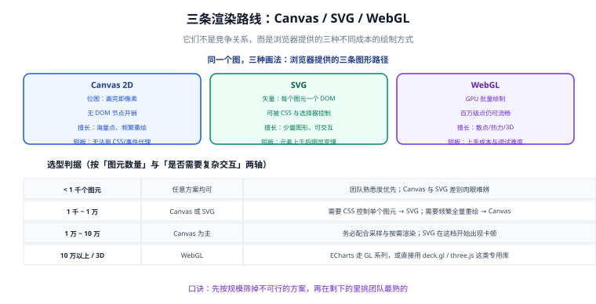

# 渲染路线：Canvas / SVG / WebGL

浏览器一共提供三条画图的路：**Canvas 2D、SVG、WebGL**。它们不是竞争关系，而是三种成本结构完全不同的绘制方式。这一页讲清它们的原理与边界，让你在选型时能一眼筛掉不可行的方案。

## 三条路线的本质差异



一句话概括三者的差别：

| 路线 | 画出来的东西是什么 | 谁来画 | 一个「图形」的成本 |
| --- | --- | --- | --- |
| Canvas 2D | 一**整张位图** | CPU（软件光栅化） | 绘图指令，几乎无对象开销 |
| SVG | 一**棵 DOM 树**，每个图元是一个节点 | 浏览器渲染引擎 | 一个 DOM 节点 + 样式计算 + 布局 |
| WebGL | 一**张 GPU 纹理** | GPU（并行） | 一次 draw call，可以批量几万个顶点 |

这个差别直接决定了三件事：**元素多了谁先崩、能不能用 CSS 控制单个图元、能不能做 3D。**

## Canvas 2D

Canvas 提供一块**像素画布**和一个 2D 绘图上下文（`CanvasRenderingContext2D`）。所有绘制都是「在画布上覆盖像素」——画完之后，**画布上就只有像素，没有对象**。

```javascript [canvas-basic.js]
const canvas = document.getElementById('c');
const ctx = canvas.getContext('2d');

// 关键：先处理高分屏，否则在高 DPI 屏上会模糊
const dpr = window.devicePixelRatio || 1;
const cssWidth = canvas.clientWidth;
const cssHeight = canvas.clientHeight;
canvas.width = Math.round(cssWidth * dpr);   // 位图尺寸（物理像素）
canvas.height = Math.round(cssHeight * dpr);
ctx.scale(dpr, dpr);                          // 后续按 CSS 像素坐标绘制

// 绘制：清屏 → 画线 → 描边
ctx.clearRect(0, 0, cssWidth, cssHeight);
ctx.beginPath();
ctx.moveTo(0, 0);
ctx.lineTo(cssWidth, cssHeight);
ctx.strokeStyle = '#2563EB';
ctx.lineWidth = 2;
ctx.stroke();
```

### 三个必须记住的性质

1. **没有「撤销」**。改一个点要整块重绘，或者用脏矩形只重绘变化区域。所以 Canvas 图表的更新逻辑往往是「清屏 → 重画全部」。
2. **不能给单个图形绑事件**。需要在 `canvas` 上监听，然后用鼠标坐标自己判断「点到了哪个图形」（命中的反查工作要自己做）。ECharts 这类库内部就维护了一份图形索引来干这件事。
3. **不受 CSS 控制**。`strokeStyle` 是 JS 属性，不是 CSS 属性；浏览器开发者工具里也看不到「元素」。这是 Canvas 调试相对困难的原因。

::: danger 高分屏发虚是「必现」问题而不是偶发问题
只设 `width`/`height` 属性而不乘 `devicePixelRatio`，在 Retina 与大部分手机屏上，图形会有明显的边缘模糊。

**正确做法**：位图尺寸 = CSS 尺寸 × DPR，再用 `ctx.scale(dpr, dpr)` 把坐标系还原成 CSS 像素。图表库通常内置了这一步（ECharts 会自动读取 DPR），但**自己手写 Canvas 时必须显式处理**。

反例：`canvas.width = 600; canvas.height = 300;` 同时 CSS 也是 `600×300`，在 2 倍屏上等于用 600 个物理像素撑 600 个 CSS 像素 → 每个 CSS 像素只有 1 个物理像素 → 发虚。
:::

## SVG

SVG 是**矢量标记语言**，每个图元（`<rect>`、`<circle>`、`<path>`、`<text>`）都是真实的 DOM 节点。

```html [svg-basic.html]
<!-- 与 canvas 的写法对照：SVG 用标签声明图形 -->
<svg width="720" height="360" viewBox="0 0 720 360" xmlns="http://www.w3.org/2000/svg">
  <line x1="0" y1="0" x2="720" y2="360" stroke="#059669" stroke-width="2" />
</svg>
```

### 三个关键优势

1. **可以用 CSS 控制**：`path { transition: d 0.3s }`、`:hover`、`@media` 查询都能作用到图元上，做交互态和主题切换非常自然。
2. **事件直接绑在元素上**：`circle.addEventListener('click', ...)` 就能拿到这个圆的数据（常用 `data-*` 属性或闭包携带）。
3. **可访问性与可搜索**：图元能带 `<title>`、`aria-label`，屏幕阅读器可读；导出为矢量图放大不失真。

### 它的天花板在哪

DOM 节点的代价是实打实的：每个节点都要参与样式计算、布局与合成。**元素数量上千之后，SVG 的性能会明显下降**，典型表现是交互时掉帧、悬停高亮有延迟。

::: warning 「SVG 更清晰所以更好」是个误解
在 DPR 处理正确的前提下，**Canvas 在高分屏上同样清晰**（因为位图本身就是按物理像素渲染的）。SVG 的优势是「**无限放大不失真**」，只在需要打印、导出矢量图、或用户会大幅缩放时才是决定性优势。
:::

## WebGL

WebGL 直接把绘制交给 GPU，适合**图元数量极大**或**需要 3D** 的场景。

```javascript [webgl-context.js]
// 拿到上下文只是第一步；真正的工作在着色器（vertex/fragment shader）里
const gl = canvas.getContext('webgl2') || canvas.getContext('webgl');
if (!gl) {
  console.warn('当前环境不支持 WebGL，需要降级到 Canvas 渲染');
}
```

实际项目里很少直接用原生 WebGL 画图表，而是用封装好的库：

- **ECharts GL 系列**：`scatterGL`、`linesGL`、`bar3D`、`map3D` 等，接口与普通系列接近，只需把系列类型换掉。
- **deck.gl**：面向地理与大规模数据可视化，图层化设计。
- **three.js**：通用 3D 场景，适合数字孪生类需求。

### 什么时候真的需要 WebGL

判据只有一条：**点数规模已经让 Canvas 方案达不到目标帧率**。经验分档：

| 点数规模 | 建议 | 说明 |
| --- | --- | --- |
| 1 万以内 | Canvas / SVG 均可 | 不需要考虑 WebGL |
| 1 万 ~ 10 万 | Canvas + 采样 | 通常采样后即可流畅，不必上 WebGL |
| 10 万 ~ 100 万 | Canvas + 采样，或 WebGL | 看交互要求：只是「看」可用采样，要「框选下钻」建议 WebGL |
| 100 万以上 | WebGL | 此时 WebGL 是唯一可行方案 |

::: tip 先做采样，再考虑 WebGL
十万个点里，屏幕上**能画出来的像素点通常不超过 2000 个**（1920 宽的画布横轴最多 1920 列）。也就是说，超出屏幕分辨率的点在物理上就是冗余的。

**先把点采样到屏幕宽度级别，再决定要不要 WebGL**——这一步往往就能把问题解决掉，成本却接近于零。详见 [大数据量下的性能工程](LargeData/index.md)。
:::

## 三者对照

| 对比项 | Canvas 2D | SVG | WebGL |
| --- | --- | --- | --- |
| 绘制方式 | 逐像素覆盖 | DOM 树 + 渲染引擎 | GPU 并行 |
| 上千元素性能 | 好 | 明显下降 | 很好 |
| 单元素样式控制 | 需 JS 重绘 | CSS 直接控制 | 需重新上传数据 |
| 单元素事件 | 需坐标反查 | 直接绑定 | 需坐标反查 |
| 可访问性 / SEO | 差 | 好 | 差 |
| 导出矢量图 | 不支持 | 支持 | 不支持 |
| 3D 能力 | 无 | 无 | 原生支持 |
| 调试难度 | 中（看不到元素） | 低（就是 DOM） | 高（需 GPU 工具） |
| 常见使用者 | ECharts 默认、Chart.js | ECharts SVG 渲染器、D3 | ECharts GL、deck.gl、three.js |

## 实战：同一张折线图，两种画法

下面这段代码把「1000 个点的折线」用 Canvas 与 SVG 各画一次，用于观察性能差异。把两段放进同一个页面，分别在控制台计时：

```javascript [render-compare.js]
const N = 1000;
const data = Array.from({ length: N }, (_, i) => ({
  x: i,
  y: Math.sin(i / 40) * 100 + 150 + Math.random() * 20,
}));

// ---------- 方案 A：Canvas ----------
function drawCanvas(container) {
  const canvas = document.createElement('canvas');
  const dpr = window.devicePixelRatio || 1;
  const W = 720, H = 360;
  canvas.width = W * dpr;
  canvas.height = H * dpr;
  canvas.style.width = W + 'px';
  canvas.style.height = H + 'px';
  container.appendChild(canvas);

  const ctx = canvas.getContext('2d');
  ctx.scale(dpr, dpr);
  ctx.clearRect(0, 0, W, H);
  ctx.beginPath();
  data.forEach((p, i) => (i ? ctx.lineTo(p.x, p.y) : ctx.moveTo(p.x, p.y)));
  ctx.strokeStyle = '#2563EB';
  ctx.stroke();
  return canvas;
}

// ---------- 方案 B：SVG ----------
function drawSvg(container) {
  const W = 720, H = 360;
  const svg = document.createElementNS('http://www.w3.org/2000/svg', 'svg');
  svg.setAttribute('width', W);
  svg.setAttribute('height', H);
  svg.setAttribute('viewBox', `0 0 ${W} ${H}`);

  // 用一个 path 承载整条折线，而不是 1000 条 line
  const d = data.map((p, i) => `${i ? 'L' : 'M'}${p.x},${p.y}`).join(' ');
  const path = document.createElementNS('http://www.w3.org/2000/svg', 'path');
  path.setAttribute('d', d);
  path.setAttribute('fill', 'none');
  path.setAttribute('stroke', '#059669');
  svg.appendChild(path);
  container.appendChild(svg);
  return svg;
}

// 计时对比（各跑 50 次取平均）
function bench(fn, label) {
  const box = document.createElement('div');
  document.body.appendChild(box);
  const t0 = performance.now();
  for (let i = 0; i < 50; i++) {
    box.innerHTML = '';
    fn(box);
  }
  console.log(label, ((performance.now() - t0) / 50).toFixed(2) + ' ms/次');
}
bench(drawCanvas, 'Canvas 1000 点');
bench(drawSvg, 'SVG 单 path 1000 点');
```

::: danger 对比测试里最容易犯的错误
把 SVG 版本写成「1000 个 `<circle>` 元素」，然后得出「SVG 比 Canvas 慢 100 倍」的结论。这个对比不公平——**折线就该用一条 `<path>`**。

**正确做法**：对比时两者都要用各自的最优实现（Canvas 一条 path、SVG 一条 path），这样得出的差异才反映真实差距。只有在「必须每个点都能单独交互」的需求下，才需要 1000 个独立元素，那时 SVG 的劣势才是真实的。
:::

**验证方式**：控制台会打印两次的平均耗时。在 1000 点这个量级上，两者通常在同一数量级；把 `N` 改成 50000 再跑一次，并注意 SVG 版本开始出现可感知的卡顿。

## 怎么选：决策清单

按顺序回答，第一个「是」就是答案：

1. **需要 3D 或点数超过百万？** → WebGL（ECharts GL / deck.gl / three.js）
2. **需要把图导出为矢量图、或要求屏幕阅读器可读？** → SVG
3. **需要给单个图元写 CSS 动画 / 用选择器控制样式？** → SVG
4. **需要高频重绘（逐帧刷新、实时曲线）？** → Canvas
5. **点在十万级且需要交互？** → Canvas + 采样（不够再上 WebGL）
6. **其他情况** → Canvas（默认选择，性能余量最大）

## 参考资料

- [MDN · Canvas API](https://developer.mozilla.org/zh-CN/docs/Web/API/Canvas_API)
- [MDN · SVG 要素参考](https://developer.mozilla.org/zh-CN/docs/Web/SVG/Element)
- [MDN · WebGL 基础概念](https://developer.mozilla.org/zh-CN/docs/Web/API/WebGL_API/Tutorial)
- [web.dev · Canvas 与高 DPI 屏幕](https://web.dev/articles/canvas-performance)（性能与像素比相关讨论）
- [ECharts · 使用 Canvas 还是 SVG 渲染](https://echarts.apache.org/handbook/zh/best-practices/canvas-vs-svg/)
- [deck.gl 官方文档](https://deck.gl/)｜[three.js 官方文档](https://threejs.org/docs/)
