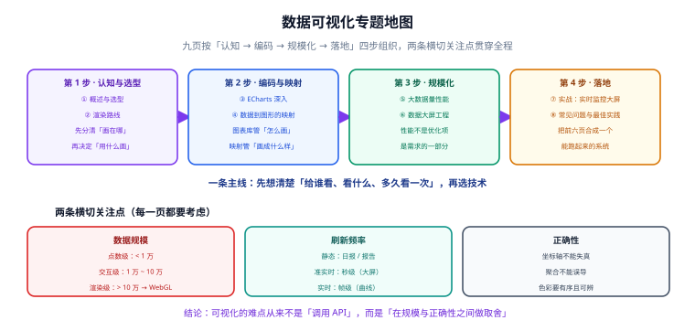

# 数据可视化

数据可视化（Data Visualization）是把数据**编码成图形**、让人用眼睛完成一部分「分析」的技术。本专题面向需要在项目里做出图表、看板与数据大屏的前端与全栈工程师，从「浏览器能画什么」讲到「几十万点怎么画得动」，再到「一套大屏怎么落地」。

::: tip 一句话理解
可视化的难点从来不是「调用 API 画出图」，而是**在数据规模、刷新频率与结论正确性之间做取舍**。同样的数据用错视觉通道，会让人得出相反结论；同样的图在十万点下没做采样，会直接卡死浏览器。
:::

::: info 本专题与相邻专题的分工
- **图表库怎么用** → [Vue3 · ECharts](../Frame/Vue/Vue3/ECharts/index.md)：讲在 Vue 项目里怎样接入、封装与按需引入，偏「工程集成」。
- **可视化怎么做对** → 本专题：讲渲染路线怎么选、数据怎么映射成图形、规模上去了怎么办，偏「方法论与性能」。
- **日志与指标怎么采集** → [日志体系](../../Ops/LogSystem/index.md) 与 [监控告警](../../Ops/Monitoring/index.md)：讲数据从哪来。
- **大屏要嵌进什么系统** → [项目交付 · 一键部署与上线验收](../../Others/ProjectDelivery/Delivery/index.md)：讲做好的东西怎么交付。
:::

## 目录

- [数据可视化概述与选型](Overview/index.md)
- [渲染路线：Canvas / SVG / WebGL](Rendering/index.md)
- [ECharts 深入：从 option 到像素](ECharts/index.md)
- [数据到图形的映射](DataMapping/index.md)
- [大数据量下的性能工程](LargeData/index.md)
- [数据大屏工程](Dashboard/index.md)
- [实战：实时监控大屏](Practice/index.md)
- [常见问题与最佳实践](FAQ/index.md)

## 专题地图

## 相关专题

- [Vue3 · ECharts](../Frame/Vue/Vue3/ECharts/index.md)：同一套 ECharts 在框架里的工程用法（实例封装、响应式数据、销毁时机）
- [前端性能优化](../Others/PerformanceOptimization/index.md)：本专题的「大数据量」页是性能优化在可视化场景下的具体化；通用手段（长任务、内存、渲染帧）在那一边
- [浏览器原理](../Basic/Browser/index.md)：Canvas 与 DOM 的绘制差异、合成层与重绘的底层机制
- [TypeScript](../Basic/TypeScript/index.md)：图表配置项类型（`EChartsOption`）与数据结构的类型建模
- [监控告警](../../Ops/Monitoring/index.md)：大屏的数据上游；指标口径与采集频率决定了可视化该怎么做
