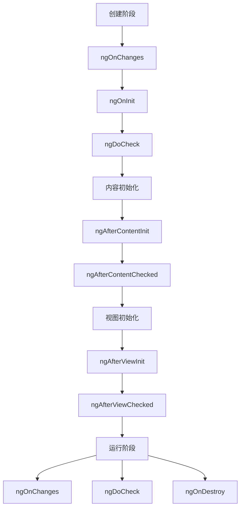

# Angular 组件开发

组件是 Angular 应用的基本构建块，每个组件控制屏幕上的一块区域（视图）。

## 组件基础

### 创建组件

```bash [终端]
ng generate component components/user-card
```

### 组件结构

```typescript [src/app/components/user-card/user-card.component.ts]
import { Component, Input, Output, EventEmitter } from '@angular/core'
import { CommonModule } from '@angular/common'

@Component({
  selector: 'app-user-card',
  standalone: true,
  imports: [CommonModule],
  templateUrl: './user-card.component.html',
  styleUrl: './user-card.component.scss'
})
export class UserCardComponent {
  @Input() name: string = ''
  @Input() avatar: string = ''
  @Input() role: string = ''
  
  @Output() select = new EventEmitter<string>()
  
  onSelect() {
    this.select.emit(this.name)
  }
}
```

```html [src/app/components/user-card/user-card.component.html]
<div class="user-card">
  
  <h3>{{ name }}</h3>
  <span class="role">{{ role }}</span>
  <button (click)="onSelect()">选择</button>
</div>
```

```scss [src/app/components/user-card/user-card.component.scss]
.user-card {
  padding: 16px;
  border: 1px solid #e0e0e0;
  border-radius: 8px;
  text-align: center;
  
  .avatar {
    width: 80px;
    height: 80px;
    border-radius: 50%;
  }
  
  .role {
    color: #666;
    font-size: 14px;
  }
}
```

## 组件通信

### 父传子（@Input）

```typescript [src/app/components/child.component.ts]
import { Component, Input } from '@angular/core'

@Component({
  selector: 'app-child',
  template: `<p>收到: {{ message }}</p>`
})
export class ChildComponent {
  @Input() message: string = ''
  
  // 带默认值和别名
  @Input('data') userData: any = null
}
```

```html [src/app/components/parent.component.html]
<app-child [message]="parentMessage"></app-child>
<app-child [data]="user"></app-child>
```

### 子传父（@Output）

```typescript [src/app/components/child.component.ts]
import { Component, Output, EventEmitter } from '@angular/core'

@Component({
  selector: 'app-child',
  template: `<button (click)="notify()">通知父组件</button>`
})
export class ChildComponent {
  @Output() notifyParent = new EventEmitter<string>()
  
  notify() {
    this.notifyParent.emit('来自子组件的消息')
  }
}
```

```html [src/app/components/parent.component.html]
<app-child (notifyParent)="handleNotification($event)"></app-child>
```

```typescript [src/app/components/parent.component.ts]
handleNotification(message: string) {
  console.log('收到消息:', message)
}
```

### 组件通信方式对比

| 方式 | 场景 | 说明 |
|------|------|------|
| `@Input` | 父传子 | 单向数据流 |
| `@Output` | 子传父 | 事件发射器 |
| `ViewChild` | 父访问子 | 获取子组件引用 |
| `Service` | 任意组件 | 通过共享服务 |
| `Signal` | 任意组件 | 响应式状态 |

## ViewChild 和 ContentChild

### ViewChild

获取子组件或 DOM 元素引用：

```typescript [src/app/components/parent.component.ts]
import { Component, ViewChild, ElementRef, AfterViewInit } from '@angular/core'
import { ChildComponent } from './child.component'

@Component({
  selector: 'app-parent',
  template: `
    <app-child></app-child>
    <input #myInput type="text">
  `
})
export class ParentComponent implements AfterViewInit {
  @ViewChild(ChildComponent) childComponent!: ChildComponent
  @ViewChild('myInput') inputElement!: ElementRef<HTMLInputElement>
  
  ngAfterViewInit() {
    // 访问子组件
    console.log(this.childComponent)
    
    // 访问 DOM 元素
    this.inputElement.nativeElement.focus()
  }
}
```

### ContentChild

获取投影内容（ng-content）中的元素：

```typescript [src/app/components/card.component.ts]
import { Component, ContentChild, TemplateRef } from '@angular/core'

@Component({
  selector: 'app-card',
  template: `
    <div class="card">
      <ng-content></ng-content>
      <ng-container *ngIf="headerTemplate">
        <ng-container *ngTemplateOutlet="headerTemplate"></ng-container>
      </ng-container>
    </div>
  `
})
export class CardComponent {
  @ContentChild('header') headerTemplate!: TemplateRef<any>
}
```

## 组件生命周期



### 生命周期钩子

| 钩子 | 时机 | 用途 |
|------|------|------|
| `ngOnChanges` | 输入属性变化时 | 响应 @Input 变化 |
| `ngOnInit` | 组件初始化后 | 初始化逻辑、数据请求 |
| `ngDoCheck` | 每次变更检测 | 自定义变更检测 |
| `ngAfterContentInit` | 内容投影初始化后 | 访问投影内容 |
| `ngAfterContentChecked` | 内容投影检查后 | 内容变更响应 |
| `ngAfterViewInit` | 视图初始化后 | 访问视图元素 |
| `ngAfterViewChecked` | 视图检查后 | 视图变更响应 |
| `ngOnDestroy` | 组件销毁前 | 清理资源、取消订阅 |

### 生命周期示例

```typescript [src/app/components/lifecycle.component.ts]
import { Component, OnInit, OnDestroy, OnChanges, SimpleChanges, Input } from '@angular/core'

@Component({
  selector: 'app-lifecycle',
  template: `<p>{{ data }}</p>`
})
export class LifecycleComponent implements OnInit, OnDestroy, OnChanges {
  @Input() data: string = ''
  
  ngOnChanges(changes: SimpleChanges) {
    console.log('输入属性变化:', changes)
  }
  
  ngOnInit() {
    console.log('组件初始化')
    // 初始化逻辑、订阅、数据请求
  }
  
  ngOnDestroy() {
    console.log('组件销毁')
    // 清理订阅、定时器
  }
}
```

## Signals 组件

Angular 16+ 引入 Signals，提供更细粒度的响应式更新：

```typescript [src/app/components/signal-counter.component.ts]
import { Component, signal, computed, effect } from '@angular/core'

@Component({
  selector: 'app-signal-counter',
  template: `
    <p>计数: {{ count() }}</p>
    <p>双倍: {{ double() }}</p>
    <button (click)="increment()">+1</button>
    <button (click)="decrement()">-1</button>
    <button (click)="reset()">重置</button>
  `
})
export class SignalCounterComponent {
  count = signal(0)
  double = computed(() => this.count() * 2)
  
  constructor() {
    effect(() => {
      console.log('计数变化:', this.count())
    })
  }
  
  increment() {
    this.count.update(c => c + 1)
  }
  
  decrement() {
    this.count.update(c => c - 1)
  }
  
  reset() {
    this.count.set(0)
  }
}
```

## 内容投影

### 单槽投影

```typescript [src/app/components/card.component.ts]
@Component({
  selector: 'app-card',
  template: `
    <div class="card">
      <ng-content></ng-content>
    </div>
  `
})
export class CardComponent {}
```

```html
<app-card>
  <h2>标题</h2>
  <p>内容</p>
</app-card>
```

### 多槽投影

```typescript [src/app/components/layout.component.ts]
@Component({
  selector: 'app-layout',
  template: `
    <div class="layout">
      <header>
        <ng-content select="[header]"></ng-content>
      </header>
      <main>
        <ng-content select="[main]"></ng-content>
      </main>
      <footer>
        <ng-content select="[footer]"></ng-content>
      </footer>
    </div>
  `
})
export class LayoutComponent {}
```

```html
<app-layout>
  <div header>头部内容</div>
  <div main>主要内容</div>
  <div footer>底部内容</div>
</app-layout>
```

## 组件样式封装

Angular 默认使用 Emulated 视图封装，组件样式只影响组件自身：

```typescript [src/app/components/styled.component.ts]
@Component({
  selector: 'app-styled',
  template: `<p class="text">样式文本</p>`,
  styles: [`
    .text {
      color: blue;
      font-size: 18px;
    }
  `],
  // 样式封装模式
  // encapsulation: ViewEncapsulation.Emulated (默认)
  // encapsulation: ViewEncapsulation.None (全局样式)
  // encapsulation: ViewEncapsulation.ShadowDom (Shadow DOM)
})
export class StyledComponent {}
```

