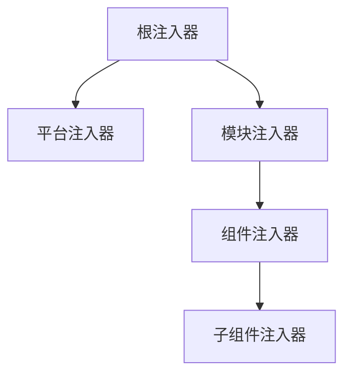

# Angular 服务与依赖注入

服务是 Angular 中用于封装可复用逻辑的类，依赖注入（DI）是 Angular 的核心特性之一。

## 创建服务

```bash [终端]
ng generate service services/user
```

## 服务基础

```typescript [src/app/services/user.service.ts]
import { Injectable, inject } from '@angular/core'
import { HttpClient } from '@angular/common/http'
import { Observable } from 'rxjs'

export interface User {
  id: number
  name: string
  email: string
}

@Injectable({
  providedIn: 'root'
})
export class UserService {
  private http = inject(HttpClient)
  private apiUrl = '/api/users'

  getUsers(): Observable<User[]> {
    return this.http.get<User[]>(this.apiUrl)
  }

  getUser(id: number): Observable<User> {
    return this.http.get<User>(`${this.apiUrl}/${id}`)
  }

  createUser(user: Omit<User, 'id'>): Observable<User> {
    return this.http.post<User>(this.apiUrl, user)
  }

  updateUser(id: number, user: Partial<User>): Observable<User> {
    return this.http.put<User>(`${this.apiUrl}/${id}`, user)
  }

  deleteUser(id: number): Observable<void> {
    return this.http.delete<void>(`${this.apiUrl}/${id}`)
  }
}
```

## 依赖注入

### providedIn: 'root'

服务在根级别提供，整个应用共享单例：

```typescript
@Injectable({
  providedIn: 'root'
})
export class UserService {}
```

### 组件级别提供

服务在组件级别提供，组件实例共享：

```typescript
@Component({
  selector: 'app-user-list',
  providers: [UserService],
  template: `...`
})
export class UserListComponent {}
```

### 使用 inject 函数

Angular 14+ 推荐使用 `inject` 函数：

```typescript
@Component({
  selector: 'app-user-list',
  template: `...`
})
export class UserListComponent {
  private userService = inject(UserService)
  private router = inject(Router)
  private route = inject(ActivatedRoute)
}
```

### 构造函数注入（传统方式）

```typescript
@Component({
  selector: 'app-user-list',
  template: `...`
})
export class UserListComponent {
  constructor(
    private userService: UserService,
    private router: Router,
    private route: ActivatedRoute
  ) {}
}
```

## 服务通信

### 使用 Subject 实现组件通信

```typescript [src/app/services/message.service.ts]
import { Injectable } from '@angular/core'
import { Subject, Observable } from 'rxjs'

@Injectable({ providedIn: 'root' })
export class MessageService {
  private subject = new Subject<string>()

  sendMessage(message: string) {
    this.subject.next(message)
  }

  getMessage(): Observable<string> {
    return this.subject.asObservable()
  }
}
```

```typescript [src/app/components/sender.component.ts]
@Component({
  selector: 'app-sender',
  template: `<button (click)="send()">发送消息</button>`
})
export class SenderComponent {
  private messageService = inject(MessageService)

  send() {
    this.messageService.sendMessage('Hello!')
  }
}
```

```typescript [src/app/components/receiver.component.ts]
@Component({
  selector: 'app-receiver',
  template: `<p>{{ message }}</p>`
})
export class ReceiverComponent implements OnInit, OnDestroy {
  private messageService = inject(MessageService)
  message: string = ''
  private subscription: Subscription | null = null

  ngOnInit() {
    this.subscription = this.messageService.getMessage().subscribe(msg => {
      this.message = msg
    })
  }

  ngOnDestroy() {
    this.subscription?.unsubscribe()
  }
}
```

## Signals 服务

```typescript [src/app/services/counter.service.ts]
import { Injectable, signal, computed } from '@angular/core'

@Injectable({ providedIn: 'root' })
export class CounterService {
  count = signal(0)
  double = computed(() => this.count() * 2)

  increment() {
    this.count.update(c => c + 1)
  }

  decrement() {
    this.count.update(c => c - 1)
  }

  reset() {
    this.count.set(0)
  }
}
```

```typescript [src/app/components/counter.component.ts]
@Component({
  selector: 'app-counter',
  template: `
    <p>计数: {{ counterService.count() }}</p>
    <p>双倍: {{ counterService.double() }}</p>
    <button (click)="counterService.increment()">+1</button>
    <button (click)="counterService.decrement()">-1</button>
  `
})
export class CounterComponent {
  counterService = inject(CounterService)
}
```

## 依赖注入层级



| 层级 | 说明 | 生命周期 |
|------|------|----------|
| 平台注入器 | 整个平台共享 | 应用启动到关闭 |
| 根注入器 | 整个应用共享 | 应用启动到关闭 |
| 模块注入器 | 模块内共享 | 模块加载到卸载 |
| 组件注入器 | 组件实例共享 | 组件创建到销毁 |

