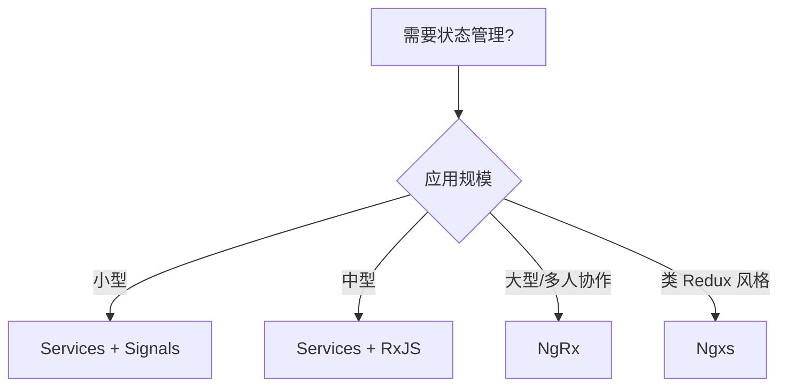

# Angular 状态管理

Angular 提供了多种状态管理方案，从简单的 Services 到专业的状态管理库。

## 状态管理方案对比

| 方案 | 体积 | 学习成本 | 适用场景 |
|------|------|----------|----------|
| Services + Signals | 内置 | 低 | 中小型项目 |
| Services + RxJS | 内置 | 中 | 响应式场景 |
| NgRx | ~12KB | 高 | 大型项目 |
| Ngxs | ~8KB | 中 | 类 Redux 风格 |
| Akita | ~10KB | 中 | 实体管理 |

## Services + Signals

### 基础使用

```typescript [src/app/services/counter.service.ts]
import { Injectable, signal, computed } from '@angular/core'

@Injectable({ providedIn: 'root' })
export class CounterService {
  private count = signal(0)
  
  readonly value = this.count.asReadonly()
  readonly double = computed(() => this.count() * 2)
  readonly isPositive = computed(() => this.count() > 0)

  increment() {
    this.count.update(c => c + 1)
  }

  decrement() {
    this.count.update(c => c - 1)
  }

  reset() {
    this.count.set(0)
  }
}
```

```typescript [src/app/components/counter.component.ts]
import { Component, inject } from '@angular/core'
import { CounterService } from '../services/counter.service'

@Component({
  selector: 'app-counter',
  template: `
    <p>计数: {{ counterService.value() }}</p>
    <p>双倍: {{ counterService.double() }}</p>
    <p>正数: {{ counterService.isPositive() }}</p>
    <button (click)="counterService.increment()">+1</button>
    <button (click)="counterService.decrement()">-1</button>
    <button (click)="counterService.reset()">重置</button>
  `
})
export class CounterComponent {
  counterService = inject(CounterService)
}
```

### 实际场景：购物车

```typescript [src/app/services/cart.service.ts]
import { Injectable, signal, computed } from '@angular/core'

export interface CartItem {
  id: string
  name: string
  price: number
  quantity: number
}

@Injectable({ providedIn: 'root' })
export class CartService {
  private items = signal<CartItem[]>([])
  
  readonly itemsList = this.items.asReadonly()
  readonly itemCount = computed(() => this.items().length)
  readonly totalPrice = computed(() => 
    this.items().reduce((sum, item) => sum + item.price * item.quantity, 0)
  )

  addItem(item: Omit<CartItem, 'quantity'>) {
    this.items.update(items => {
      const existing = items.find(i => i.id === item.id)
      if (existing) {
        return items.map(i => 
          i.id === item.id ? { ...i, quantity: i.quantity + 1 } : i
        )
      }
      return [...items, { ...item, quantity: 1 }]
    })
  }

  removeItem(id: string) {
    this.items.update(items => items.filter(item => item.id !== id))
  }

  updateQuantity(id: string, quantity: number) {
    this.items.update(items => 
      items.map(item => 
        item.id === id ? { ...item, quantity: Math.max(0, quantity) } : item
      )
    )
  }

  clear() {
    this.items.set([])
  }
}
```

```typescript [src/app/components/cart.component.ts]
import { Component, inject } from '@angular/core'
import { CommonModule } from '@angular/common'
import { CartService } from '../services/cart.service'

@Component({
  selector: 'app-cart',
  standalone: true,
  imports: [CommonModule],
  template: `
    <div class="cart">
      @for (item of cartService.itemsList(); track item.id) {
        <div class="cart-item">
          <span>{{ item.name }}</span>
          <input 
            type="number" 
            [value]="item.quantity"
            (change)="cartService.updateQuantity(item.id, $any($event.target).value)">
          <span>¥{{ item.price * item.quantity }}</span>
          <button (click)="cartService.removeItem(item.id)">删除</button>
        </div>
      } @empty {
        <p>购物车为空</p>
      }
      <div class="cart-total">
        <span>总计: ¥{{ cartService.totalPrice() }}</span>
        <button (click)="cartService.clear()">清空</button>
      </div>
    </div>
  `
})
export class CartComponent {
  cartService = inject(CartService)
}
```

## Services + RxJS

### 使用 BehaviorSubject

```typescript [src/app/services/user.service.ts]
import { Injectable } from '@angular/core'
import { BehaviorSubject, Observable } from 'rxjs'

export interface User {
  id: number
  name: string
  email: string
}

@Injectable({ providedIn: 'root' })
export class UserService {
  private userSubject = new BehaviorSubject<User | null>(null)
  readonly user$ = this.userSubject.asObservable()

  get currentUser(): User | null {
    return this.userSubject.value
  }

  login(user: User) {
    this.userSubject.next(user)
  }

  logout() {
    this.userSubject.next(null)
  }
}
```

```typescript [src/app/components/user.component.ts]
import { Component, inject, OnInit } from '@angular/core'
import { UserService } from '../services/user.service'

@Component({
  selector: 'app-user',
  template: `
    @if (user) {
      <p>欢迎, {{ user.name }}</p>
      <button (click)="userService.logout()">退出</button>
    } @else {
      <p>未登录</p>
    }
  `
})
export class UserComponent implements OnInit {
  userService = inject(UserService)
  user: User | null = null

  ngOnInit() {
    this.userService.user$.subscribe(user => {
      this.user = user
    })
  }
}
```

## NgRx

### 安装

```bash [终端]
npm install @ngrx/store @ngrx/effects @ngrx/store-devtools
```

### 定义 Action

```typescript [src/app/store/actions/user.actions.ts]
import { createAction, props } from '@ngrx/store'
import { User } from '../../models/user.model'

export const loadUsers = createAction('[User] Load Users')
export const loadUsersSuccess = createAction(
  '[User] Load Users Success',
  props<{ users: User[] }>()
)
export const loadUsersFailure = createAction(
  '[User] Load Users Failure',
  props<{ error: string }>()
)
```

### 定义 Reducer

```typescript [src/app/store/reducers/user.reducer.ts]
import { createReducer, on } from '@ngrx/store'
import * as UserActions from '../actions/user.actions'
import { User } from '../../models/user.model'

export interface UserState {
  users: User[]
  loading: boolean
  error: string | null
}

export const initialState: UserState = {
  users: [],
  loading: false,
  error: null
}

export const userReducer = createReducer(
  initialState,
  on(UserActions.loadUsers, state => ({ ...state, loading: true, error: null })),
  on(UserActions.loadUsersSuccess, (state, { users }) => ({ ...state, users, loading: false })),
  on(UserActions.loadUsersFailure, (state, { error }) => ({ ...state, error, loading: false }))
)
```

### 定义 Effects

```typescript [src/app/store/effects/user.effects.ts]
import { Injectable, inject } from '@angular/core'
import { Actions, createEffect, ofType } from '@ngrx/effects'
import { catchError, map, switchMap } from 'rxjs/operators'
import { of } from 'rxjs'
import * as UserActions from '../actions/user.actions'
import { UserService } from '../../services/user.service'

@Injectable()
export class UserEffects {
  private actions$ = inject(Actions)
  private userService = inject(UserService)

  loadUsers$ = createEffect(() =>
    this.actions$.pipe(
      ofType(UserActions.loadUsers),
      switchMap(() =>
        this.userService.getUsers().pipe(
          map(users => UserActions.loadUsersSuccess({ users })),
          catchError(error => of(UserActions.loadUsersFailure({ error: error.message })))
        )
      )
    )
  )
}
```

### 配置 Store

```typescript [src/app/app.config.ts]
import { ApplicationConfig } from '@angular/core'
import { provideRouter } from '@angular/router'
import { provideStore } from '@ngrx/store'
import { provideEffects } from '@ngrx/effects'
import { provideStoreDevtools } from '@ngrx/store-devtools'
import { userReducer } from './store/reducers/user.reducer'
import { UserEffects } from './store/effects/user.effects'
import { routes } from './app.routes'

export const appConfig: ApplicationConfig = {
  providers: [
    provideRouter(routes),
    provideStore({ user: userReducer }),
    provideEffects([UserEffects]),
    provideStoreDevtools({ maxAge: 25 })
  ]
}
```

### 使用 Store

```typescript [src/app/components/user-list.component.ts]
import { Component, inject, OnInit } from '@angular/core'
import { Store } from '@ngrx/store'
import * as UserActions from '../store/actions/user.actions'

@Component({
  selector: 'app-user-list',
  template: `
    @if (loading$ | async) {
      <p>加载中...</p>
    } @else {
      <ul>
        @for (user of users$ | async; track user.id) {
          <li>{{ user.name }}</li>
        }
      </ul>
    }
  `
})
export class UserListComponent implements OnInit {
  private store = inject(Store)
  users$ = this.store.select(state => state.user.users)
  loading$ = this.store.select(state => state.user.loading)

  ngOnInit() {
    this.store.dispatch(UserActions.loadUsers())
  }
}
```

## 状态管理选型指南



::: tip 推荐方案
2026 年的主流选择：**Services + Signals**。这套方案内置、体积小、API 简单、TypeScript 支持完美，覆盖绝大多数场景。
:::

