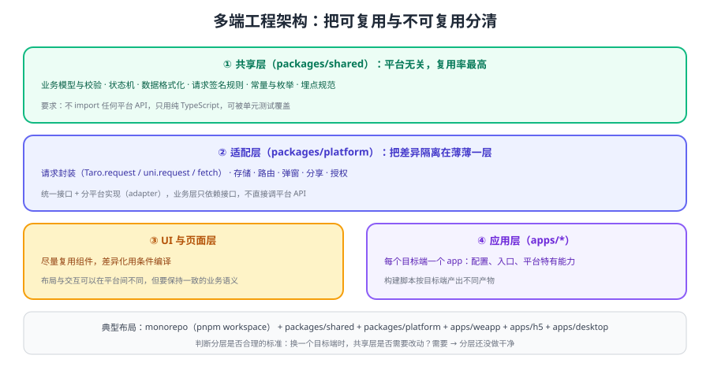

# 多端工程架构

跨端项目最容易失控的地方不是"能不能编译"，而是**代码越写越乱**：业务逻辑里散落着 `if (platform === 'weapp')`，同一个接口在三端各写一份，改一处要同步三处。解决办法是把「可复用」与「不可复用」用分层切开。



## 四层划分

| 层 | 内容 | 复用率 | 规则 |
| --- | --- | --- | --- |
| 共享层 | 业务模型、校验规则、格式化、状态机、常量 | 接近 100% | **不允许** import 任何平台 API |
| 适配层 | 请求、存储、路由、弹窗、分享、授权 | 接口 100%，实现按端 | 对外暴露统一接口，内部按平台实现 |
| UI / 页面层 | 组件、页面、样式 | 中到高 | 差异用条件编译或平台特有文件 |
| 应用层 | 各端入口、平台配置、特有能力 | 低 | 每端一个 app 目录 |

::: tip 一句话判断分层是否合格
**换一个新的目标端时，共享层是否需要改动？** 需要 → 分层还没做干净；不需要 → 抽象是合格的。
:::

## 推荐目录结构（monorepo）

```text
cross-app/
├─ packages/
│  ├─ shared/              # 纯 TS：模型、校验、格式化、常量
│  ├─ platform/            # 适配层：request/storage/router/...
│  └─ ui/                  # 跨端组件（基于 Taro/uni-app 内置组件）
├─ apps/
│  ├─ weapp/               # 小程序端入口与配置
│  ├─ h5/                  # H5 端入口与配置
│  └─ desktop/             # 桌面端（Electron）入口
├─ pnpm-workspace.yaml
└─ package.json
```

优势：共享代码只有一份，改动天然同步；各端产物独立构建，互不影响。

## 适配层怎么写

适配层的目标是把"平台差异"变成"接口实现差异"，业务层只看到接口：

```ts [packages/platform/src/request.ts]
export interface RequestOptions {
  url: string
  method?: 'GET' | 'POST'
  data?: Record<string, unknown>
}

export interface HttpClient {
  request<T>(options: RequestOptions): Promise<T>
}

// 各端实现文件由构建目标决定（如 http.weapp.ts / http.h5.ts）
export const http: HttpClient = createHttpClient()
```

```ts [packages/shared/src/order.ts]
import { http } from '@app/platform'

// 共享层只依赖适配层接口，不关心当前运行在哪一端
export async function fetchOrder(id: string) {
  const data = await http.request<{ id: string; status: string }>({
    url: `/api/orders/${id}`,
  })
  return { ...data, statusText: statusMap[data.status] ?? '未知' }
}
```

::: danger 分层中最常见的三种破坏
1. **共享层里 import 平台 API**：一旦引入 `Taro` 或 `uni`，共享层就不再可复用，也无法在 Node 环境做单元测试。
2. **适配层泄漏实现细节**：业务层直接调用 `Taro.request`，等于把适配层作废。
3. **把条件编译写进业务逻辑**：`if (env === 'weapp') { ... }` 出现在业务代码里，多端行为将难以推理。
:::

## 条件编译放在哪一层

| 位置 | 是否推荐 | 说明 |
| --- | --- | --- |
| 适配层实现内部 | ✅ 推荐 | 差异被限制在一处，业务无感 |
| 平台特有文件（`*.weapp.ts`） | ✅ 推荐 | 差异较大时最清晰 |
| 页面/组件渲染分支 | ⚠️ 谨慎 | 仅用于布局与交互差异，需保持业务语义一致 |
| 共享层业务逻辑 | ❌ 禁止 | 共享层应保持平台无关 |

## 状态管理与数据流

| 方案 | 适用 | 多端注意点 |
| --- | --- | --- |
| 组件内状态 | 局部交互 | 无差异 |
| 全局状态（如 Pinia / Redux） | 跨页面共享 | 小程序端需注意页面栈与持久化差异 |
| 本地存储 + 版本号 | 离线缓存、草稿 | 各端存储容量与同步/异步 API 不同，统一走适配层 |

## 构建与 CI

1. **每端独立构建脚本**（`build:weapp`、`build:h5`、`build:desktop`），CI 中按需触发。
2. **共享层先跑单元测试**：它是复用率最高的部分，测试收益最大。
3. **构建产物与版本号统一**：三端使用同一个版本号，便于定位问题（见 [实战](../Practice/index.md)）。
4. **缓存与依赖锁定**：monorepo 中依赖版本要锁定，避免"本地能构建、CI 构建失败"。

## 验证方式

1. 抽出共享层后，为其写 3 个单元测试，确认在 Node 环境下可直接运行（不依赖任何平台 API）。
2. 临时新增一个假想的第 4 个端（如只写空壳入口），确认共享层无需改动即可接入。
3. 全局搜索 `Taro.` / `uni.` / `wx.` 在共享层与业务层的出现次数，确认只集中在适配层。
4. 在 CI 中同时构建两端产物，确认构建时间与体积符合预期。

## 相关专题

- [多端兼容与差异处理](../Compatibility/index.md)：差异清单与测试矩阵
- [Taro 多端开发](../Taro/index.md)：编译与条件编译的写法
- [Uniapp](../../Uniapp/index.md)：uni-app 的目录结构与工程实践
- [前端工程化专题](../../../Others/FrontendEngineering/index.md)：通用工程化与 monorepo 规范

## 参考资料

- Taro 官方文档 · 项目配置：https://docs.taro.zone/docs/config
- pnpm workspace 官方文档：https://pnpm.io/workspaces
