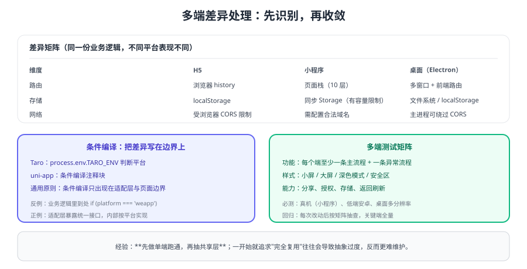

# 多端兼容与差异处理

跨端的成本几乎全部来自**平台差异**。差异本身不可怕，可怕的是它散落在业务代码里、没人知道有多少处。本页给出一份可落地的差异清单与处理套路，让"多端兼容"从经验变成流程。



## 差异矩阵

| 维度 | H5 | 小程序 | 桌面（Electron） |
| --- | --- | --- | --- |
| 路由 | 浏览器 history / 前端路由 | 页面栈（层级有限） | 多窗口 + 前端路由 |
| 返回行为 | 浏览器返回 | `navigateBack`，页面不重新 `onLoad` | 窗口返回 / 路由返回 |
| 存储 | `localStorage`（同步） | 平台 Storage（有容量限制） | 文件系统 / `localStorage` |
| 网络 | 受 CORS 限制 | 需配置合法域名 | 主进程可绕过 CORS |
| 弹窗/授权 | 浏览器原生 | 平台授权流程与隐私协议 | 自定义窗口 |
| 分享 | 复制链接 / Web Share | 平台分享能力 | 通常无分享概念 |
| 样式单位 | px / rem / vw | rpx（与设计稿换算） | px / rem |
| 性能瓶颈 | 首屏 JS 与资源体积 | 主包体积与 `setData` 频率 | 启动耗时与内存 |

::: warning 差异处理的第一原则
**先统一语义，再处理表现**。例如"返回列表并刷新"在每个端的实现方式不同，但业务语义必须一致；否则用户在不同端会得到不同结果。
:::

## 三种处理套路

### ① 适配层（首选）

把差异封装在统一接口内部，业务层无感：

```ts [packages/platform/src/share.ts]
export interface ShareAdapter {
  share(title: string, url: string): Promise<void>
}
```

### ② 平台特有文件

差异较大、逻辑较长时，按平台拆文件（Taro 的 `*.weapp.ts`、uni-app 的条件编译块），让差异"看得见"。

### ③ 条件编译（慎用）

只用于**渲染层的表现差异**，例如某个端需要不同的布局：

```tsx [pages/detail/index.tsx]
{process.env.TARO_ENV === 'h5' ? (
  <View className="detail-h5">...</View>
) : (
  <View className="detail-mini">...</View>
)}
```

::: danger 条件编译的三种滥用
1. **在共享层里判断平台**：共享层应保持平台无关。
2. **同一个业务分支写多份逻辑**：应改为适配层统一接口 + 各端实现。
3. **用条件编译绕过设计问题**：布局差异背后往往是设计没定义清楚，先对齐设计再写代码。
:::

::: tip 差异处理的上限思维
**假设你明天要接入第 5 个端**：如果现在的写法需要改动业务代码，说明差异还没有收敛到适配层。用这个假设检验自己的分层，比事后重构便宜得多。
:::

## 样式与尺寸适配

| 问题 | 处理方式 |
| --- | --- |
| 单位不统一 | 小程序用 rpx，H5/桌面用 rem 或 vw，按端换算 |
| 安全区 | 小程序与移动端需处理底部安全区 |
| 字体与行高 | 不同端默认字体不同，关键文案要指定字号与行高 |
| 深色模式 | 统一用变量（CSS 变量）管理配色 |
| 长文本与截断 | 多端省略号实现不同，必要时用 JS 截断 |

## 多端测试矩阵

| 层级 | 内容 | 频率 |
| --- | --- | --- |
| 单元测试 | 共享层逻辑（模型、校验、格式化） | 每次提交 |
| 组件测试 | 跨端组件的基本渲染与交互 | 每次提交 |
| 端到端 | 每个端至少一条主流程 | 每次发布 |
| 异常路径 | 断网、接口失败、权限拒绝、空数据 | 每次发布 |
| 设备覆盖 | 真机（小程序）、低端安卓、桌面多分辨率 | 定期 |

## 常见差异坑清单

1. **H5 刷新 404**：前端路由需服务端配置 history 回退。
2. **小程序 `switchTab` 不能带参数**：需要全局状态或 Storage。
3. **页面返回不刷新**：小程序页面栈保留，需 `onShow` 或事件回传（见 [微信小程序 · 路由与页面栈](../../WxMini/Router/index.md)）。
4. **本地存储异步/同步差异**：统一走适配层，避免各端写法不同。
5. **弹窗被拦截**：某些端对弹窗时机有限制，注意调用时机与用户手势。
6. **时间与数字格式化不一致**：统一用共享层函数，不依赖运行时默认行为。

## 验证方式

1. 按差异矩阵逐项在本项目中确认"是否涉及"，形成自己的差异清单。
2. 任选一处差异，用适配层重构一次，确认业务层代码没有出现平台判断。
3. 在两端分别执行一次"断网 → 请求 → 恢复"流程，确认提示与重试行为一致。
4. 记录一次发布前的多端回归耗时，作为后续流程优化的基线。

## 相关专题

- [多端工程架构](../Architecture/index.md)：适配层与共享层的划分
- [Taro 多端开发](../Taro/index.md)：条件编译与平台特有文件
- [微信小程序 · 基础库版本与兼容](../../WxMini/Version/index.md)：小程序侧版本差异
- [微信小程序 · 常见错误](../../WxMini/Errors/index.md)：小程序端高频报错

## 参考资料

- Taro 官方文档 · 多端开发：https://docs.taro.zone/docs/process
- uni-app 官方文档 · 条件编译：https://uniapp.dcloud.net.cn/tutorial/platform.html
