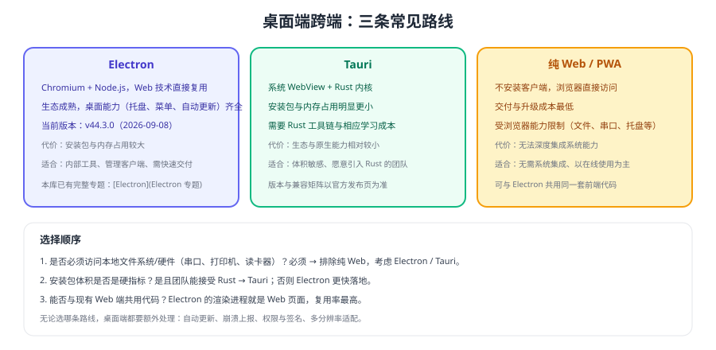

# 桌面端跨端

桌面端（Windows / macOS / Linux）是跨端里"最像 Web"的一端：用现有前端代码加一层桌面容器，就能交付一个可安装的客户端。本页讲清三条常见路线的取舍，以及与既有 [Electron 专题](../../Electron/index.md) 的分工。



## 三条路线对比

| 维度 | Electron | Tauri | 纯 Web / PWA |
| --- | --- | --- | --- |
| 内核 | Chromium + Node.js | 系统 WebView + Rust | 浏览器 |
| 代码复用 | 渲染进程就是 Web 页面，复用率最高 | 前端部分同样复用 | 完全复用 |
| 安装包体积 | 较大 | 明显更小 | 无需安装 |
| 内存占用 | 较高 | 较低 | 取决于浏览器 |
| 系统能力 | 齐全（托盘、菜单、文件、自动更新） | 较全，需 Rust 侧实现 | 受限 |
| 团队门槛 | 前端即可上手 | 需要 Rust 工具链 | 最低 |
| 适用 | 内部工具、管理客户端、快速交付 | 体积敏感、愿意引入 Rust | 无需系统集成 |

::: tip 一句话选择
**要快、要稳、团队是前端 → Electron；对体积有硬要求且能接受 Rust → Tauri；根本不需要访问本地文件与硬件 → 直接做 Web**。
:::

## Electron 最小落地

Electron 的核心是**主进程 + 渲染进程**：主进程负责窗口与系统能力，渲染进程就是前端页面，两者通过 IPC 通信。

```js [main.js（主进程）]
const { app, BrowserWindow, ipcMain } = require('electron')

function createWindow() {
  const win = new BrowserWindow({
    width: 1200,
    height: 800,
    webPreferences: {
      preload: __dirname + '/preload.js',
      contextIsolation: true,      // 安全基线，不要关闭
      nodeIntegration: false,      // 渲染进程不直接访问 Node
    },
  })
  win.loadURL('http://localhost:5173')       // 开发环境加载前端
}

ipcMain.handle('read-file', async (_event, path) => {
  return require('fs/promises').readFile(path, 'utf-8')
})

app.whenReady().then(createWindow)
```

```js [preload.js（预加载脚本）]
const { contextBridge, ipcRenderer } = require('electron')

// 只暴露白名单能力，不要把整个 ipcRenderer 暴露给页面
contextBridge.exposeInMainWorld('desktop', {
  readFile: (path) => ipcRenderer.invoke('read-file', path),
})
```

```js [renderer.js（前端调用）]
const content = await window.desktop.readFile('/path/to/file.txt')
```

::: danger 桌面端安全的四条底线
1. **不要开启 `nodeIntegration`**：渲染进程直接拿到 Node 能力，等于把系统交出去。
2. **不要关闭 `contextIsolation`**：隔离被破坏后，页面脚本可以污染预加载环境。
3. **只暴露白名单 API**：把 `ipcRenderer` 整体暴露出去，等同于允许页面调用任意主进程能力。
4. **校验来自渲染进程的所有参数**：路径、命令参数都要在主进程侧校验，防止路径穿越与命令注入。
:::

## 与 Web / 小程序共用代码

| 复用对象 | 能否复用 | 说明 |
| --- | --- | --- |
| 业务逻辑（共享层） | ✅ 完全复用 | 与 [多端工程架构](../Architecture/index.md) 的分层一致 |
| 请求与状态管理 | ✅ 复用 | 桌面端可绕过 CORS，但接口封装仍建议走适配层 |
| UI 组件与页面 | ✅ 大部分复用 | 需注意窗口尺寸、右键菜单、快捷键等桌面交互差异 |
| 路由 | ⚠️ 部分复用 | 桌面端可能使用多窗口，路由策略需单独设计 |
| 存储 | ⚠️ 需适配 | 文件系统与浏览器存储的取舍 |

## 桌面端特有的四件事

1. **自动更新**：必须有版本检查与回滚策略，否则"用户不升级"会让老版本长期存在。
2. **打包与签名**：Windows/macOS 各自需要签名与公证流程，越早准备越好。
3. **多分辨率与缩放**：桌面分辨率差异大，注意窗口最小尺寸与高 DPI 缩放。
4. **崩溃与日志**：客户端崩溃后拿不到现场，本地日志与崩溃上报是必备能力。

## 与 Electron 专题的分工

- 本页：**选型与跨端视角**（该不该用、怎么与 Web 共用代码、桌面端特有事项）。
- [Electron 专题](../../Electron/index.md)：**实现细节**（进程模型、IPC、窗口、菜单、托盘、打包、自动更新、安全实践）。

## 验证方式

1. 用 Electron 加载现有前端页面，确认页面在桌面端可正常渲染与交互。
2. 通过预加载脚本暴露一个只读文件接口，确认前端可读取文件、且无法访问任意 Node API。
3. 关闭 `contextIsolation` 后再试一次，确认安全隐患（理解为什么不能关）。
4. 打一次安装包并完成升级流程验证，记录签名与更新所需步骤。

## 相关专题

- [Electron 专题](../../Electron/index.md)：进程模型、IPC、打包与自动更新
- [多端工程架构](../Architecture/index.md)：桌面端如何复用共享层
- [多端兼容与差异处理](../Compatibility/index.md)：路由、存储、弹窗的端间差异
- [实战：一套代码发布到多端](../Practice/index.md)：H5 + 小程序 + 桌面的发布流程

## 参考资料

- Electron 官方文档：https://www.electronjs.org/docs/latest
- Electron 安全建议：https://www.electronjs.org/docs/latest/tutorial/security
- Tauri 官方文档：https://v2.tauri.app/
