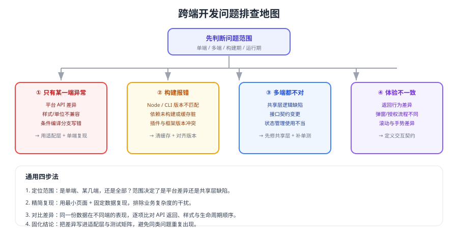

# 常见问题与最佳实践

跨端项目的问题集中在四类：**只有某一端异常、构建报错、多端都不对、体验不一致**。本页按现象给出排查路径，并汇总团队协作层面的最佳实践。



## 通用排查四步

```shell
# 1. 确认环境版本（版本不匹配是多端问题的第一嫌疑）
node -v && npm -v && pnpm -v

# 2. 分别构建各端，确认问题出在编译期还是运行期
npm run build:weapp
npm run build:h5

# 3. 清理缓存后重试（构建缓存脏是很常见的原因）
rm -rf node_modules/.cache dist
```

## 1. 只有某一端异常

| 可能原因 | 验证方式 | 处理 |
| --- | --- | --- |
| 使用了该端不支持的 API | 查官方兼容表 | 改用适配层统一接口 |
| 条件编译分支写错 | 检查 `process.env.TARO_ENV` 判断 | 修正条件或改用平台特有文件 |
| 样式单位/选择器不支持 | 对比两端样式表现 | 按端调整单位与选择器 |
| 平台配置缺失 | 检查域名、权限、AppID | 补齐平台侧配置 |

## 2. 构建失败

1. **版本不匹配**：Node、CLI、插件版本三者的组合问题最常见（见 [版本与兼容矩阵](../Version/index.md)）。
2. **依赖未构建**：monorepo 中共享包需先构建（`pnpm build:shared`）。
3. **缓存脏**：删除 `node_modules/.cache` 与 `dist` 后重试。
4. **CI 与本地不一致**：提交 lockfile，CI 固定 Node 版本。

## 3. 多端都不对

说明问题在**共享层或接口**，而不是平台差异：

1. 先写一个最小单测复现共享层逻辑问题。
2. 检查接口契约是否变更（字段改名、类型变化）。
3. 检查全局状态是否被某个页面误改（参考 [多端工程架构](../Architecture/index.md) 的状态管理建议）。

## 4. 体验不一致

| 差异点 | 处理思路 |
| --- | --- |
| 返回刷新行为 | 统一"返回即刷新"的语义，小程序端用 `onShow` + 脏标记 |
| 弹窗与授权流程 | 抽出统一的交互契约，各端用不同实现满足同一契约 |
| 滚动与手势 | 关键交互优先使用框架提供的基础组件 |
| 首屏时间 | 各端分别做性能优化，不要用同一套指标硬比 |

::: warning 一致性的正确目标
追求"**业务语义一致 + 关键交互一致**"是合理的；追求"像素级一致"会显著增加成本，且往往与平台习惯冲突（例如小程序的返回手势）。
:::

## 5. 复用率总是不高

按顺序检查：

1. **共享层是否被平台 API 污染**：一旦 import 平台 API，复用就断了。
2. **适配层是否真的被使用**：业务层绕过适配层直接调平台 API，复用同样会断。
3. **UI 差异是否被过度放大**：多数页面可以共用布局，只有少数需要真正区分。
4. **是否一开始就追求全端复用**：建议先做单端，再逐步抽出共享层。

## 6. 团队协作怎么分工

| 角色 | 职责 |
| --- | --- |
| 架构/负责人 | 分层规范、版本策略、多端发布流程 |
| 业务开发 | 共享层逻辑、页面实现、适配层补充 |
| 平台专项 | 小程序审核与合规、桌面打包与签名、原生能力 |
| 测试 | 多端测试矩阵、异常路径、真机与低端设备验证 |

## 最佳实践清单

::: tip 架构
1. 共享层保持平台无关，只放纯 TS 逻辑。
2. 差异一律收敛到适配层或平台特有文件。
3. 条件编译只用于渲染表现差异，不用于业务分支。
:::

::: tip 工程
1. 提交 lockfile，CI 固定 Node 版本。
2. 三端产物统一版本号，便于定位问题。
3. 共享层优先补单元测试，测试收益最高。
:::

::: tip 发布
1. 按端上线：H5 → 小程序 → 桌面，每端观察一个周期。
2. 每端都能独立回滚，并演练过一次。
3. 发布前按多端矩阵回归，关键端做真机验证。
:::

## 验证方式

1. 用一个真实的多端问题走一遍排查四步，输出"范围 → 根因 → 改动 → 验证结果"。
2. 全局搜索平台 API 在共享层与业务层的出现次数，确认分层未被破坏。
3. 执行一次完整的多端发布与单端回滚演练。
4. 把本次踩到的差异补进 [多端兼容与差异处理](../Compatibility/index.md) 的清单里。

## 相关专题

- [多端工程架构](../Architecture/index.md)
- [多端兼容与差异处理](../Compatibility/index.md)
- [版本与兼容矩阵](../Version/index.md)
- [微信小程序 · 常见错误](../../WxMini/Errors/index.md)

## 参考资料

- Taro 官方文档：https://docs.taro.zone/
- uni-app 官方文档：https://uniapp.dcloud.net.cn/
- Electron 官方文档：https://www.electronjs.org/docs/latest
