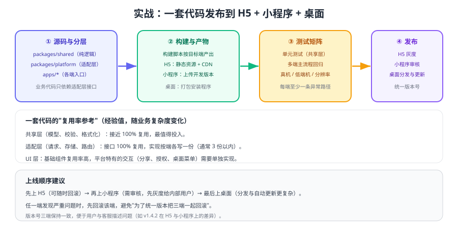

# 实战：一套代码发布到 H5 + 小程序 + 桌面

把前面的分层、兼容与桌面方案拼起来，做一次完整落地：**一个 monorepo，三端产物，统一版本号，各自可回滚**。本页给出目录骨架、关键代码、上线顺序与验收标准。



## 目标与范围

| 项 | 设定 |
| --- | --- |
| 端 | H5（对外）、小程序（微信内）、桌面（内部员工用） |
| 技术栈 | Taro（H5 + 小程序）+ Electron（桌面，复用同一套前端代码） |
| 复用目标 | 共享层 100% 复用，适配层接口复用、实现按端 |
| 版本策略 | 三端统一版本号，如 `v1.4.2` |
| 不做什么 | 不追求页面的像素级一致；核心业务语义必须一致 |

::: tip 先定义"一致"的边界
**业务语义一致（必须）、交互流程一致（尽量）、像素表现一致（不追求）**。把边界说清楚，能省掉大量无意义的对齐工作。
:::

## 目录骨架

```text
cross-app/
├─ packages/
│  ├─ shared/          # 纯 TS：模型、校验、格式化、状态机
│  ├─ platform/        # 适配层：request / storage / share / router
│  └─ ui/              # 跨端组件
├─ apps/
│  ├─ taro-app/        # Taro 工程：构建 H5 与小程序
│  └─ desktop/         # Electron 工程：加载 H5 构建产物
└─ pnpm-workspace.yaml
```

## 适配层示例

```ts [packages/platform/src/storage.ts]
export interface StorageAdapter {
  get<T>(key: string): T | null
  set<T>(key: string, value: T): void
  remove(key: string): void
}

// 各端实现文件由构建目标决定：
// storage.taro.ts   → 使用 Taro.getStorageSync / setStorageSync
// storage.desktop.ts → 使用文件或 localStorage
export const storage: StorageAdapter = createStorage()
```

```ts [packages/shared/src/cart.ts]
import { storage } from '@app/platform'

const CART_KEY = 'cart:v1'

export function addToCart(sku: string, qty: number) {
  const cart = storage.get<Record<string, number>>(CART_KEY) ?? {}
  cart[sku] = (cart[sku] ?? 0) + qty
  storage.set(CART_KEY, cart)      // 业务层不关心底层是哪种存储
  return cart
}
```

## 构建与发布脚本

```json [package.json（根目录，节选）]
{
  "scripts": {
    "build:shared": "pnpm --filter @app/shared build",
    "build:h5": "pnpm --filter taro-app build:h5",
    "build:weapp": "pnpm --filter taro-app build:weapp",
    "build:desktop": "pnpm --filter desktop build",
    "release:all": "pnpm build:shared && pnpm build:h5 && pnpm build:weapp && pnpm build:desktop"
  }
}
```

| 端 | 产物 | 发布方式 | 回滚方式 |
| --- | --- | --- | --- |
| H5 | 静态资源 | CDN / 静态服务器，可灰度 | 切回上一版本目录 |
| 小程序 | 小程序代码包 | 后台提交审核 → 发布 | 版本管理回退到上一线上版本 |
| 桌面 | 安装包 + 更新包 | 分发服务器 / 自动更新 | 关闭更新通道，回退到旧版本 |

## 上线顺序

1. **先上 H5**：可以随时回滚，用来验证业务逻辑与接口。
2. **再上小程序**：内部体验版 → 提交审核 → 灰度发布；注意类目与合规检查（见 [微信小程序 · 上线发布](../../WxMini/Release/index.md)）。
3. **最后上桌面**：安装包分发与自动更新链路最复杂，放在最后。

::: warning 不要三端同时上线
同时发布会让问题归因变难：一旦数据异常，你无法判断是业务逻辑问题还是某一端的实现问题。**按端上线，每端观察一个周期**。
:::

## 验收标准

| 维度 | 标准 | 验证方式 |
| --- | --- | --- |
| 功能 | 三端主流程一致 | 手动回归同一份用例清单 |
| 共享层复用 | 业务逻辑改动只需改一处 | 修改一处共享逻辑后三端行为同步变化 |
| 差异收敛 | 平台判断只出现在适配层 | 全局搜索平台 API 出现位置 |
| 体验 | 首屏时间与交互可接受 | 各端性能面板 / 真机测试 |
| 可回滚 | 每端都能独立回滚 | 演练一次回滚 |

## 故障演练

| 演练 | 操作 | 期望结果 |
| --- | --- | --- |
| H5 回滚 | 切回上一版本静态资源 | 用户侧立即恢复，无需重启客户端 |
| 小程序回退 | 后台回退到上一线上版本 | 新用户拿到旧版本，数据兼容 |
| 桌面更新失败 | 中断更新包下载 | 客户端仍可用，给出重试提示 |
| 适配层异常 | 某个端存储接口报错 | 业务层捕获并给出可读提示，不白屏 |
| 接口变更 | 后端字段改名 | 共享层校验失败并上报，三端表现一致 |

## 验证方式

1. 修改共享层一个函数（如价格格式化），确认三端表现同步变化且无需改动适配层。
2. 三端各跑一遍主流程与一条异常流程，记录差异与处理结论。
3. 执行一次完整发布（H5 + 小程序 + 桌面）并记录耗时，找出最慢环节。
4. 演练一次 H5 回滚与一次小程序回退，确认流程可执行。

## 相关专题

- [多端工程架构](../Architecture/index.md)：分层与 monorepo 设计
- [多端兼容与差异处理](../Compatibility/index.md)：差异清单与测试矩阵
- [桌面端跨端](../Desktop/index.md)：Electron 落地与安全基线
- [微信小程序 · 上线发布](../../WxMini/Release/index.md)：小程序审核与灰度

## 参考资料

- Taro 官方文档：https://docs.taro.zone/
- Electron 官方文档：https://www.electronjs.org/docs/latest
- pnpm workspace：https://pnpm.io/workspaces
