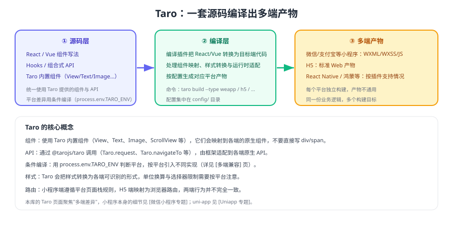

# Taro 多端开发

Taro 是京东开源的**多端统一开发框架**：用 React（或 Vue）写一套代码，通过编译生成小程序、H5、React Native 等多个端的产物。它的理念是「**一次编写，多端运行**」，把平台差异交给编译期与运行时适配层处理。



## 核心概念

| 概念 | 说明 |
| --- | --- |
| 内置组件 | `View`、`Text`、`Image`、`ScrollView` 等，会映射到各端原生组件，**不要写 `div`/`span`** |
| Taro API | 通过 `@tarojs/taro` 调用（`Taro.request`、`Taro.navigateTo` 等），由框架适配到各端 |
| 条件编译 | 用 `process.env.TARO_ENV` 判断当前编译目标，按端引入不同实现 |
| 配置 | 集中在 `config/` 目录（`index.js`、`dev.js`、`prod.js`） |
| 编译目标 | `taro build --type weapp` / `h5` / `rn` 等，每个目标独立产出 |

::: tip 一句话理解
**写 Taro 的心智模型是「写一套能编译到多端的代码」，而不是「写 React 再想办法套壳」**。凡是直接用平台 API、直接操作 DOM、或依赖 Web 专有能力的写法，都会在某一端失效。
:::

## 项目结构

```text
my-taro-app/
├─ config/                 # 构建配置：index / dev / prod
│  └─ index.js
├─ src/
│  ├─ app.config.ts        # 全局配置（页面路径、窗口、tabBar）
│  ├─ app.ts               # 应用入口
│  ├─ app.scss             # 全局样式
│  ├─ pages/               # 页面（每个页面一个目录）
│  │  └─ index/
│  │     ├─ index.tsx
│  │     ├─ index.config.ts
│  │     └─ index.scss
│  └─ components/          # 自定义组件
├─ package.json
└─ project.config.json     # 小程序项目配置
```

页面需要在 `app.config.ts` 的 `pages` 中注册（小程序端要求如此），H5 端会据此生成路由。

## 一个最小页面

```tsx [src/pages/index/index.tsx]
import { View, Text, Button } from '@tarojs/components'
import Taro from '@tarojs/taro'
import { useState } from 'react'
import './index.scss'

export default function Index() {
  const [count, setCount] = useState(0)

  const goDetail = () => {
    // 使用 Taro API，由框架适配到各端的路由实现
    Taro.navigateTo({ url: '/pages/detail/index?id=1001' })
  }

  return (
    <View className="index">
      <Text>当前计数：{count}</Text>
      <Button onClick={() => setCount(count + 1)}>+1</Button>
      <Button onClick={goDetail}>查看详情</Button>
    </View>
  )
}
```

```tsx [src/pages/detail/index.tsx]
import { View, Text } from '@tarojs/components'
import { useRouter } from '@tarojs/taro'

export default function Detail() {
  // 获取页面参数：小程序端来自页面栈，H5 端来自 URL
  const router = useRouter()
  return (
    <View>
      <Text>商品 ID：{router.params.id}</Text>
    </View>
  )
}
```

## 多端差异怎么处理

### 条件编译

```ts [src/services/share.ts]
// 按编译目标选择实现，差异只出现在这一层
export async function share(title: string) {
  if (process.env.TARO_ENV === 'weapp') {
    // 小程序：使用平台分享能力
    return
  }
  if (process.env.TARO_ENV === 'h5') {
    // H5：复制链接作为降级方案
    return
  }
}
```

### 平台特有文件

Taro 支持按平台命名文件（如 `index.weapp.tsx`、`index.h5.tsx`），编译时自动选择对应实现。这比在业务代码里写 `if` 更清晰，推荐用于差异较大的模块。

::: danger Taro 使用中的五个高频问题
1. **直接写 `div`/`span`**：小程序端不支持，必须用 `View`/`Text` 等内置组件。
2. **直接用 `window`/`document`**：H5 可用，其他端会直接报错（见 [多端兼容与差异处理](../Compatibility/index.md)）。
3. **样式里用复杂选择器**：小程序对选择器支持有限，避免后代选择器与通配符滥用。
4. **依赖 Web 专有 API**（如 `localStorage`）：应改用 `Taro.setStorageSync` 等适配后的 API。
5. **忽略页面栈限制**：路由行为在小程序端遵循平台规则，`navigateTo` 有层级上限（见 [微信小程序 · 路由与页面栈](../../WxMini/Router/index.md)）。
:::

## 构建与调试

```shell
# 开发模式（监听文件变化，生成对应端产物）
npm run dev:weapp      # 微信小程序
npm run dev:h5         # H5

# 生产构建
npm run build:weapp
npm run build:h5
```

| 目标端 | 调试方式 | 注意事项 |
| --- | --- | --- |
| 小程序 | 微信开发者工具打开 `dist/` | 需配置 AppID 与合法域名 |
| H5 | 本地静态服务器 / 浏览器调试 | 注意路由模式与刷新 404 问题 |
| 桌面 / RN | 见 [桌面端跨端](../Desktop/index.md) | 原生模块与打包配置单独维护 |

## 与既有专题的关系

- **uni-app 专题**：[Uniapp](../../Uniapp/index.md)（另一条主流路线，Vue 技术栈）
- **小程序细节**：[微信小程序专题](../../WxMini/index.md)（页面栈、基础库兼容、发布审核）
- **工程分层**：[多端工程架构](../Architecture/index.md)
- **差异清单**：[多端兼容与差异处理](../Compatibility/index.md)

## 验证方式

1. 用 Taro 创建一个页面，分别构建小程序与 H5，确认两端都能正确渲染与跳转。
2. 在页面中使用 `Taro.request` 请求同一接口，确认两端都能拿到数据（小程序端需配置合法域名）。
3. 写一段 `process.env.TARO_ENV === 'h5'` 的条件分支，确认只有 H5 产物包含该逻辑。
4. 把 `View` 换成 `div` 后重新构建小程序产物，观察报错信息（理解组件映射的必要性）。

## 参考资料

- Taro 官方文档：https://docs.taro.zone/
- Taro GitHub 仓库：https://github.com/NervJS/taro
- 多端差异处理：[多端兼容与差异处理](../Compatibility/index.md)
