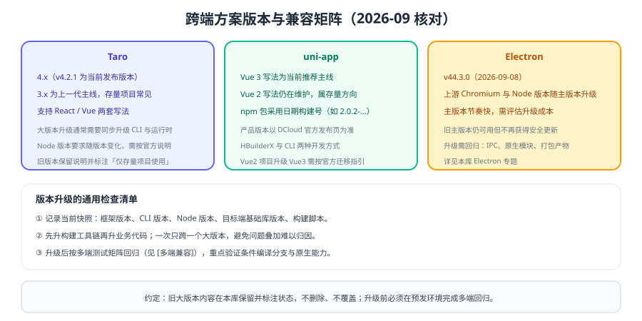

# 版本与兼容矩阵

跨端项目的版本问题比单端更复杂：**框架版本、CLI 版本、Node 版本、目标端基础库版本**任意一项不匹配，都可能表现为"构建失败"或"某一端运行异常"。本页给出当前状态与升级流程；旧版本内容保留并标注状态，不删除、不覆盖。



## 框架版本状态

| 方案 | 当前版本 | 上一代 | 状态说明 |
| --- | --- | --- | --- |
| Taro | **4.x（v4.2.1，2026-07-17）** | 3.x | 4.x 为主线；3.x 存量项目较多，升级需同步升级 CLI 与运行时 |
| uni-app | **Vue 3 写法为当前推荐** | Vue 2 写法 | Vue 2 仍在维护，属存量方向；npm 包采用日期构建号（如 `2.0.2-…`），产品版本以 DCloud 官方发布页为准 |
| Electron | **v44.3.0（2026-09-08）** | 更低主版本 | 上游 Chromium/Node 随主版本升级，旧主版本不再获得安全更新 |
| Tauri | 以官方发布页为准 | — | 需要 Rust 工具链，版本与系统 WebView 相关 |

::: info 版本标注约定
「当前」指新项目应采用；「上一代」仍在维护或仍被大量使用，本库保留说明；「仅存量」指历史版本，仅用于维护既有系统。所有版本以官方发布页为准，升级前必须在预发环境完成多端回归。
:::

::: tip 用 lockfile + 固定 Node 版本保证可复现
多端构建最容易出现「本地能构建、CI 失败」，根因大多是依赖与 Node 版本不一致。**提交 lockfile、在 CI 中固定 Node 版本、统一包管理器**，是成本最低的稳定性投入。
:::

## 环境依赖链

```text
操作系统 / 驱动
   └─ Node.js 版本（由框架与工具链要求）
        └─ 包管理器（pnpm / npm）
             └─ 框架与 CLI（Taro / uni-app）
                  └─ 编译插件（平台适配器）
                       └─ 目标端基础库（小程序基础库、浏览器内核）
```

排查版本问题的顺序**从下往上**：先确认 Node 与包管理器，再确认框架与 CLI，最后看目标端基础库。

## 大版本升级检查清单

1. **冻结变更**：升级窗口内不做业务功能开发，避免问题归因困难。
2. **记录快照**：框架版本、CLI 版本、Node 版本、插件版本、目标端基础库版本。
3. **一次只跨一个大版本**：Taro 3 → 4 完成后，再考虑其他升级。
4. **先升构建工具链，再升业务代码**：很多编译错误来自工具链与插件不匹配。
5. **按多端测试矩阵回归**：每端主流程 + 异常路径 + 条件编译分支（见 [多端兼容与差异处理](../Compatibility/index.md)）。
6. **保留回滚能力**：保留旧分支与旧构建产物，确认可随时切回。

::: danger 升级期的四个高危动作
1. 在生产发布窗口做框架升级。
2. 同时升级框架、Node 与多个插件（出问题无法定位）。
3. 只在一端验证就全量发布。
4. 升级后立即删除旧分支与旧产物，失去回滚能力。
:::

## 常见版本问题对照

| 现象 | 可能原因 | 处理 |
| --- | --- | --- |
| 构建报语法错误 | Node 版本过低或过高 | 对齐框架要求的 Node 版本 |
| 插件报 peer 依赖冲突 | 插件版本与框架版本不匹配 | 对齐插件版本，必要时锁定版本 |
| 某一端产物运行时报 API 不存在 | 目标端基础库版本过低 | 按 [小程序基础库兼容](../../WxMini/Version/index.md) 做能力判断 |
| `npm run build` 本地成功、CI 失败 | 依赖未锁定 / Node 版本不同 | 提交 lockfile，CI 使用固定 Node 版本 |
| 桌面端升级后 IPC 异常 | Electron 主版本行为变更 | 对照官方迁移说明回归 IPC 与原生模块 |

## 验证方式

1. 记录当前项目的完整环境快照（Node、包管理器、框架、CLI、插件、目标端版本）并写入项目文档。
2. 在预发环境按清单执行一次升级演练，记录耗时与踩坑点。
3. 用同一份用例在三端回归，确认升级后行为与升级前一致。
4. 演练一次回滚（切回旧分支/旧产物），确认可执行。

## 相关专题

- [Taro 多端开发](../Taro/index.md)：构建命令与条件编译
- [多端兼容与差异处理](../Compatibility/index.md)：回归矩阵
- [微信小程序 · 基础库版本与兼容](../../WxMini/Version/index.md)：目标端版本策略
- [Electron 专题](../../Electron/index.md)：Electron 主版本升级注意点

## 参考资料

- Taro 官方文档与发布说明：https://docs.taro.zone/
- uni-app 官方文档：https://uniapp.dcloud.net.cn/
- Electron 发布与支持说明：https://www.electronjs.org/docs/latest/tutorial/electron-timelines
- Node.js 版本发布计划：https://nodejs.org/en/about/previous-releases
