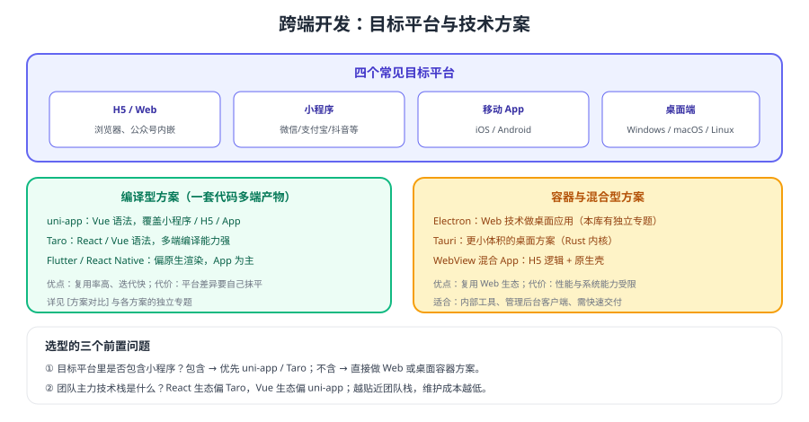

# 跨端开发

<p style="text-align:center;"></p>

跨端开发（Cross-Platform Development）指**用一套技术栈覆盖多个运行端**：H5、小程序、移动 App、桌面客户端。它的价值是「一次开发、多端交付」，代价是**平台差异必须有人买单**——要么由框架抹平，要么由你的工程架构抹平。



## 专题导航

- [Taro 多端开发](Taro/index.md)：React / Vue 一套源码编译到多端
- [多端工程架构](Architecture/index.md)：共享层、适配层与 monorepo 分层
- [多端兼容与差异处理](Compatibility/index.md)：差异矩阵、条件编译与测试矩阵
- [桌面端跨端](Desktop/index.md)：Electron / Tauri / 纯 Web 的选择
- [实战：一套代码发布到 H5 + 小程序 + 桌面](Practice/index.md)：端到端落地与上线顺序
- [版本与兼容矩阵](Version/index.md)：Taro、uni-app、Electron 的版本状态
- [常见问题与最佳实践](FAQ/index.md)：多端排查与团队协作经验

::: tip 一句话理解
跨端的本质是**抽象**：把「所有端都一样」的部分（业务逻辑）放到共享层，把「每个端都不同」的部分（API、样式、交互）收敛到薄薄一层适配层。抽象做得越干净，多端的维护成本越低。
:::

## 方案对比速览

| 方案 | 技术栈 | 覆盖端 | 优势 | 代价 |
| --- | --- | --- | --- | --- |
| [uni-app](../Uniapp/index.md) | Vue | 小程序 / H5 / App | Vue 生态友好，国内小程序适配成熟 | 复杂交互与深度原生能力受限 |
| [Taro](Taro/index.md) | React / Vue | 小程序 / H5 / RN 等 | React 生态友好，多端编译能力灵活 | 编译链路与插件生态需持续跟进 |
| [Electron](../Electron/index.md) | Web | 桌面（Win/macOS/Linux） | Web 代码直接复用，桌面能力齐全 | 安装包与内存占用较大 |
| Tauri | Web + Rust | 桌面 | 体积与内存占用小 | 需要 Rust 工具链 |
| Flutter / React Native | Dart / React | 移动 App | 接近原生的体验 | 与 Web/小程序复用率低 |
| 纯 Web / PWA | Web | 浏览器 | 交付与升级成本最低 | 系统能力受限 |

## 选型决策树

1. **是否包含小程序？** 是 → 优先 uni-app 或 Taro；否 → 直接按 Web / 桌面方案考虑。
2. **团队主力框架是 Vue 还是 React？** Vue → uni-app 上手最快；React → Taro 与既有代码融合更自然。
3. **是否需要桌面端？** 需要 → 评估 Electron（复用 Web 代码）或 Tauri（体积敏感）。
4. **是否有重度原生需求（蓝牙、串口、复杂动画）？** 有 → 缩小跨端范围，关键页面用原生实现。
5. **团队能否长期维护构建链路？** 不能 → 选择生态更成熟、资料更多的方案。

::: danger 跨端选型的三个常见误区
1. **为了「一套代码」牺牲核心体验**：把高频核心页面硬塞进跨端框架，结果卡顿、动画失真，得不偿失。
2. **忽视构建与升级成本**：多端构建链路、插件版本、Node 版本都是长期维护负担，选型时必须算进去。
3. **没有多端测试矩阵**：改一处逻辑要回归三个端，没有矩阵就只能「发布后等用户反馈」。
:::

## 版本速览

| 方案 | 当前状态（2026-09 核对） | 说明 |
| --- | --- | --- |
| Taro | 4.x（v4.2.1） | 3.x 为上一代主线，存量项目常见，见 [版本与兼容矩阵](Version/index.md) |
| uni-app | Vue 3 写法为当前推荐 | Vue 2 写法仍在维护；npm 包采用日期构建号，产品版本以 DCloud 官方发布页为准 |
| Electron | v44.3.0 | 主版本节奏快，升级需回归 IPC 与原生模块 |

::: info 大版本处理约定
本库对存在大版本差异的主题采用「主线 + 旧版本标注」的方式组织：跨端部分以 Taro 4.x、uni-app Vue3 写法、Electron 当前主版本为**主线**；Taro 3.x、uni-app Vue2、旧 Electron 主版本的内容**保留说明并标注「仅存量项目使用」**，不删除、不覆盖。详细状态与升级流程见 [版本与兼容矩阵](Version/index.md)。
:::

## 最小可运行验证（Taro 示例）

```shell
# 安装 CLI 并创建项目（按提示选择 React / Vue 与目标端）
npm install -g @tarojs/cli
taro init my-cross-app

# 构建不同端产物
cd my-cross-app
npm run build:weapp     # 微信小程序
npm run build:h5        # H5
```

预期结果：`dist/` 下分别生成小程序与 H5 产物；小程序产物用开发者工具打开可正常运行，H5 产物用本地静态服务器打开可正常访问。若构建失败，先确认 Node 版本与 CLI 版本是否匹配（见 [版本与兼容矩阵](Version/index.md)）。

## 学习路径

| 顺序 | 内容 | 页面 |
| --- | --- | --- |
| 1 | 认识方案与选型 | 本页 |
| 2 | 选一个框架跑通多端 | [Taro](Taro/index.md) / [uni-app](../Uniapp/index.md) |
| 3 | 设计工程分层 | [多端工程架构](Architecture/index.md) |
| 4 | 处理平台差异 | [多端兼容与差异处理](Compatibility/index.md) |
| 5 | 需要桌面端时 | [桌面端跨端](Desktop/index.md) |
| 6 | 完整落地一次 | [实战](Practice/index.md) |

## 验证方式

1. 用 Taro 或 uni-app 创建项目，分别构建出小程序与 H5 产物，确认两端都能跑通同一个页面。
2. 修改一处共享业务逻辑，确认两端行为一致且不需重复改代码。
3. 记录构建耗时与产物体积，作为后续多端构建优化的基线。
4. 按 [多端兼容与差异处理](Compatibility/index.md) 的矩阵，为每个端补一条异常路径测试。

## 参考资料

- Taro 官方文档：https://docs.taro.zone/
- uni-app 官方文档：https://uniapp.dcloud.net.cn/
- Electron 官方文档：https://www.electronjs.org/docs/latest
- Tauri 官方文档：https://v2.tauri.app/
