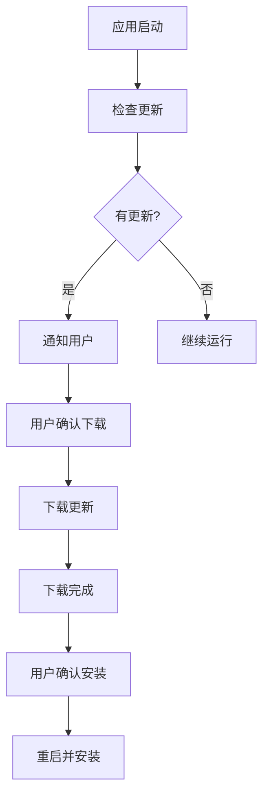

# Electron 自动更新

## electron-updater

### 安装

```bash [终端]
npm install electron-updater
```

### 配置

```json [package.json]
{
  "build": {
    "publish": {
      "provider": "github",
      "owner": "username",
      "repo": "my-electron-app",
      "releaseType": "release"
    }
  }
}
```

### 主进程实现

```javascript [main.js]
const { app, BrowserWindow, ipcMain } = require('electron')
const { autoUpdater } = require('electron-updater')

let mainWindow

function createWindow() {
  mainWindow = new BrowserWindow({
    width: 800,
    height: 600
  })

  mainWindow.loadFile('index.html')

  autoUpdater.autoDownload = false
  autoUpdater.autoInstallOnAppQuit = true

  autoUpdater.on('checking-for-update', () => {
    mainWindow.webContents.send('update-status', '正在检查更新...')
  })

  autoUpdater.on('update-available', (info) => {
    mainWindow.webContents.send('update-available', info)
  })

  autoUpdater.on('update-not-available', () => {
    mainWindow.webContents.send('update-status', '当前已是最新版本')
  })

  autoUpdater.on('error', (err) => {
    mainWindow.webContents.send('update-error', err.message)
  })

  autoUpdater.on('download-progress', (progressObj) => {
    mainWindow.webContents.send('download-progress', progressObj)
  })

  autoUpdater.on('update-downloaded', () => {
    mainWindow.webContents.send('update-downloaded')
  })
}

ipcMain.on('check-for-update', () => {
  autoUpdater.checkForUpdates()
})

ipcMain.on('download-update', () => {
  autoUpdater.downloadUpdate()
})

ipcMain.on('quit-and-install', () => {
  autoUpdater.quitAndInstall()
})

app.whenReady().then(createWindow)
```

### 渲染进程实现

```javascript [preload.js]
const { contextBridge, ipcRenderer } = require('electron')

contextBridge.exposeInMainWorld('electronAPI', {
  checkForUpdate: () => ipcRenderer.send('check-for-update'),
  downloadUpdate: () => ipcRenderer.send('download-update'),
  quitAndInstall: () => ipcRenderer.send('quit-and-install'),
  onUpdateStatus: (callback) => ipcRenderer.on('update-status', (_event, status) => callback(status)),
  onUpdateAvailable: (callback) => ipcRenderer.on('update-available', (_event, info) => callback(info)),
  onUpdateNotAvailable: (callback) => ipcRenderer.on('update-not-available', (_event) => callback()),
  onUpdateError: (callback) => ipcRenderer.on('update-error', (_event, error) => callback(error)),
  onDownloadProgress: (callback) => ipcRenderer.on('download-progress', (_event, progress) => callback(progress)),
  onUpdateDownloaded: (callback) => ipcRenderer.on('update-downloaded', (_event) => callback())
})
```

```javascript [renderer.js]
window.electronAPI.onUpdateStatus((status) => {
  console.log('更新状态:', status)
})

window.electronAPI.onUpdateAvailable((info) => {
  console.log('发现新版本:', info.version)
  if (confirm('发现新版本，是否下载？')) {
    window.electronAPI.downloadUpdate()
  }
})

window.electronAPI.onDownloadProgress((progress) => {
  console.log('下载进度:', progress.percent.toFixed(2) + '%')
})

window.electronAPI.onUpdateDownloaded(() => {
  if (confirm('更新已下载，是否立即安装？')) {
    window.electronAPI.quitAndInstall()
  }
})

// 检查更新
window.electronAPI.checkForUpdate()
```

## 更新服务器配置

### GitHub Releases

```json [package.json]
{
  "build": {
    "publish": {
      "provider": "github",
      "owner": "username",
      "repo": "my-electron-app",
      "releaseType": "release",
      "token": "your-github-token"
    }
  }
}
```

### 自定义服务器

```json [package.json]
{
  "build": {
    "publish": {
      "provider": "generic",
      "url": "https://example.com/updates/",
      "channel": "latest"
    }
  }
}
```

### S3

```json [package.json]
{
  "build": {
    "publish": {
      "provider": "s3",
      "bucket": "my-electron-updates",
      "region": "us-east-1"
    }
  }
}
```

## 手动更新检查

```javascript [main.js]
const { autoUpdater } = require('electron-updater')

// 应用启动时检查
app.whenReady().then(() => {
  createWindow()

  setTimeout(() => {
    autoUpdater.checkForUpdatesAndNotify()
  }, 5000)
})
```

## 更新流程



## 错误处理

```javascript [main.js]
autoUpdater.on('error', (err) => {
  console.error('更新错误:', err)

  if (err.message.includes('net::ERR_INTERNET_DISCONNECTED')) {
    mainWindow.webContents.send('update-error', '网络连接失败')
  } else if (err.message.includes('404')) {
    mainWindow.webContents.send('update-error', '未找到更新文件')
  } else {
    mainWindow.webContents.send('update-error', '更新失败，请稍后重试')
  }
})
```

## 强制更新

```javascript [main.js]
autoUpdater.on('update-downloaded', () => {
  mainWindow.webContents.send('update-downloaded')

  setTimeout(() => {
    autoUpdater.quitAndInstall()
  }, 60000)
})
```

