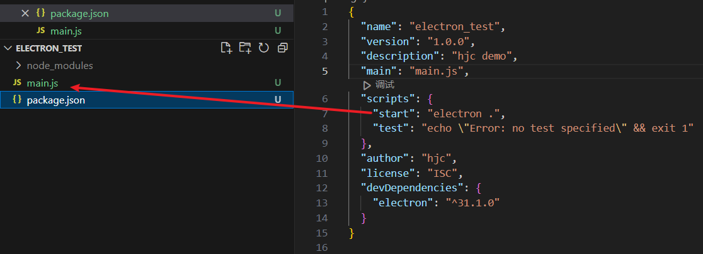

# Electron 搭建环境

## 前置要求

需要安装 [Node.js](../../Basic/NodeJs/index.md)（建议 18.x 或更高版本）。

## 创建项目

```bash [终端]
mkdir my-electron-app && cd my-electron-app
npm init -y
```

安装 Electron 开发依赖：

```bash [终端]
npm install --save-dev electron
```

## 安装问题排查

安装 Electron 时卡住一段时间后报错 `TIMEOUT reify:@types/node: timing reifyNode:node_modules/global-agent Completed in 206ms`

**解决办法**：

1. 使用 cnpm

   ```bash [终端]
   npm install -g cnpm --registry=https://registry.npmmirror.com
   cnpm install electron -D
   ```

2. 在项目根目录下新建 `.npmrc` 文件：

   ```ini [.npmrc]
   ELECTRON_MIRROR="https://npmmirror.com/mirrors/electron/"
   ```

   然后将原来的 `node_modules` 文件夹删掉，重新安装：

   ```bash [终端]
   npm install electron --save-dev
   ```

## 配置启动脚本

在 `package.json` 配置文件中的 `scripts` 字段下增加一条 `start` 命令：

```json [package.json]
{
  "name": "my-electron-app",
  "version": "1.0.0",
  "main": "main.js",
  "scripts": {
    "start": "electron ."
  }
}
```

## 创建主进程文件

创建 `main.js`：



```javascript [main.js]
const { app, BrowserWindow } = require('electron')

app.whenReady().then(() => {
  const win = new BrowserWindow({
    width: 800,
    height: 600,
    autoHideMenuBar: true,
    webPreferences: {
      preload: './preload.js',
      contextIsolation: true,
      nodeIntegration: false
    }
  })

  win.loadURL('https://www.baidu.com')
})
```

使用 `npm run start` 运行项目：


## 使用现代 ES 模块语法

```javascript [main.js]
import { app, BrowserWindow } from 'electron'

app.whenReady().then(() => {
  const win = new BrowserWindow({
    width: 800,
    height: 600,
    autoHideMenuBar: true
  })

  win.loadURL('https://www.baidu.com')
})
```

需要在 `package.json` 中添加：

```json [package.json]
{
  "type": "module"
}
```

## 使用 TypeScript

```bash [终端]
npm install --save-dev typescript @types/node
npx tsc --init
```

```typescript [main.ts]
import { app, BrowserWindow } from 'electron'

let mainWindow: BrowserWindow | null = null

function createWindow() {
  mainWindow = new BrowserWindow({
    width: 800,
    height: 600,
    webPreferences: {
      preload: './preload.ts',
      contextIsolation: true,
      nodeIntegration: false
    }
  })

  mainWindow.loadURL('https://www.baidu.com')
}

app.whenReady().then(createWindow)

app.on('window-all-closed', () => {
  if (process.platform !== 'darwin') {
    app.quit()
  }
})

app.on('activate', () => {
  if (BrowserWindow.getAllWindows().length === 0) {
    createWindow()
  }
})
```

