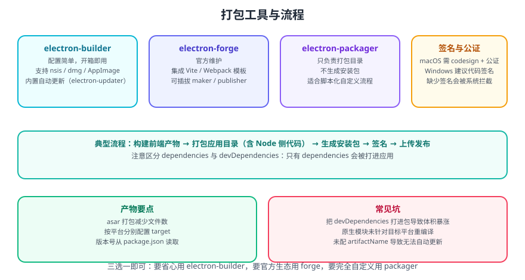

# Electron 构建工具

Electron 应用要交付给用户，必须经过「**打包（packaging）** → **生成安装包（distribution）** → **签名**」三步。选对工具能让这三步从手工操作变成一条命令。



## 一句话定位

| 工具 | 定位 | 适合谁 |
| --- | --- | --- |
| **electron-builder** | 一体化打包 + 安装包 + 自动更新 | 绝大多数项目，配置最省心 |
| **electron-forge** | 官方维护的一体化工具链，模板与插件生态 | 想跟随官方路线、需要 Vite/Webpack 模板 |
| **electron-packager** | 只打包出可运行目录，不生成安装包 | 需要完全自定义安装包流程 |

三者都基于同一原理：把 **Electron 运行时** 与 **你的应用代码** 组装成一个可直接运行的目录，再按平台生成安装包。

## 三者的取舍

### electron-builder

```json [package.json]
{
  "scripts": {
    "dist": "electron-builder"
  },
  "build": {
    "appId": "com.example.desktop",
    "productName": "ExampleApp",
    "directories": { "output": "release" },
    "files": ["dist/**/*", "main.js", "preload.js"],
    "asar": true,
    "win": { "target": ["nsis"] },
    "mac": { "target": ["dmg"], "category": "public.app-category.productivity" },
    "linux": { "target": ["AppImage", "deb"] }
  }
}
```

优点：

- 配置即声明，`win` / `mac` / `linux` 各自独立配置目标格式；
- 内置 `electron-updater` 自动更新方案；
- `artifactName` 可精确控制产物命名，是**自动更新能否生效的关键**。

### electron-forge

```shell
# 用官方模板创建项目
npx create-electron-app@latest my-app --template=vite

# 打包并生成安装包
npm run make
```

```javascript [forge.config.js]
module.exports = {
  packagerConfig: { asar: true },
  makers: [
    { name: '@electron-forge/maker-squirrel' },   // Windows
    { name: '@electron-forge/maker-dmg' },        // macOS
    { name: '@electron-forge/maker-deb' },        // Linux
  ],
  plugins: [{ name: '@electron-forge/plugin-vite' }],
};
```

优点：官方维护、模板开箱即用、maker / publisher 可插拔；缺点是自动更新生态不如 electron-builder 成熟。

### electron-packager

```shell
npx electron-packager . ExampleApp --platform=win32 --arch=x64 --out=release
```

只输出可运行目录（`ExampleApp-win32-x64/`），**不生成安装包**，适合把安装包生成交给别的工具或自研脚本。

## electron-vite：面向开发体验的构建工具

`electron-vite` 不是打包工具，而是**开发与构建工具**：用 Vite 打包主进程、预加载脚本与渲染进程三份代码，并提供 HMR / 热重载。

它的核心价值有两点：

1. **统一三端配置**：在一个配置文件里分别配置 `main` / `preload` / `renderer`，并针对 Electron 的 Node + 浏览器混合环境做预设。
2. **开发体验**：渲染进程支持模块热替换（HMR），主进程与预加载脚本支持热重载，改代码不必手动重启应用。

```javascript [electron.vite.config.js]
import { defineConfig } from 'electron-vite';
import vue from '@vitejs/plugin-vue';
import path from 'node:path';

export default defineConfig({
  main: {
    build: {
      rollupOptions: {
        input: { index: path.resolve(__dirname, 'src/main/index.js') },
      },
    },
  },
  preload: {
    build: {
      rollupOptions: {
        input: { index: path.resolve(__dirname, 'src/preload/index.js') },
      },
    },
  },
  renderer: {
    plugins: [vue()],
  },
});
```

::: tip 正确的组合方式
**开发用 electron-vite，打包用 electron-builder**。前者负责把三端代码编译成可运行产物并支持热更新，后者负责生成安装包与自动更新配置。二者不冲突，是最常见的搭配。
:::

## 打包流程详解

```text
① 构建前端产物（Vite / Webpack / 直接写原生）
        ↓
② 组织应用目录（main.js / preload.js / 渲染产物 / package.json）
        ↓
③ 打包为 app.asar（electron-builder / forge 自动完成）
        ↓
④ 与 Electron 运行时组装 → 生成可运行目录
        ↓
⑤ 按平台生成安装包（nsis / dmg / AppImage ...）
        ↓
⑥ 代码签名 → 上传发布（配合自动更新服务器）
```

::: danger 注意
1. **只有 `dependencies` 会被打进应用**。把运行时依赖误写进 `devDependencies` 会导致打包后 `Cannot find module`；反过来把构建工具写进 `dependencies` 会让安装包体积暴涨。
2. **原生模块（native addon）必须针对目标平台重编译**。在 Windows 上打 macOS 包会失败或运行时报错，跨平台构建需用对应平台的 CI runner。
3. **`asar: true` 是默认推荐的**，但需要动态读写文件的场景要么用 `asarUnpack` 排除，要么改写到 `userData` 目录。
4. **缺少代码签名会导致系统拦截**（尤其 macOS），且较新版本 macOS 上未签名应用的部分系统能力会直接失败。
:::

## 常见问题

| 现象 | 原因 | 处理 |
| --- | --- | --- |
| 打包后提示找不到模块 | 依赖被放进了 `devDependencies` | 移入 `dependencies` |
| 安装包体积异常大 | 把构建工具打进了包 | 精简 `dependencies`，用 `files` 白名单 |
| 开发正常、打包后白屏 | 资源路径用了相对路径或 `file://` 限制 | 用 `loadFile`，路径基于 `__dirname` 解析 |
| 自动更新总是失败 | `artifactName` 与清单不匹配 | 统一产物命名，核对 `latest.yml` |
| 原生模块加载报错 | 未按目标平台重编译 | 用对应平台 runner 构建 |
| macOS 提示「已损坏」 | 未签名 / 未公证 | 配置签名与公证流程 |

## 验证方式

1. 执行打包命令，确认 `release/` 下生成了对应平台的安装包（如 `.exe` / `.dmg` / `.AppImage`）。
2. 在目标系统上安装并启动，确认能正常打开、功能可用，而不是「开发机能跑、装机就白屏」。
3. 检查安装包体积，确认没有把 `node_modules` 里的构建工具打进去。
4. 若已配置自动更新，确认更新服务器上存在与产物同名的清单文件（如 `latest.yml`）。
5. 在另一台干净的机器上安装一次，验证不依赖开发环境中的任何东西。

## 相关专题

- [Electron 打包应用](../PackageApplications/index.md)：`electron-builder` 的具体配置
- [Electron+Vue3 项目打包](../VuePackaging/index.md)：前端框架与 Electron 的集成
- [Electron 自动更新](../AutoUpdate/index.md)：产物命名与更新服务器
- [Electron 安全最佳实践](../Security/index.md)：签名与完整性保护

## 参考资料

- electron-builder 官方文档：https://www.electron.build/
- Electron Forge 官方文档：https://www.electronforge.io/
- electron-vite 官方文档：https://electron-vite.org/
