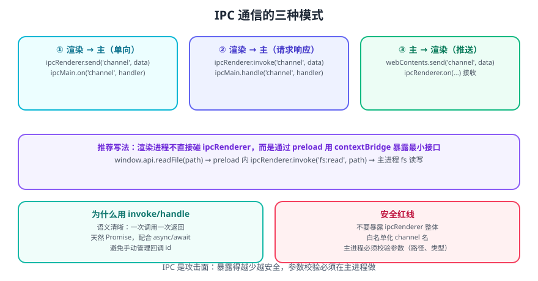

# Electron 进程通信 IPC

进程通信(IPC、InterProcess Communication)，IPC 是 Electron 中最为核心的内容，它是从 UI 调用原生 API 的唯一方法。
Electron 中，主要使用 ipcMain 和 ipcRenderer 来定义"通道"，进行进程通信。



## 三种通信模式速查

| 模式 | 渲染进程侧 | 主进程侧 | 返回 | 典型场景 |
| --- | --- | --- | --- | --- |
| 渲染 → 主（单向） | `ipcRenderer.send` | `ipcMain.on` | 无 | 通知、埋点、日志 |
| 渲染 → 主（请求响应） | `ipcRenderer.invoke` | `ipcMain.handle` | `Promise` | 读写文件、查询系统信息 |
| 主 → 渲染（推送） | `ipcRenderer.on` | `win.webContents.send` | 无 | 更新提示、菜单动作、进度 |

::: tip 一句话理解
**能用 `invoke/handle` 就别用 `send/on`**。前者天然是 Promise，语义清晰、异常可捕获；后者要自己管理回信通道，容易写乱。
:::

::: danger 注意
渲染进程**不要直接调用 `ipcRenderer`**，而应由预加载脚本用 `contextBridge` 暴露**白名单化的最小接口**。直接把 `ipcRenderer` 挂到 `window` 上等于把任意 channel 暴露给页面（含第三方脚本），是 Electron 应用最常见的安全漏洞。
:::

## 渲染进程到主进程单向通信

在渲染器进程中 ipcRenderer.send 发送消息，在主进程中使用 ipcMain.on 接收消息。常用于在Web中调用主进程的API。

**例**：点击按钮后，在用户的 D 盘创建一个hello.txt文件，文件内容来自于用户输入。

1. 页面中添加相关元素， render.js中添加对应脚本

   > index.html

   ```html
   <input id="content" type="text"><br><br>
   <button id="btn">在用户的D盘创建一个hello.txt</button>
   ```

   >  render.js

   ```js
   const btn = document.getElementById('btn')
   const content = document.getElementById('content')
   
   btn.addEventListener('click',()=>{
     console.log(content.value)
     myAPI.saveFile(content.value)
   })
   ```

2. preload.js中使用 `ipcRenderer.send('信道',参数)`发送消息，与主进程通信：

   ```js
   const {contextBridge,ipcRenderer} = require('electron')
   contextBridge.exposeInMainWorld('myAPI',{
     	/*******/
     	saveFile(str){
     		// 渲染进程给主进程发送一个消息
     		ipcRenderer.send('create-file',str)
   	}
   })
   ```

3. 主进程中，在加载页面之前，使用 `ipcMain.on('信道',回调)`配置对应回调函数，接收消息

   ```js
   const { app, BrowserWindow,ipcMain } = require('electron')
   const path = require('path');
   const fs = require('fs');
   // 用于创建窗口
   function createWindow() {
   	/**********/
   	// 主进程注册对应回调
   	ipcMain.on('create-file',createFile)
   	// 加载一个本地页面
   	win.loadFile(path.resolve(__dirname,'./pages/index.html'))
   }
   //创建文件
   function createFile(event,data){
   	fs.writeFileSync('D:/hello.txt',data)
   }
   ```

## 渲染进程与主进程双向通信

渲染进程通过ipcRenderer.invoke 发送消息，主进程使用 ipcMain.handle 接收并处理消息。ipcRederer.invoke 的返回值是Promise实例。常用于：从渲染器进程调用主进程方法并等待结果。

**例**：点击按钮从 D 盘读取hello.txt中的内容，并将结果呈现在页面上。

1. 页面中添加相关元素， render.js中添加对应脚本

   > index.html

   ```html
   <button id="btn">读取用户D盘的hello.txt</button>
   ```

   > render.js

   ```js
   const btn = document.getElementById('btn')
   btn.addEventListener('click', async () => {
       let data = await myAPI.readFile('D:/hello.txt')
       document.body.innerHTML += `<h2>${data}</h2>`
   })
   ```

2. preload.js中使用 `ipcRenderer.invoke('信道',参数)`发送消息，与主进程通信

   ```js
   const {contextBridge,ipcRenderer} = require('electron')
   contextBridge.exposeInMainWorld('myAPI',{
    /*******/
    readFile (path){
    	return ipcRenderer.invoke('read-file',path)
    }
   }
   ```

3. 主进程中，在加载页面之前，使用 `ipcMain.handle('信道',回调)`接收消息，并配置回调函数

   ```js
   // 用于创建窗口
   function createWindow() {
    /**********/
    // 主进程注册对应回调
    ipcMain.handle('read-file',readFile)
    // 加载一个本地页面
    win.loadFile(path.resolve(__dirname,'./pages/index.html'))
   }
   //读取文件
   function readFile(event,path){
    return fs.readFileSync(path).toString()
   }
   ```

## 主进程到渲染进程通信

主进程使用 win.webContents.send 发送消息，渲染进程通过ipcRenderer.on 处理消息。常用于：从主进程主动发送消息给渲染进程。

**例**：应用加载 6 秒钟后，主动给渲染进程发送一个消息，内容是：你好啊！

1. 页面中添加相关元素， render.js中添加对应脚本

   ```js
   window.onload = ()=>{
    myAPI.getMessage(logMessage)
   }
   function logMessage(event,str){
    console.log(event,str)
   }
   ```

2. preload.js中使用 `ipcRenderer.on ('信道',回调)`接收消息，并配置回调函数

   ```js
   const {contextBridge,ipcRenderer} = require('electron')
   contextBridge.exposeInMainWorld('myAPI',{
    /*******/
    getMessage: (callback) => {
     return ipcRenderer.on('message', callback);
    }
   })
   ```

3. 主进程中，在合适的时候，使用 `win.webContents.send('信道',数据)`发送消息

   ```js
   // 用于创建窗口
   function createWindow() {
    /**********/
    // 加载一个本地页面
    win.loadFile(path.resolve(__dirname,'./pages/index.html'))
    // 创建一个定时器
    setTimeout(() => {
     win.webContents.send('message','你好啊！')
    }, 6000);
   }
   ```

## 用 invoke/handle 封装安全接口

把「渲染进程能做什么」收敛成一份白名单，是 IPC 工程化的关键：

```javascript [preload.js]
const { contextBridge, ipcRenderer } = require('electron')

// 白名单：只暴露业务需要的能力，不暴露 ipcRenderer 本体
const channels = {
  readFile: (relativePath) => ipcRenderer.invoke('fs:read', relativePath),
  writeFile: (relativePath, content) => ipcRenderer.invoke('fs:write', relativePath, content),
  getAppVersion: () => ipcRenderer.invoke('app:version'),
}

contextBridge.exposeInMainWorld('api', channels)
```

```javascript [main.js]
const { ipcMain, app } = require('electron')
const path = require('node:path')
const fs = require('node:fs/promises')

const SAFE_ROOT = app.getPath('userData')   // 限定可操作目录

function safeJoin(relativePath) {
  const target = path.resolve(SAFE_ROOT, relativePath)
  // 防目录穿越：解析后必须仍在允许目录内
  if (!target.startsWith(SAFE_ROOT)) throw new Error('路径不合法')
  return target
}

ipcMain.handle('fs:read', async (_event, relativePath) => {
  return fs.readFile(safeJoin(relativePath), 'utf-8')
})

ipcMain.handle('fs:write', async (_event, relativePath, content) => {
  await fs.writeFile(safeJoin(relativePath), content, 'utf-8')
  return { ok: true }
})

ipcMain.handle('app:version', () => app.getVersion())
```

::: danger 注意
1. **主进程必须校验参数**：渲染进程传来的路径、类型、范围都不可信。上例的 `safeJoin` 用来阻止 `../../` 目录穿越。
2. **不要暴露「万能 channel」**：例如 `invoke(channel, ...args)` 这种透传形式，等于白名单失效。
3. **`ipcMain.handle` 抛出的错误会被序列化后传给渲染进程**，错误信息里不要包含敏感路径或密钥。
4. **避免在 `handle` 里做重计算**：它会占用主进程事件循环，导致界面卡顿。
:::

## 常见坑

| 现象 | 原因 | 处理 |
| --- | --- | --- |
| 渲染进程报 `ipcRenderer is not defined` | 未通过 preload 暴露 | 在 preload 中用 `contextBridge` 暴露 |
| `invoke` 一直 pending | 主进程没注册对应 `handle`，或 channel 名不一致 | 核对两侧 channel 字符串 |
| 页面刷新后监听叠加 | 每次加载都 `on`，未移除 | 用 `ipcRenderer.removeListener`，或暴露幂等接口 |
| 传对象过去字段丢失 | 结构化克隆不支持函数/类实例 | 只传可序列化数据 |
| 开发正常、打包后 IPC 失效 | preload 路径在打包后变化 | 用 `path.join(__dirname, ...)` 并配置好打包包含 |

## 验证方式

1. 点击按钮触发一次 `invoke`，在渲染进程打印返回值，确认类型与内容正确。
2. 在 preload 中 `console.log(Object.keys(window.api))`，确认暴露的接口只有白名单里的方法。
3. 传入 `../../etc/passwd` 这类越界路径，确认主进程抛错而不是真的读到文件。
4. 主进程用 `webContents.send` 推一条消息，确认渲染进程的监听被触发且只触发一次。

## 相关专题

- [Electron 进程](../Process/index.md)：三类进程的职责边界
- [Electron Preload 脚本](../Preload/index.md)：桥接层实现细节
- [Electron 安全最佳实践](../Security/index.md)：IPC 相关的安全配置
- [Electron 自动更新](../AutoUpdate/index.md)：更新流程中的 IPC 应用

## 参考资料

- Electron 官方文档 · 进程间通信：https://www.electronjs.org/zh/docs/latest/tutorial/ipc
- Electron 官方文档 · ipcMain：https://www.electronjs.org/zh/docs/latest/api/ipc-main
- Electron 官方文档 · ipcRenderer：https://www.electronjs.org/zh/docs/latest/api/ipc-renderer

   

