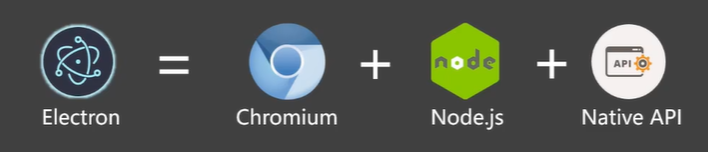
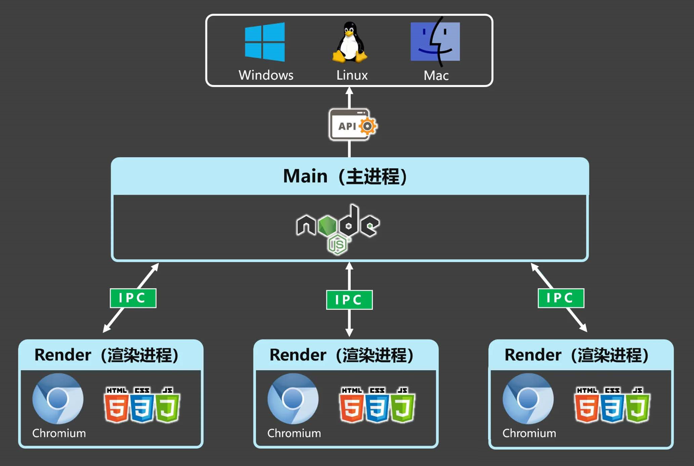

# Electron 概述

Electron 是一个**跨平台桌面应用**开发框架，开发者可以使用 HTML、CSS、JavaScript 等 Web 技术来构建桌面应用程序。它的本质是结合了 Chromium 和 Node.js，现在广泛用于桌面应用程序开发。

**官方网站**：https://www.electronjs.org/zh/

例如这些桌面应用都用到了 Electron 技术：

- Visual Studio Code
- GitHub Desktop
- 1Password
- 新版 QQ
- Discord
- Slack
- Figma Desktop

## Electron 的优势

1. **跨平台**：同一套代码可以构建出能在 Windows、macOS、Linux 上运行的应用程序。
2. **上手容易**：使用 Web 技术就可以轻松完成开发桌面应用程序。
3. **底层权限**：允许应用程序访问文件系统、操作系统等底层功能，从而实现复杂的系统交互。
4. **社区支持**：拥有一个庞大且活跃的社区，开发者可以轻松找到文档、教程和开源库。
5. **自动更新**：内置自动更新机制，方便应用版本管理。
6. **原生 API 集成**：支持系统通知、剪贴板、对话框等原生功能。

## Electron 技术架构

Electron = Chromium + Node.js + Native API

## 进程模型

核心**进程通信**：

## 核心概念

### 主进程（Main Process）

- 每个 Electron 应用只有一个主进程
- 负责创建和管理渲染进程
- 可以访问 Node.js API 和原生系统功能
- 使用 `BrowserWindow` 创建和管理窗口

### 渲染进程（Renderer Process）

- 每个 `BrowserWindow` 实例对应一个渲染进程
- 运行在 Chromium 环境中
- 负责渲染页面和处理用户交互
- 默认无法直接访问 Node.js API

### 预加载脚本（Preload Script）

- 在渲染进程加载网页之前执行
- 可以访问 Node.js API
- 通过 `contextBridge` 安全地向渲染进程暴露 API
- 是主进程和渲染进程之间的桥梁

## 适用场景

- 需要跨平台的桌面应用
- 团队熟悉 Web 技术栈
- 需要集成 Web 服务和 API 的应用
- 需要访问系统底层功能的应用

## 不适用场景

- 对性能要求极高的应用（如游戏）
- 对安装包大小有严格限制的应用
- 需要深度系统集成且性能敏感的应用

## 版本信息

| 版本 | 发布日期 | Node.js | Chromium | V8 |
|------|----------|---------|----------|-----|
| 35.x | 2025-03 | 22.x | 134 | 13.4 |
| 34.x | 2025-01 | 20.x | 132 | 13.2 |
| 33.x | 2024-10 | 20.x | 130 | 13.0 |

::: tip
建议使用最新的稳定版本，以获得最佳的安全性和性能。
:::

