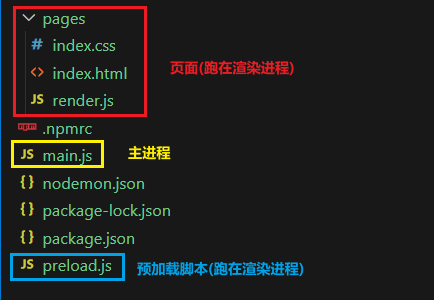

# Electron Preload 脚本

预加载 (Preload) 脚本是运行在渲染进程中的，但它是在网页内容加载之前执行的，这意味着它具有比普通渲染器代码更高的权限，可以访问 Node.js 的 API，同时又可以与网页内容进行安全的交互。

简单说：它是 Node.js 和 Web API 的桥梁，Preload 脚本可以安全地将部分 Node.js 功能暴露给网页，从而减少安全风险。

## 基本使用

**例**：点击按钮后，在页面呈现当前的 Node 版本。

1. 创建预加载脚本 `preload.js`：

   ```javascript [preload.js]
   const { contextBridge } = require('electron')

   contextBridge.exposeInMainWorld('myAPI', {
     n: 666,
     version: process.version
   })
   ```

2. 在主进程中引入 `preload.js`：

   ```javascript [main.js]
   const path = require('path')
   const win = new BrowserWindow({
     webPreferences: {
       preload: path.resolve(__dirname, './preload.js'),
       contextIsolation: true,
       nodeIntegration: false
     }
   })
   ```

3. 在 HTML 页面中编写对应按钮，并创建专门编写网页脚本的 `render.js`，随后引入：

   ```html [index.html]
   <body>
     <h1>你好啊！</h1>
     <button id="btn1">获取 Node 版本</button>
     <script type="text/javascript" src="./render.js"></script>
   </body>
   ```

4. 在渲染进程中使用 `version`：

   ```javascript [render.js]
   const btn1 = document.getElementById('btn1')
   btn1.addEventListener('click', () => {
     console.log(myAPI.version)
     document.body.innerHTML += `<h2>${myAPI.version}</h2>`
   })
   ```

5. 整体文件结构：

   

## contextBridge API

### exposeInMainWorld

```javascript [preload.js]
const { contextBridge } = require('electron')

contextBridge.exposeInMainWorld('electronAPI', {
  version: process.versions.electron,
  platform: process.platform,
  isMac: process.platform === 'darwin',
  isWindows: process.platform === 'win32'
})
```

```javascript [renderer.js]
console.log(window.electronAPI.version)
console.log(window.electronAPI.platform)
```

### 暴露函数

```javascript [preload.js]
const { contextBridge, ipcRenderer } = require('electron')

contextBridge.exposeInMainWorld('electronAPI', {
  getVersion: () => process.versions.electron,
  readFile: (path) => ipcRenderer.invoke('read-file', path),
  writeFile: (path, content) => ipcRenderer.invoke('write-file', path, content),
  onMessage: (callback) => ipcRenderer.on('message', (_event, value) => callback(value))
})
```

## 安全最佳实践

### 推荐配置

```javascript [main.js]
const win = new BrowserWindow({
  webPreferences: {
    preload: './preload.js',
    contextIsolation: true,
    nodeIntegration: false,
    sandbox: true
  }
})
```

| 选项 | 推荐值 | 说明 |
|------|--------|------|
| `contextIsolation` | `true` | 隔离预加载脚本和页面脚本 |
| `nodeIntegration` | `false` | 禁止渲染进程直接访问 Node.js |
| `sandbox` | `true` | 沙盒模式，限制渲染进程权限 |

### 避免的做法

```javascript
// 错误：开启 nodeIntegration
const win = new BrowserWindow({
  webPreferences: {
    nodeIntegration: true,
    contextIsolation: false
  }
})
```

```html
<!-- 错误：在渲染进程中直接使用 require -->
<script>
  const fs = require('fs')
</script>
```

## 预加载脚本调试

```javascript [main.js]
const win = new BrowserWindow({
  webPreferences: {
    preload: './preload.js',
    devTools: true
  }
})

win.webContents.on('preload-error', (event, preloadPath, error) => {
  console.error('预加载脚本错误:', error)
})
```

## 多预加载脚本

```javascript [main.js]
const win = new BrowserWindow({
  webPreferences: {
    preload: './preload.js'
  }
})
```

```javascript [preload.js]
const { contextBridge, ipcRenderer } = require('electron')

const fs = require('./preload-fs.js')
const app = require('./preload-app.js')

contextBridge.exposeInMainWorld('electronAPI', {
  ...fs,
  ...app
})
```

```javascript [preload-fs.js]
const { ipcRenderer } = require('electron')

module.exports = {
  readFile: (path) => ipcRenderer.invoke('read-file', path),
  writeFile: (path, content) => ipcRenderer.invoke('write-file', path, content)
}
```

